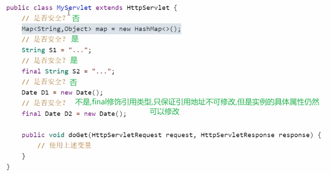
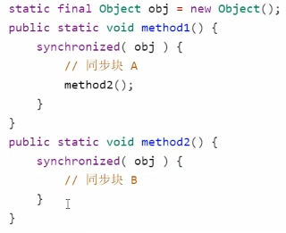
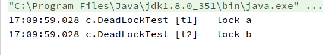
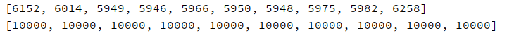
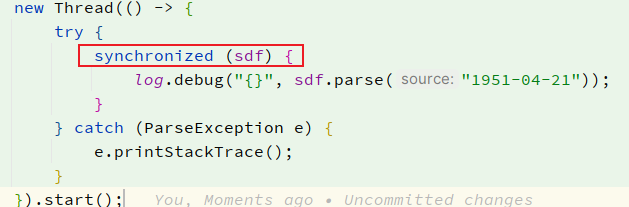
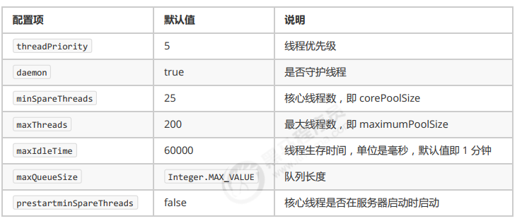
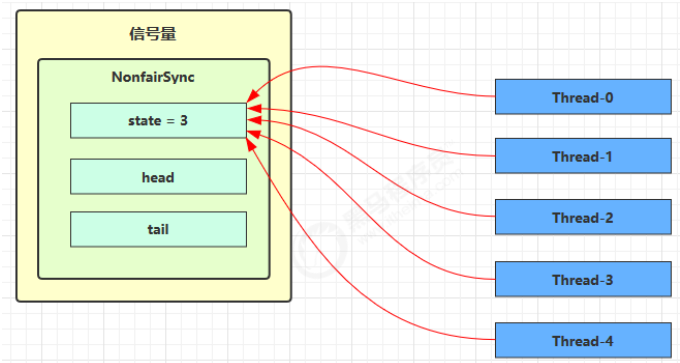

# 框架

>进程和线程
>
>共享模型
>
>非共享模型
>
>并行
>
>其他


[TOC]


# 1 进程和线程

## 1.1 进程和线程的对比

进程

- 计算机执行时的一个实例(程序从磁盘中加载至内存,就开启了一个线程),它包括程序代码和当前的活动(程序运行).
- 进程可以是由多个线程并行执行而组成.
- windows中的进程是不活动的,只是作为线程的容器

线程

- 进程可以是由一个或多个线程组成

- 是一个指令流,将指令流中的指令以一定的顺序交给cpu执行.
- 在java中,线程作为最小的调度单位;进程作为资源分配的最小单位.

对比

- 进程相互独立,线程存在于进程中
- 进程有用于内部共享的资源,如内存空间,供其内部的线程共享
- 进程间通信复杂
  - 同一台计算机内部的进程通信称为 IPC(inter-process communication)
  - 不同计算机间的进程通信,需要通过网络,并遵循协议,如HTTP
- 线程通信相对简单,因为他们共享进程内的内存
- 线程轻量,线程的上下文切换成本比进程上下文切换低

---

## 1.2 并行和并发

### 1.2.1 单核和多核cpu

单核cpu下,**微观串行,宏观并行**:

单核cpu下的线程实际上是串行执行的,操作系统的任务调度组件,把cpu的的执行时间分片(windows下时间片最小约15毫秒),每一个时间片分给不同的程序使用,并切换的速度很快,给人一种同时执行的错觉.


多核cpu下,每个核都可以调度运行程序,此时线程才可以并行执行:


### 1.2.2 并发和并行

rob pike:

- 并发(concurrent)是同一时间应对多件事情的能力
- 并行(parallel)是同一时间动手做多件事情的能力


---

## 1.3 应用

### 1.3.1 多线程异步调用(并发能力)

从调用方的角度:

- 需要等待结果返回,才能继续运行的就是同步
- 不需要等待结果返回,就能继续运行的就是异步

多线程可以让方法的执行变为异步:

​	比如读取磁盘文件,读取消耗的时长如果是同步,那么这段时间内cpu只能等待结果返回

应用:

- 操作费时的任务,可以单独开启一个新线程处理,避免阻塞主线程
- tomcat的异步servlet,让用户线程处理耗时长的操作,避免阻塞tomcat的工作线程


### 1.3.2 多线程提升效率(并行能力)

需要执行的多个计算,最后汇总结果,


- 如果是串行计算,总花费为31ms
- 如果是多核cpu,例如4核,各个核心分别使用不同的线程计算,那么三个线程的计算是并行的,计算时长只取决与最长的那个线程运行时间(11ms),最后再汇总结果,最终只需12ms

> 注意: 并行是需要多核cpu才能提高效率,单核cpu仍然是串行计算

应用:

- 单核cpu下,多线程不能实际提升程序运行效率
- 多核cpu可以并行跑多个线程,但是否提高程序运行效率还是分情况的
  - 有些任务可以拆分,并行执行,可以提升效率
  - 但不是所有的计算任务都可拆分,(如 阿姆达尔定律)
  - 也不是所有的任务都需要拆分,如果任务的目的不同就没有意义了
- io操作不占用cpu,只是我们使用的是**阻塞io**,相当于线程虽然不用cpu,但是需要一直等待io结束(后面的非阻塞io和异步io处理这类问题)

---

# 2 java线程

## 2.1 创建和运行线程

**方式1**: new thread

```java
public static void m1() {
  Thread t1 = new Thread("t1") {
    @Override
    public void run() {
      log.debug("t1 running");
    }
  };
  t1.start();
}
```

**方式2**: 使用runnable配合thread

把任务和线程分离,runnable表示任务,thread表示线程

```java
public static void m2() {
  Runnable r2 = new Runnable() {
    @Override
    public void run() {
      log.debug("t2 running");
    }
  };
  Thread t2 = new Thread(r2, "t2");
  t2.start();
}
```

lambda写法

```java
public static void m2jdk8() {
  Runnable task = () -> log.debug("t2 running");
  Thread t2 = new Thread(task, "t2");
  t2.start();
}
```

小结:

- 使用Runnable更容易与线程池等高级API配合使用
- 用Runnable让任务类脱离Thread的继承体系,更灵活


**方式3**: 使用FutureTask配合Runnable

FutureTask能够接受Callable类型的参数,用来处理带有返回结果的情况

```java
public static void m3() {
  FutureTask<Integer> task = new FutureTask<>(() -> {
    log.debug("t3 running");
    return 100;
  });

  Thread t3 = new Thread(task, "t3");
  t3.start();

  // 主线程注册,等待task执行完毕后返回结果
  Integer result = null;
  try {
    result = task.get();
  } catch (Exception e) {
    throw new RuntimeException(e);
  }
  log.debug("t3 running result" + String.valueOf(result));

}
```

---

## 2.3 线程运行原理

### 2.3.1 栈和栈帧

jvm的虚拟机栈,在每个**线程**启动后,虚拟机都会为其分配一块栈内存

- 每个栈由多个栈帧(Frame)组成,对应着每次方法调用时所占用的内存
- 每个线程只能有一个活动栈帧,对应着当前正在执行的方法

```java
public class FrameTest {
  public static void main(String[] args) {
    method1(10);
  }
  private static void method1(int x) {
    int y = x + 1;
    Object m = method2();
    System.out.println(m);
  }
  private static Object method2() {
    return new Object();
  }
}
```


```java
public class FrameTest {
  public static void main(String[] args) {
    Thread thread = new Thread("t1") {
      @Override
      public void run() {
        method1(20);
      }
    };
    thread.start();

    method1(10);
  }
  private static void method1(int x) {
    int y = x + 1;
    Object m = method2();
    System.out.println(m);
  }

  private static Object method2() {
    return new Object();
  }


}
```


mian线程栈帧运行图示:


### 2.3.2 上下文切换(Thread Context Switch)

由于一些原因,导致cpu不再执行当前线程,转而执行另一个线程的代码

- 线程的cpu时间片用完
- 垃圾回收
- 有更高优先级的线程需要运行
- 线程自己调用了`sleep,yield,wait,join,park,synchronized,lock`等方法

当上下文切换时,需要由操作系统保存当前线程的状态,并恢复另一个线程的状态(线程中的状态有以下几种)

- 程序计数器
- 栈帧信息(如局部变量,操作数栈,返回地址等)

> 注: 程序计数器
>
> 作用是记录下一条jvm指令的执行地址,是线程私有的


## 2.4 线程API

|       方法名        | static |                功能说明                 |                            注意点                            |
| :-----------------: | :----: | :-------------------------------------: | :----------------------------------------------------------: |
|       start()       |        |          启动线程,调用run方法           | start方法只是让线程进入就绪,代码不一定立即执行(等待时间片),每个线程对象的start方法只执行一次,调用多次出现IllegalThreadStateException |
|        run()        |        |           线程实际执行的方法            | 构造Thread时传入Runnable参数,线程启动后会调用Runnable的run方法;也可以创建Thread的之类对象来重写该方法 |
|       join()        |        |            等待线程运行结束             |                                                              |
|    join(long n)     |        |      等待线程运行结束,最多等待n秒       |                                                              |
|       getId()       |        |           获取线程长整型的id            |                            id唯一                            |
| getName()/setName() |        |             获取/修改线程名             |                                                              |
|    getPriority()    |        |             修改线程优先级              | java中规定线程优先级是1-10的整数,较大优先级能提高该线程被cpu调度的几率(不能确保先执行) |
|     getState()      |        |              获取线程状态               | java中的线程状态是由6个enum表示,分别是:NEW,RUNNBALE,BLOCKED,WAITING,TIMED_WAITING,TERMINATED |
|   isInterrupted()   |        |             判断是否被打断              |                        不清除打断标记                        |
|      isAlive()      |        |              线程是否存活               |                                                              |
|     interrupt()     |        |                打断线程                 | 如果被打断的线程正在sleep,wait,join,会导致被打断的线程抛出InterruptedException,并清除打断标记;如果打断的是正在运行的线程,会设置打断标记;park的线程被打断,也会设置打断标记(Thread.*interrupted*()会清除打断标志) |
|    interrupted()    | static |             判断是否被打断              |                        会清除打断标记                        |
|   currentThread()   | static |         获取当前正在执行的线程          |                                                              |
|    sleep(long n)    | static |  让当前执行的线程休眠n毫秒,让出时间片   |                                                              |
|       yield()       | static | 提示线程调度器让出了当前线程对cpu的使用 |                           测试使用                           |


### 2.4.1 start与run

- 直接调用run,是在主线程中执行run方法,并没有启动新线程,方法执行仍然是同步的
- 使用start是启动新线程,通过新线程间接执行run中的代码,异步的

### 2.4.2 sleep与yield

sleep方法:

- 调用sleep会让当前线程从RUNNING进入Timed_Waiting状态(阻塞)

- 其他线程使用睡眠线程的interrupt方法打断正在睡眠的线程,这时的sleep方法会抛出InterruptedException
- 睡眠结束后线程未必立刻得到执行
- 剪影使用TimeUnit的sleep代替Thread的Sleep来获得更高的可读性

yield方法:

- 调用yield会让当前线程从Running进入Runnable就绪状态,然后调度执行其它线程
- 具体的实现依赖于操作系统的任务调度器

vs:

sleep和yield都会让出线程,但是yield仍然有机会获得时间片,而sleep会阻塞,无法参与到时间片的分配

> sleep的小应用,防止cpu占用100%:
>
> 

### 2.4.3 线程优先级

- 线程优先级会**提示**调度器优先调度该线程,但它仅仅只是一个提示,调度器可以忽略
- 如果cpu比较忙,优先级高可能会获得更多的时间片;但是cpu闲时,优先级几乎没有作用

### 2.4.4 join方法

```java
public static void test1() throws InterruptedException {
  Thread t1 = new Thread(() -> {
    try {
      TimeUnit.SECONDS.sleep(1);
      r1 = 10;
    } catch (InterruptedException e) {
      throw new RuntimeException(e);
    }
  }, "t1");

  Thread t2 = new Thread(() -> {
    try {
      TimeUnit.SECONDS.sleep(2);
      r2 = 20;
    } catch (InterruptedException e) {
      throw new RuntimeException(e);
    }
  }, "t2");

  long start = System.currentTimeMillis();
  t1.start();
  t2.start();

  t1.join();
  t2.join();
  long end = System.currentTimeMillis();

  log.debug("r1: {}, r2: {}, cost: {}", r1, r2, end - start);

}
```


`join`方法可以让其它线程等待该线程结束,形成同步关系

**带时效的join**,如下图:


- 线程执行**2s,**只是等待**1.5s,**线程提前结束,程序执行1.5s
- 线程执行**1s,**只是等待**1.5s,**线程提前结束,程序执行1s

### 2.4.5 interrupt

- 打断阻塞状态的线程,会清除打断状态(调用isInterrupted()为false)

> 注
>
> - sleep,wait,join(底层还是wati)会使线程进入阻塞状态,(理想情况下,中断标志置为true)
> - 打断状态,实际上是给线程设置一个**中断标志**,线程仍然会继续运行

```java
// 阻塞线程(sleep, wait, join)打断抛出异常
private static void test1() throws InterruptedException {
  Thread t1 = new Thread("t1") {
    @Override
    public void run() {
      log.debug("enter sleep...");
      try {
        Thread.sleep(2000);
      } catch (InterruptedException e) {
        log.debug("线程打断状态: {}", isInterrupted());
        log.error("wake up...");
        e.printStackTrace();
      }
    }
  };

  t1.start();

  Thread.sleep(1000);

  log.debug("interrupt...");
  t1.interrupt();
  log.debug("线程打断状态: {}", t1.isInterrupted());
}
```


- 打断正常运行的线程,不会清除打断状态,中断标志位true

```java
// 正常线程打断,中断标志为true
private static void test2() throws InterruptedException {
  Thread t1 = new Thread(() -> {
    while (true) {
      Thread current = Thread.currentThread();
      boolean interrupted = current.isInterrupted();
      if (interrupted) {
        log.debug("中断标志: {}", interrupted);
        break;
      }
    }
  }, "t1");

  t1.start();

  TimeUnit.SECONDS.sleep(1);
  t1.interrupt();

}
```
---

#### 模式:interrupt-终止模式之两阶段终止模式

> 在一个线程t1中如何优雅的终止另一个线程t2?t2在进入终止前还能执行一些其它任务后终止

错误实践:

- 使用stop()停止线程

stop()方法会杀死线程,这时如果线程锁住了共享资源,就会造成死锁

- 使用System.exit(int)停止线程

这种会停止整个程序

**两阶段终止模式**

> 场景:
>
> 监控线程,每隔2s记录一次.希望存在一个入口,可以让监控程序暂停


- 使用interrupted

  ```java
  @Slf4j(topic = "c.Monitor")
  class MonitorInterrupted {
  
    private Thread thread;
  
    public void start() {
      thread = new Thread(() -> {
        while (true) {
          Thread current = Thread.currentThread();
          if (current.isInterrupted()) {
            log.debug("料理后事");
            break;
          }
  
          try {
            TimeUnit.SECONDS.sleep(1);
            log.debug("等待1s后保存结果");
          } catch (InterruptedException e) {
            e.printStackTrace();
            // 睡眠时被打断,中断标记为false
            // 重新设置打断标记为true
            current.interrupt();
          }
        }
      }, "监控程序");
  
      thread.start();
    }
  
    public void stop() {
      // 正常运行执行打断,中断标志为true
      thread.interrupt();
    }
  }
  ```

---

- 打断park线程,不会清除中断,但是再次park会失效

使用Thread.interrupted()会清除中断标志,park仍然有效

```java
// 打断park线程,不清除中断
private static void test3() throws InterruptedException {
  Thread t1 = new Thread(() -> {
    log.debug("park...");
    LockSupport.park();
    log.debug("unPark...");
    // log.debug("打断状态: {}...", Thread.currentThread().isInterrupted());
    log.debug("打断状态: {}...", Thread.interrupted());

    // 再次打断
    // isInterrupted()不会清除中断标志,再次使用park会失效
    // Thread.interrupted()会清除中断标志,park仍然有效
    LockSupport.park();
    log.debug("unPark...");

  }, "t1");

  t1.start();

  TimeUnit.MILLISECONDS.sleep(500);
  t1.interrupt();

}
```

### 2.4.6 不推荐使用的api


## 2.5 主线程和守护线程

默认情况下,java进程需要等待所有进程结束,才会退出

有一种特殊的线程称为守护线程,只要当其它的会守护线程运行结束了,即使守护线程的代码没有执行完,都会强制结束

```java
private static void test1() throws InterruptedException {
  Thread t1 = new Thread(() -> {
    while (true) {
      // 线程设置了daemon
      // 其它非守护线程结束,触发interrupt
      if (Thread.currentThread().isInterrupted()) {
        log.debug("结束");
        break;
      }
    }
  }, "t1");

  // 启动前设置守护线程
  t1.setDaemon(true);
  t1.start();

  Thread.sleep(1000);
  log.debug("结束");
}
```

> 注:
>
> 1.垃圾回收器线程就是一种守护线程
>
> 2.tomcat中的Accptor和Poller线程都是守护线程,所有当Tomcat接受到shutdown命令后,不会等他们处理完当前的请求

## 2.6 线程状态

### 2.6.1 五状态模型

> 操作系统层面描述


- 初始状态

仅在代码层面创建了线程对象,没有和操作系统线程关联

- 可运行/就绪状态

线程已经被创建,且和操作系统关联.具备可以被cpu调度执行

- 运行状态

获得了cpu的时间片,处于运行中

当cpu时间片用完,会从运行状态切换到可运行状态(会执行上下文切换)

- 阻塞状态

调用阻塞api,如bio读写文件等,这时线程不用cpu(会执行上下文切换),进入阻塞

等bio操作完毕,会由操作系统唤醒阻塞状态的线程,转至可运行状态

阻塞和可运行状态的区别在于,处于阻塞态的线程,调度器不考虑分配时间片

- 终止状态

表示线程已经执行完毕,生命周期已经结束,状态不会再切换了

### 2.6.2 六状态模型

> 从java api层面描述,根据Thread.State枚举,分为六种状态


- NEW

线程刚被创建,但是没有调用start()方法

- RUNNABLE

调用start()后

> 注:
>
> java api层面的RUNNABLE状态涵盖了操作系统层面的
>
> 可运行状态,运行状态,阻塞状态
>
> (对应bio导致线程的阻塞,在java中无法区分,仍然被认定为是可运行状态)

- BLOCKED,WAITING,TIMED_WAITING

java api层面对阻塞状态的细分

- TERMINATED

当前线程代码运行结束

```java
// NEW 没有调用start方法
Thread t1 = new Thread(() -> {
  log.debug("running");
}, "t1");

// RUNNABLE 运行状态,包括了os的可运行,运行和阻塞状态
Thread t2 = new Thread(() -> {
  while (true) {

  }
}, "t2");
t2.start();

// TERMINATED 运行结束
Thread t3 = new Thread(() -> {

}, "t3");
t3.start();

// TIMED_WAITING 阻塞状态的一种,有时间的阻塞
Thread t4 = new Thread(() -> {
  synchronized (TreadStateTest.class) {
    try {
      TimeUnit.SECONDS.sleep(1000);
    } catch (InterruptedException e) {
      e.printStackTrace();
    }
  }
}, "t4");
t4.start();

// WAITING 阻塞,等待线程2结束(线程2当前在运行)
Thread t5 = new Thread(() -> {
  try {
    t2.join();
  } catch (InterruptedException e) {
    e.printStackTrace();
  }

}, "t5");
t5.start();

// BLOCKED 阻塞,等待获取锁
Thread t6 = new Thread(() -> {
  synchronized (TreadStateTest.class) {
    try {
      Thread.sleep(1000000);
    } catch (InterruptedException e) {
      e.printStackTrace();
    }
  }

}, "t6");
t6.start();
```

---


# 3 共享模型之管程


## 3.1 共享问题

```java
public static void main(String[] args) throws InterruptedException {
  Thread t1 = new Thread(() -> {
    for (int i = 0; i < 15000; i++) {
      count++;
    }
  }, "t1");


  Thread t2 = new Thread(() -> {
    for (int i = 0; i < 15000; i++) {
      count--;
    }
  }, "t2");

  t1.start();
  t2.start();

  t1.join();
  t2.join();

  log.debug("count: {}", count);


}
```

多线程对于**共享资源**的访问,会导致最终的结果可能是正数,负数或者0

分析:

java内存模型中,静态资源(共享)的自增,自减需要在主存和工作内存中进行数据交换


单线程情况下,不会出现问题,共享资源只有一个线程使用

多线程情况下:

出现负数的情况


出现正数的情况


### 3.1.1 临界区

critical section

- 程序运行多线程本身没有问题
- 出现问题在于多个线程访问共享资源
  - 多线程**读**共享资源也没有问题
  - 多线程**读写**共享资源时指令出现交错,会出现问题
- 一段代码内,存在对共享资源的多线程读写操作,称这段代码块为**临界区**

### 3.1.2 竞态条件

多个线程在临界区执行,由于代码的**执行序列不同**而导致结果无法预测,称之为发生了竞态条件,即出现并发问题

为避免临界区的竞态条件的产生,可以使用以下方案解决:

- 阻塞式的解决方案:synchronized,lock
- 非阻塞式的: 原子变量

## 3.2 synchronized

synchronized,又称为**对象锁**.它采用互斥的方式让同一时刻只能有一个线程持有对象锁,其它线程BLOCKED,拥有锁的线程才能执行临界区的代码

> 注:
>
> java中互斥和同步都可以使用synchronized关键字完成,但是区别在于:
>
> - 互斥是保证临界区代码不出现竞态条件,同一时刻只有一个线程执行临界区代码
> - 同步是由于线程执行的先后顺序不同,一个线程需要等待另一个线程运行到某个点


理解synchronized:

- `synchronized(对象)`中的对象,可以理解成房间,进入房间需要锁住门,防止其它人进入
- 当t1执行到synchronized时,表示t1进入房间,并且锁住了门,在门内执行count++
- 当t2执行到synchronized时,发现门被锁住,只能等待(线程上下文切换,状态转为BOLCKED)
- 这是即使t1的时间片用完,被踢出了门外(不要错误理解为锁住的对象就能一直执行,需要时间片),这是门仍然是锁住的,t2还在阻塞,只有下次时间片分配给t1时,t1才能继续执行
- 当t1执行完synchronized中的代码,这时会解锁,唤醒t2线程,t2就可以获得锁,锁住门执行count--

图示:


思考:

> synchronized实际是用**对象锁保证了临界区内代码的原子性**,使得临界区内的代码对外是不可分隔的,不会被线程切换打断

考虑以下几个问题:

- synchronized放在for循环外?

等到for循环(原子)执行结束后才释放锁

- 若t1锁obj1,而t2锁obj2,代码怎样运行?

不同的锁对象不能保证唯一进入

- 如果t1枷锁,而t2没有加?

t2不会被阻塞,不用获取锁对象,仍然不能唯一进入

### 3.2.1 synchronized的其它使用

- 加在成员方法上

相当于锁住this对象


- 加载静态方法上

相对于锁住类对象


### 3.2.2 线程八锁

> 考察synchronized锁住的是哪个对象

- 情况一: 


12或者21

- 情况二:


1s后12,2 1s后1

- 情况三:


3不需要等锁:

32 1s后1(t2先锁)

3 1s后12(t1先锁)

23 1s后1

- 情况四:


不同锁对象:

2 1s后1

- 情况五:


不同锁对象,t1锁类对象,t2锁实例n1:

2 1s后1

- 情况6:


1s后12, 2 1s后1

- 情况七:


不同锁对象:

2 1s后1

- 情况八:


1s后 12, 2 1s后1

---

## 3.3 变量线程安全分析

1. **成员变量和静态变量**是否线程安全

- 如果没有被共享,则线程安全

- 如果被共享了,则根据是否会被改变状态,分为以下两种情况:
  - 如果只有读操作,则线程安全
  - 如果有读写操作,则需要考虑线程安全

2. 局部变量的线程安全性

- 局部变量线程安全

- 但局部变量的**引用对象**未必安全

  - 如果该对象只在方法内作用,则是线程安全的
  - 如果对象方法外也有(return出去了),则需要考虑线程安全

  

### 3.3.1 局部变量线程安全分析

- 局部变量(非引用类型)

每个线程在调用方法时,线程内的栈帧会存放一份局部变量(非引用类型),不存在共享


- 局部变量是引用类型

```java
public class VarUnSafeTest {

  // 启动线程数
  static final int THREAD_NUMBER = 2;

  // 循环次数
  static final int LOOP_NUMBER = 200;

  public static void main(String[] args) {
    ThreadUnsafe test = new ThreadUnsafe();
    for (int i = 0; i < THREAD_NUMBER; i++) {
      new Thread(() -> {
        test.method1(LOOP_NUMBER);
      }, "thread" + i).start();
    }

  }
}

/**
 * 出现的异常分析(ArrayIndexOutOfBoundsException):
 *  线程2还没add
 *  线程1就执行了remove
 */
class ThreadUnsafe {

  // 成员变量,在堆中
  ArrayList<String> list = new ArrayList<>();

  public void method1(int loopNumber) {
    for (int i = 0; i < loopNumber; i++) {
      // 临界区
      method2();
      method3();
    }

  }

  public void method2() {
    list.add("1");
  }

  public void method3() {
    list.remove(0);
  }

}
```

分析:

多个线程对共享资源进行读写


- 将list成员变量修改为局部变量,不存在共享,就没有线程安全问题

```java
/**
 *  两个线程调用method1,会在堆中创建两个局部变量,不存在共享
 */
class ThreadSafe {

  public final void method1(int loopNumber) {
    // 局部变量,在堆中
    ArrayList<String> list = new ArrayList<>();

    for (int i = 0; i < loopNumber; i++) {
      // 临界区
      method2(list);
      method3(list);
    }

  }

  private void method2(List<String> list) {
    list.add("1");
  }

  private void method3(List<String> list) {
    list.remove(0);
  }

}
```


如果修改method2或3的方法为public:

- 其它线程调用也不会出现线程安全问题

原因时调用传入其它的list,不存在共享问题

- 在上面的基础上,为ThreadSafe添加了子类,子类覆盖了m2或m3的方法

这是其它线程再调用调用m2方法,会出现线程安全问题,其它线程非共享局部变量

> private或者final提供安全的意义,开闭原则中的闭

### 3.3.2 线程安全类实例分析

- 例1



- 例2


- 例3


环绕通知解决,将成员变量转换成局部变量

- 例4


- 例5


- 例6


- 例7


抽象方法foo的行为是不确定的,可能会导致线程不安全,这种方法被称为**外星方法**

## 3.4 常见的线程安全类

- String
- Integer
- StringBuffer
- Random
- Vector
- Hashtable
- java.util.concurrent(juc)包下的类

这里的线程安全是指,多个线程调用他们同一实例的某个方法时,是线程安全的:

- 每个方法都是原子操作,如hashtable加了put中加了synchronized

理解: Hashtable中put方法保证线程安全


- 多个方法的组合不是原子的


get和put单独是原子操作,但是组合起来还是会有线程安全问题:


### 3.4.1 不可变类线程安全性

String和Integer都是不可变类,因为其内部状态不可改变(只读不可写),因此他们处于共享状态下也是线程安全的

问题: String有replace,substring方法改变值,这些方法如何保证线程安全?

源码:


解答: 产生一个新的字符串,并赋值,仍然没有改变对象属性

## 3.5 synchronized原理

### 3.5.1 Java对象头

前置知识: java对象头概念,

在32位虚拟机中:


其中Mark Word结构为:


64位虚拟机中,Mark Word结构为:


### 3.5.2 Monitor(锁)

Monitor对象被翻译成监视器或者管程

每个java对象都可以关联一个Monitor对象,

当使用syncronized给对象上锁(重量级)之后,该对象头的Mark Word中就被设置指向Monnitor对象的指针

monitor结构如下:


运行流程:

- 刚开始Monitor中的Owner为null
- 当thread-2执行synchronized(obj)方法时,就会将Monitor的Owner置为thread-2
- 在thread-2上锁后,如果thread-3,-4,-5也来执行synchronized(obj),就会进入EntryList(等待队列) BLOCKED
- thread-2执行完同步代码块的内容后,会唤醒EntryList中等待的线程来竞争锁,竞争是非公平的(先后顺序随机)
- 图中,WaitSet中的thread-0,-1是之前获得过锁,但运行条件不满足进入WAITING状态的线程

> 注:
>
> - synchronized只有锁住同一个对象的monitor才有上述效果
> - 不加synchronized的对象不会关联monitor,没有以上规则

## 3.6 synchronized进阶-优化原理

### 3.6.1 引入,jvm锁升级

故事角色:

- 老王: jvm
- 小南,小女: 线程
- 房间: 对象
- 房间门上-防盗锁: Monitor
- 房间门上-小南书包: 轻量级锁
- 房间门上-刻名字: 偏向锁
- 批量重刻名: 当一个类的偏向锁撤销到达20阈值时,同时切换偏向锁
- 不能刻名字,转为挂书包: 批量撤销该类对象的偏向锁,设置该类为不可偏向

故事内容:


### 3.6.2 轻量级锁

> 轻量级锁的使用场景: 如果一个对象虽然有多个线程访问,但是多线程访问的时间是错开的(没有完全竞争),那么可以使用轻量级锁来优化
>
> 轻量级锁对使用者是透明的,但语法仍然是synchronized

**案例**: 两个同步代码块,利用同一个对象加锁



- method1执行synchronized

1. 创建锁记录(Lock Record)对象,每个线程的栈帧中都会包含一个锁记录的结构,结构内部存储锁定对象的Mark Word


2. 让锁记录中Object reference指向锁对象,并尝试用cas替换Object的Mark Word,将Mark Word的值存入锁记录中


3. 如果cas替换成功,对象头中存储了`锁记录地址和状态 00(normal)`,表示由该线程给对象加锁,


4. 如果cas失败,有两种情况

- 其它线程已经持有了该Object的轻量级锁,这时表明有竞争,进入**锁膨胀过程**
- 如果是自己再次执行synchronized锁重入(method2),那么再添加一条Lock Record作为重入的计数


5. 当退出synchronized(解锁时),如果有取值为null的锁记录,表示有重入,这时重置锁记录,表示重入计数减一


6. 当退出synchronized(解锁时),锁记录的值不为null,这是使用cas将Mark Word的值恢复给对象头

- 成功,则解锁成功
- 失败,说明轻量级锁进行了锁膨胀,或者已经**升级**为重量锁,进入重量级锁解锁流程

### 3.6.3 锁膨胀

如果再尝试加轻量级锁的过程中,cas操作无法操作成功,这时的一种情况就是有**其它线程为此对象加上了轻量级锁**(有竞争),这是需要进行锁膨胀,将轻量级锁变为重量级锁


- 当Thread-1进入轻量级加锁时,thread-0已经对该对象加了轻量级锁


- 这时thread-1加轻量级锁失败,进入锁膨胀流程

  - 即为Objecy对象申请Monitor锁,让Object指向重量级锁地址
  - 然后将thread1加入到monitor的entrylist队列中,进入BLOCKED状态

  

- 当thread-0退出同步代码块解说时,使用cas将mark word的值恢复给对象头,失败.这是会进入重量级锁解锁流程,即按照Monitor地址找到Monitor对象,设置Owner为null,泛型entry list中BOLCKED线程

### 3.6.4 自旋重试优化

重量级锁竞争时,还可以使用自旋来进行优化,如果当前线程自旋成功(即这时候持锁线程已经退出了同步代码块,释放了锁),这时当前线程就可以避免阻塞

- 自旋重试成功的情况


- 自旋重试失败的情况


>注:
>
>- 自旋会占用cpu时间,单核cpu自旋就是浪费资源,且没有必要(单个cpu没有多余资源给线程自旋使用),多核cpu自旋才能发挥优势
>- 再java6之后自旋锁是自适应的(比如对象刚刚一次自选操作成功过,那么认为这次自旋成功的可能性会更高,就会多自旋几次;反之,就会少自旋或者不自旋)
>- java7之后不能控制是否开启自旋功能

### 3.6.5 偏向锁

轻量级锁在没有竞争时(就自己这个线程),每次重入仍然需要执行cas操作

java6中引入了偏向锁来做进一步优化:

- 只有第一次使用cas,将线程id设置到对象的mark word头中
- 之后发现这个线程id是自己的就表示没有竞争,不用重新cas,以后只要不发生竞争,这个对象就归该线程所有

例如:


1. 轻量级锁情况下


2. 偏向锁情况下


#### 3.6.5.1 偏向状态

- 对象头的mark word


当一个对象创建时:

- 如果开启了偏向锁(默认开启),那么对象创建后,markdown值为0x05,即最后3位为101,这时它的thread,epoch,age都为0
- 偏向锁是默认是延迟的,不会再程序启动时立即生效,如果想避免延迟,可以增加vm参数`-xx:BiasedLockingStartupDelay=0`
- 如果没有开启偏向锁,那么对象创建后,markword值为0x01,即最后3位为001,这是它的hashcode,age都为0,第一次用到hashcode时才会赋值

实践:

- 测试偏向锁

默认启用偏向锁,设置偏向锁延迟时间为0`xx:BiasedLockingStartupDelay=0`,

默认创建对象是家偏向锁的

```java
 // 创建可偏向对象
Dog dog = new Dog();
String printable = ClassLayout.parseInstance(dog).toPrintable();
log.debug(printable);

// 偏向锁延迟特性
Thread.sleep(4000);
log.debug(ClassLayout.parseInstance(new Dog()).toPrintable());

// 加偏向锁
synchronized (dog) {
  // 00101010101110001001110000010110000000000101
  // 最后还是101
  // 前面是os给线程赋的id
  log.debug(ClassLayout.parseInstance(dog).toPrintable());
}
// 后续mark word都是添加偏向锁
log.debug(ClassLayout.parseInstance(dog).toPrintable());
```

mark word分析:

第一次打印,


0x0000000000000005 --> 101: Baised偏向锁

第二次打印,和上面一样

第三次打印,加synchronized后,


0x000002ab89c16005 --> 101010101110001001110000010110000000000 101: 仍然是偏向锁;前面的地址分配了os给的线程id

第四次打印,和上面一样,

处于偏向锁的对象解锁后,线程id仍存储在对象头中

- 测试偏向锁禁用

`-XX:-UseBiasedLocking `


打印测试,后三位都是001,normal状态

只有当加synchronized,才会升级成功轻量级锁

#### 3.6.5.2 撤销偏向锁的三种情况

1. 调用hashcode

注意,调用hashcode后,会撤销对象的偏向锁,恢复为正常状态,原因在31的hashcode在有偏向锁的对象中无法存入,只能移除偏向锁腾出位置(轻量级锁和重量级锁没有这个问题,存储位置不在mark word)

- 轻量级锁会在锁记录中记录hashcode
- 重量级锁会在Monitor中记录hashcode

调用hashcode实践:


001(正常) --> 000(轻量级) --> 001(正常)

2. 其它线程使用对象

当有其它线程使用偏向锁对象时,会将偏向锁升级为轻量级锁

```java
// 创建可偏向对象
Dog2 dog = new Dog2();


new Thread(() -> {
  log.debug(ClassLayout.parseInstance(dog).toPrintable());
  synchronized (dog) {
    log.debug(ClassLayout.parseInstance(dog).toPrintable());
  }
  log.debug(ClassLayout.parseInstance(dog).toPrintable());

  synchronized (WithdrawBiasedTest.class) {
    WithdrawBiasedTest.class.notify();
  }

}, "t1").start();

new Thread(() -> {

  synchronized (WithdrawBiasedTest.class) {
    try {
      WithdrawBiasedTest.class.wait();
    } catch (InterruptedException e) {
      throw new RuntimeException(e);
    }
  }

  log.debug(ClassLayout.parseInstance(dog).toPrintable());
  synchronized (dog) {
    log.debug(ClassLayout.parseInstance(dog).toPrintable());
  }
  log.debug(ClassLayout.parseInstance(dog).toPrintable());
}, "t2").start();
```

分析:


t1,t2线程交错执行,

t1先执行,正常偏向锁的逻辑

当唤醒t2执行时,由偏向锁转换成轻量级锁,最后解锁恢复正常状态

3. 调用wait/notify

```java
// 创建可偏向对象
Dog3 dog = new Dog3();


new Thread(() -> {
  log.debug(ClassLayout.parseInstance(dog).toPrintable());
  synchronized (dog) {
    log.debug(ClassLayout.parseInstance(dog).toPrintable());
    try {
      //
      dog.wait();
    } catch (InterruptedException e) {
      throw new RuntimeException(e);
    }
  }
  log.debug(ClassLayout.parseInstance(dog).toPrintable());

}, "t1").start();

new Thread(() -> {

  synchronized (WithdrawBiasedTest.class) {
    try {
      Thread.sleep(6000);
    } catch (InterruptedException e) {
      throw new RuntimeException(e);
    }
  }

  synchronized (dog) {
    log.debug("notify");
    dog.notify();
  }
}, "t2").start();
```

分析:


t1正常执行为偏向锁,直到notify后,轻量级锁转换为正常

#### 3.6.5.3 批量重偏向

如果对象虽然被多个线程访问,但没有竞争,这时偏向了线程t1的对象仍有机会重新偏向t2,重偏向会重置对象的thread id

当撤销偏向锁阈值超过20次后,jvm会觉得偏向错误(一开始偏向t1,但总是撤销,是不是应该给t2),于是再给这些对象加锁是重新偏向至加锁线程

实践:


都是偏向锁,但是thread id改变了

#### 3.6.5.4 批量撤销

当撤销偏向锁阈值超过40次后,jvm会觉得的确是偏向错误,根本就不该偏向.于是整个类的所有对象都会变为不可偏向,新建的对象也是不可偏向的

实践:


### 3.6.6 锁消除

演示代码(锁消除):


默认开启锁消除:


jit:即时编译器,在发现b方法的锁对象不存在竞争时,会消除加锁部分的代码

关闭锁消除:


---

## 3.7 wait/notify

- 引入

wait的场景,小故事


- 原理


分析:

- Owner线程发现条件不满足,调用wait方法,就可以进入watiset变为WAITING状态
- BLOCKED和WAITING的线程都处于阻塞状态,不占用cpu时间片
- BLOCKED线程会在Owner线程释放锁时唤醒
- WAITING线程会在Owner线程调用notifyAll时唤醒,但唤醒后并不意味着立刻会的锁,仍然需要进入entrylist中重新竞争

### 3.7.1 api

- obj.wait(): 让进入object监视器的线程到waitset中等待
  - wait(): 方法会是释放对象的锁,进入waitset等待区,从而让其它线程有机会获得对象的锁,且没有等待时间限制,知道notify为止
  - wait(long n): 有时限的等待,到n毫秒后结束等待,或是被notify
- obj.notify(): 在object上正在waitset等待的线程中挑选一个唤醒
- obj.notifyAll(): 让object上正在waitset等待的线程全部唤醒

> 注:
>
> - 上述api都是线程间进行协作的手段,都属于Object对象的方法
> - 且必须获得此对象的锁,才能调用这几个方法

```java
// 锁对象最好用final修饰一下
final static Object OBJ = new Object();

new Thread(() -> {
  synchronized (OBJ) {
    log.debug("执行...");
    try {
      OBJ.wait();
    } catch (InterruptedException e) {
      throw new RuntimeException(e);
    }
    log.debug("其它代码继续继续...");

  }
}, "t1").start();

new Thread(() -> {
  synchronized (OBJ) {
    log.debug("执行...");
    try {
      OBJ.wait();
    } catch (InterruptedException e) {
      throw new RuntimeException(e);
    }
    log.debug("其它代码继续继续...");
  }
}, "t2").start();


// 主线程
log.debug("主线程执行中...");
Thread.sleep(2000);
log.debug("唤醒obj上的其它线程");
synchronized (OBJ) {
  //            obj.notify();
  OBJ.notifyAll();
}
```

### 3.7.2 wait,notify的正确使用方式

- 对比sleep(long n)和wait(long n)的区别

1. sleep是thread的方法,而wait是object的方法
2. sleep不需要强制和synchronized配合使用,但是wait需要在synchronized内部使用
3. sleep在睡眠时,是不需要释放锁的,但**wait在等待的是否会释放对象锁**
4. 他们的状态都是TIMED_WAITING

#### 3.7.2.1 方案1

```java
// 锁对象最好用final修饰一下
final static Object ROOM = new Object();
static boolean hasCigarette = false;
static boolean hasTakeout = false;

public static void main(String[] args) throws InterruptedException {
  new Thread(() -> {
    synchronized (ROOM) {
      log.debug("有烟没? [{}]", hasCigarette);
      if (!hasCigarette) {
        log.debug("没烟,先歇会儿!");
        try {
          Thread.sleep(2000);
        } catch (InterruptedException e) {
          throw new RuntimeException(e);
        }
      }
      log.debug("有烟没? [{}]", hasCigarette);
      if (hasCigarette) {
        log.debug("可以开售干活了...");
      }

    }

  }, "小南").start();

  for (int i = 0; i < 5; i++) {
    new Thread(() -> {
      synchronized (ROOM) {
        log.debug("可以开售干活了...");
      }
    }, "其他人" + i).start();
  }

  Thread.sleep(1000);

  new Thread(() -> {
    hasCigarette = true;
    log.debug("烟到了哦");
  }, "送烟的").start();
}
```

分析:

- 其它线程会被一直阻塞,直到小南线程等烟工作完后
- 小南线程必须睡眠2s后才能醒来,就算烟提前送到,也无法立刻醒来
- 使用wait-notify机制解决该问题

#### 3.7.2.2 方案2

```java
public static void main(String[] args) throws InterruptedException {
  new Thread(() -> {
    synchronized (ROOM) {
      log.debug("有烟没? [{}]", hasCigarette);
      if (!hasCigarette) {
        log.debug("没烟,先歇会儿!");
        try {
          //                        Thread.sleep(2000);
          ROOM.wait(2000);
        } catch (InterruptedException e) {
          throw new RuntimeException(e);
        }
      }
      log.debug("有烟没? [{}]", hasCigarette);
      if (hasCigarette) {
        log.debug("可以开售干活了...");
      }

    }

  }, "小南").start();

  for (int i = 0; i < 5; i++) {
    new Thread(() -> {
      synchronized (ROOM) {
        log.debug("可以开售干活了...");
      }
    }, "其他人" + i).start();
  }

  Thread.sleep(1000);

  new Thread(() -> {
    //            hasCigarette = true;
    //            log.debug("烟到了哦");

    synchronized (ROOM) {
      hasCigarette = true;
      log.debug("烟到了哦");
      ROOM.notify();
    }
  }, "送烟的").start();
}
```

分析:

- 解决了其它干活的线程阻塞问题
- 但如果其它线程也有等待条件呢?

#### 3.7.2.3 方案3

```java
public static void main(String[] args) throws InterruptedException {
  new Thread(() -> {
    synchronized (ROOM) {
      log.debug("有烟没? [{}]", hasCigarette);
      if (!hasCigarette) {
        log.debug("没烟,先歇会儿!");
        try {
          //                        Thread.sleep(2000);
          ROOM.wait(2000);
        } catch (InterruptedException e) {
          throw new RuntimeException(e);
        }
      }
      log.debug("有烟没? [{}]", hasCigarette);
      if (hasCigarette) {
        log.debug("可以开售干活了...");
      } else {
        log.debug("没干成活...");
      }

    }

  }, "小南").start();


  new Thread(() -> {
    synchronized (ROOM) {
      log.debug("外卖送到没? [{}]", hasTakeout);
      if (!hasTakeout) {
        log.debug("没外卖,先歇会儿!");
        try {
          ROOM.wait();
        } catch (InterruptedException e) {
          throw new RuntimeException(e);
        }
      }
      log.debug("外卖送到没? [{}]", hasTakeout);
      if (hasTakeout) {
        log.debug("可以开售干活了...");
      } else {
        log.debug("没干成活...");
      }
    }
  }, "小女").start();

  for (int i = 0; i < 5; i++) {
    new Thread(() -> {
      synchronized (ROOM) {
        log.debug("可以开售干活了...");
      }
    }, "其他人" + i).start();
  }

  Thread.sleep(1000);

  new Thread(() -> {
    //            hasCigarette = true;
    //            log.debug("烟到了哦");

    synchronized (ROOM) {
      // 希望叫醒小南,但是有可能会把小女唤醒,但是小女仍然不满足执行条件(虚假唤醒)
      hasCigarette = true;
      log.debug("烟到了哦");
      ROOM.notify();
    }
  }, "送烟的").start();
}
```

分析:

- notify只能随机唤醒一个waitset中的线程,这时如果有其它线程也在等待,那么就可能唤醒不了正确的线程,称之为**虚假唤醒**

- 希望叫醒小南,但是有可能会把小女唤醒,但是小女仍然不满足执行条件(**虚假唤醒**)

- 解决方法,使用notifyAll

#### 3.7.2.4 方案4

改为notifyall唤醒

```java
new Thread(() -> {
  synchronized (ROOM) {
    hasCigarette = true;
    log.debug("烟到了哦");
    ROOM.notifyAll();
  }
}, "送烟的").start();
```

- 使用notifyall仅能解决某个线程的唤醒问题
- 但是if+wait判断仅有一次机会,一旦条件不成立,不能重新唤醒
- 使用while+wait的方式,但条件不成立时,再次wait

#### 3.7.2.5 方案5

改为while循环,多次判断

```java
new Thread(() -> {
  synchronized (ROOM) {
    log.debug("有烟没? [{}]", hasCigarette);
    //                if (!hasCigarette) {
    while (!hasCigarette) {
      log.debug("没烟,先歇会儿!");
      try {
        //                        Thread.sleep(2000);
        ROOM.wait(2000);
      } catch (InterruptedException e) {
        throw new RuntimeException(e);
      }
    }
    log.debug("有烟没? [{}]", hasCigarette);
    if (hasCigarette) {
      log.debug("可以开售干活了...");
    } else {
      log.debug("没干成活...");
    }

  }

}, "小南").start();


new Thread(() -> {
  synchronized (ROOM) {
    log.debug("外卖送到没? [{}]", hasTakeout);
    //                if (!hasTakeout) {
    while (!hasTakeout) {
      log.debug("没外卖,先歇会儿!");
      try {
        ROOM.wait();
      } catch (InterruptedException e) {
        throw new RuntimeException(e);
      }
    }
    log.debug("外卖送到没? [{}]", hasTakeout);
    if (hasTakeout) {
      log.debug("可以开售干活了...");
    } else {
      log.debug("没干成活...");
    }
  }
}, "小女").start();

for (int i = 0; i < 5; i++) {
  new Thread(() -> {
    synchronized (ROOM) {
      log.debug("可以开售干活了...");
    }
  }, "其他人" + i).start();
}

Thread.sleep(1000);

new Thread(() -> {
  //            hasCigarette = true;
  //            log.debug("烟到了哦");

  synchronized (ROOM) {
    hasCigarette = true;
    log.debug("烟到了哦");
    //                ROOM.notify();
    ROOM.notifyAll();
  }
}, "送烟的").start();
```

#### 3.7.2.6 最佳方案

```java
synchronized(lock) {
	while(条件不成立) {
    lock.wait();
  }
  // 正常逻辑
}

// 唤醒线程
synchronized(lock) {
	lock.notifyAll();
}
```

### 3.7.3 同步模式: 保护性暂停

- 定义

即guarded suspension,用在一个线程等待另一个线程的执行结果;

要点:

1. 有一个结果需要从另一个线程传递到另一个线程,让他们关联同一个guarded object
2. 如果有结果不断的从一个线程到另一个线程,那么可以使用消息队列(生产者/消费者)
3. jdk中,**join**的实现,**future**的实现,采用的就是此模式
4. 因为要等待另一方的结果,因此归类为**同步模式**


#### 3.7.3.1 普通版本实现

```java
/**
 * 模式:
 * 保护性暂停
 *
 * @author qlk
 */
@Slf4j(topic = "c.GuardSuspension")
public class GuardSuspension {

    private final Object LOCK = new Object();

    private Object response;

    public static void main(String[] args) {
        GuardSuspension guardSuspension = new GuardSuspension();

        new Thread(() -> {
            try {
                List<String> resp = Downloader.download();
                log.debug("download complete...");
                guardSuspension.complete(resp);
            } catch (IOException e) {
                throw new RuntimeException(e);
            }
        }, "子线程").start();

        log.debug("waiting...");
        // 主线程阻塞等待
        Object resp = guardSuspension.get();
        log.debug("get response: [{}] lines", ((List<String>) resp).size());


    }

    public Object get() {
        synchronized (LOCK) {
            while (response == null) {
                try {
                    LOCK.wait();
                } catch (InterruptedException e) {
                    e.printStackTrace();
                }
            }
            return response;
        }
    }

    public void complete(Object response) {
        synchronized (LOCK) {
            this.response = response;
            LOCK.notifyAll();
        }
    }
}

```

Downloader类:

```java
public class Downloader {
  public static List<String> download() throws IOException {
    HttpURLConnection conn = (HttpURLConnection) new URL("https://www.baidu.com/")
      .openConnection();
    List<String> lines = new ArrayList<>();
    try (BufferedReader reader =
         new BufferedReader(new InputStreamReader(conn.getInputStream(), StandardCharsets.UTF_8))) {
      String line;
      while ((line = reader.readLine()) != null) {
        lines.add(line);
      }
    }
    return lines;
  }
}
```


#### 3.7.3.2 超时版本实现

比如下载很慢,超过时间后就不等待了

```java
public static void main(String[] args) {
  GuardSuspensionV2 guardSuspension = new GuardSuspensionV2();

  new Thread(() -> {
    try {
      TimeUnit.SECONDS.sleep(1);
      guardSuspension.complete(null);
      TimeUnit.SECONDS.sleep(1);
      guardSuspension.complete(Arrays.asList("a", "b", "c"));
    } catch (InterruptedException e) {
      throw new RuntimeException(e);
    }
  }, "子线程").start();

  log.debug("waiting...");
  // 主线程阻塞等待
  //        Object resp = guardSuspension.get(1500);
  Object resp = guardSuspension.get(2500);
  if (resp != null) {
    log.debug("get response: [{}] lines", ((List<String>) resp).size());
  } else {
    log.debug("can't get  response");
  }


}

public Object get(long mills) {
  synchronized (LOCK) {
    // 记录时间
    long begin = System.currentTimeMillis();
    long timePasswd = 0;
    while (response == null) {
      // 多次进入循环
      // 记录剩余还需要等待的时间
      long waitTime = mills - timePasswd;
      log.debug("waitTime: {}", waitTime);
      // 超过等待时间,退出循环,不再等待
      if (waitTime <= 0) {
        log.debug("break...");
        break;
      }
      try {
        // 动态更新等待时间
        LOCK.wait(waitTime);
      } catch (InterruptedException e) {
        e.printStackTrace();
      }
      // 如果被提前唤醒,这是已经经历的时间假设为 400
      timePasswd = System.currentTimeMillis() - begin;
      log.debug("timePassed: {}, object is null: {}", timePasswd, response == null);
    }
    return response;
  }
}

public void complete(Object response) {
  synchronized (LOCK) {
    this.response = response;
    LOCK.notifyAll();
  }
}
```


#### 3.7.3.3 join原理: 等价于超时版本实现

- 保护性暂停模式

用调用者轮询检查线程alive状态


#### 3.7.3.4 多任务版实现

- 一一对应的生产者消费者


分析:

如果需要在多个类之间使用GuardedObject对象,作为参数传递不是很方便,因此设计一个**用来解耦的中间类**,这样不仅能够解耦 [结果等待者]和 [结果生产者],还能够同时支持多个任务的管理

```java
/**
 * 中间解耦类
 *
 * @author qlk
 * @see GuardSuspensionV3
 */
public class MailBoxes {
  // 线程安全-hashtable
  private static Map<Integer, GuardSuspensionV3> boxes = new Hashtable<>();

  private static int id = 1;

  // 产生唯一id,线程安全-synchronized
  public static synchronized int generateId() {
    return id++;
  }

  public static GuardSuspensionV3 getGuardSuspensionV3(int id) {
    return boxes.remove(id);
  }

  public static GuardSuspensionV3 createGuardSuspensionV3() {
    GuardSuspensionV3 guard = new GuardSuspensionV3(generateId());
    boxes.put(guard.getId(), guard);
    return guard;
  }

  public static Set<Integer> getIds() {
    return boxes.keySet();
  }
}

// people
public class People extends Thread {
  @Override
  public void run() {
    // 收信
    GuardSuspensionV3 guard = MailBoxes.createGuardSuspensionV3();
    log.debug("开始收信 id: {}", guard.getId());
    Object mail = guard.get(5000);
    log.debug("收信成功 id: {}, 内容为: {}", guard.getId(), mail);

  }
}

// postman
public class Postman extends Thread {
  private int id;
  private String mail;

  public Postman(int id, String mail) {
    this.id = id;
    this.mail = mail;
  }

  @Override
  public void run() {
    GuardSuspensionV3 guard = MailBoxes.getGuardSuspensionV3(id);
    log.debug("送信 id: {}, 内容: {}", id, mail);
    guard.complete(mail);
  }
}
```

> - 生产者people和消费者postman一一对应,每个生产者都有唯一的消费者处理
> - rpc框架中常使用
>
> - MailBoxes是比较通用的类


### 3.7.4 异步模式: 异步模式之生产者消费者

定义:

- 与前面的保护性暂停中的GuardObject不同,不需要产生结果和消费结果的线程一一对应
- 中间的消息队列,可以用来平衡生产和消费的线程资源
- 生产者只负责产生数据结果,不关心数据如何处理,而消费者专心处理结果数据
- 消息队列是有容量限制的,满时不会再加入数据,空时不会再消耗数据
- jdk中的各种阻塞队列,采用的就是这种模式


实现:

```java
// 生产者消息者-消息队列
public class MessageQueue {
  private LinkedList<Message> queue;
  private int capacity;

  public MessageQueue(int capacity) {
    this.capacity = capacity;
    queue = new LinkedList<>();
  }

  public void put(Message message) {
    synchronized (queue) {
      while (queue.size() == capacity) {
        log.debug("库存已经达到上限, wait...");
        try {
          queue.wait();
        } catch (InterruptedException e) {
          e.printStackTrace();
        }
      }
      queue.addLast(message);
      queue.notifyAll();
    }
  }

  public Message take() {
    synchronized (queue) {
      while (queue.isEmpty()) {
        log.debug("没货了, wait...");
        try {
          queue.wait();
        } catch (InterruptedException e) {
          e.printStackTrace();
        }
      }
      Message message =queue.removeFirst();
      queue.notifyAll();
      return message;
    }
  }

  public static void main(String[] args) { 
    MessageQueue messageQueue = new MessageQueue(2);
    // 4个生产者
    for (int i = 0; i < 4; i++) {
      int id = i;
      new Thread(() -> {

        try {
          log.debug("download...");
          List<String> resp = Downloader.download();
          log.debug("try put message({})...", id);
          messageQueue.put(new Message(id, resp));
        } catch (IOException e) {
          e.printStackTrace();
        }
      }, "生产者" + i).start();
    }

    // 1个消费者
    new Thread(() -> {
      while (true) {
        Message message = messageQueue.take();
        List<String> response = (List<String>) message.getMessage();
        log.debug("take message({}): [{}] lines", message.getId(), response.size());
      }
    }, "消费者").start();
  }
}

// 消息实体
class Message {
  private int id;
  private Object message;

  public Message(int id, Object message) {
    this.id = id;
    this.message = message;
  }

  public int getId() {
    return id;
  }

  public Object getMessage() {
    return message;
  }
}
```

分析:


---

## 3.8 park/unpark

1. 基本使用:

他们都是LockSupport类中的方法

```java
// 暂停某个线程
LockSupport.park();

// 恢复某个线程的运行
LockSupport.unpark("暂停线程的对象");
```

先park,再unpark:

```java
public static void main(String[] args) throws InterruptedException {
  Thread t1 = new Thread(() -> {
    try {
      log.debug("start");
      TimeUnit.SECONDS.sleep(1);
      log.debug("park...");
      log.debug("resume...");
    } catch (InterruptedException e) {
      throw new RuntimeException(e);
    }

  }, "t1");
  t1.start();

  TimeUnit.SECONDS.sleep(2);
  log.debug("unpark...");
  LockSupport.unpark(t1);
}
```

先unpark再park:

```java
public static void main(String[] args) throws InterruptedException {
  Thread t1 = new Thread(() -> {
    try {
      log.debug("start");
      TimeUnit.SECONDS.sleep(2);
      log.debug("park...");
      log.debug("resume...");
    } catch (InterruptedException e) {
      throw new RuntimeException(e);
    }

  }, "t1");
  t1.start();

  TimeUnit.SECONDS.sleep(1);
  log.debug("unpark...");
  LockSupport.unpark(t1);
}
```


2. 要点

与Object的wait和notify相比

- wait,notify和notifyAll必须配合Object Monitor一起使用,而park,unpark不必
- park和unpark是以线程为单位来阻塞和唤醒线程;
- 而notify只能随机唤醒一个等待线程,notifyAll是唤醒所有等待的线程,不用那么明确
- park和unpark可以先unpark,而wait和notify不可以先notify

### 3.8.1 原理-park&unpark的原理

park和unpark底层是native方法

每个线程都有自己的一个Parker对象,由三部分组成,`_counter`,`_cond`和`_mutex`

- 比喻线程是一个旅行者,Parker就像他随身携带的背包,`_cond`条件变量是背包里的帐篷,`_counter`就好比是背包中的干粮(0为耗尽,1为充足)

- 调用park就是要看是否需要停下来休息

  - 如果备用干粮充足,就唤醒让他继续前进
  - 如果备用干粮耗尽,就需要休息

- 调用unpark,就是补充一次干粮

  - 如果这是线程还在休息,就唤醒他
  - 如果这时线程还在运行,那么下次他调用park时,仅是消耗备用干粮,不需要停留继续前进(背包空间有限,多次调用unpark仅会补充一份备用干粮)

  ---

  

调用park时:

- 当前线程调用UNSAFE.park()方法
- 检查`_counter`,本情况为0,这时获得`_mutex`互斥锁
- 线程进入`_cond`条件变量队列阻塞
- 设置`_counter`=0


调用unpark时:

- 调用UNSAFE.unpark(thread_0)方法,设置`_counter`为1
- 唤醒`_cond`条件变量中的Thread_0
- Thread_0恢复运行
- 设置`_counter`为0


先调用unpark后再调用park方法:

- unpark会是的`_counter`为1
- 当前线程调用UNSAFE.park()方法
- 检查`_counter`,本情况为1,这是线程无需阻塞,**继续运行**
- 重新设置`_counter`=0


---

## 3.9 重新理解线程状态转换


假设有线程Thread t

### 情况1: NEW-->RUNNABLE

- 当调用t.start()

### 情况2: RUNNABLE-->WAITING

t线程使用`synchronized(obj)`获取对象锁后:

- t对象使用`obj.wait()`方法时,t线程从RUNNABLE-->WAITING
- 调用`obj.notifyAll()`,`obj.notify()`,`obj.interrupt()`时:
  - 竞争锁成功,t线程从WAITING-->RUNNABLE
  - 竞争锁失败,t线程从WAITING-->BOLCKED

### 情况3: RUNNABLE-->WAITING

- 主线程调用`其它线程.join()`方法,主线程从RUNNABLE-->WAITING
  - 注意时主线程是在其它线程对象的监视器上等待
- 其它线程t运行结束后,或者调用了主线程的interrupt()时,主线程从WAITING-->RUNNABLE

### 情况4: RUNNABLE-->WAITING

- 当前线程调用`LockSupport.park()`方法,会让当前线程从`RUNNABLE-->WAITING`
- 调用`unpark(目标线程)`方法,或者调用了目标线程的`interrupt()`,会让目标线程从`WAITING-->RUNNABLE`

### 情况5: RUNNABLE-->TIMED_WAITING

t线程使用synchronized(obj)获得了对象锁后:

- 调用obj.wait(long n)`有时限`方法,t线程从RUNNABLE-->TIMED_WAITING
- t线程等待时间超过n毫秒,或者调用`obj.notify(), obj.notifyAll(), t.interrupt()`时
  - 竞争锁成功,t线程从TIMED_WAITING-->RUNNABLE
  - 竞争锁失败,t线程从TIMED_WAITING-->BOLCKED

### 情况6: RUNNABLE-->TIMED_WAITING

- 当前线程调用`t.join(long n)`方法时,当前线程从RUNNABLE-->TIMED_WAITING
  - 当前线程在t线程对象的监视器上等待
- 当前线程等待超过n毫秒,或者t线程运行结束,或者调用了当前线程的interrupt()时,当前线程从TIMED_WAITING-->RUNNABLE

### 情况7: RUNNABLE-->TIMED_WAITING

- 当前线程调用`Thread.sleep(long n)`,当前线程从RUNNABLE --> TIMED_WAITING
- 当前线程睡眠n毫秒后,当前线程从 TIMED_WAITING --> RUNNABLE

### `情况8: RUNNABLE-->TIMED_WAITING

- 当前线程调用`LockSupport.parkNanos(long nanos)`,或者时`parkUntil(long mills)`时,当前线程会从RUNNABLE-->TIMED_WAITING
- 当调用`LockSupport.unpark(目标线程)`,或者调用了线程的`interrupt()`, 或者`等待超时`,会让目标线程从TIMED_WAITING --> RUNNABLE

### 情况9: RUNNABLE-->BLOCKED

- t线程用synchronized(obj)获取对象锁时,如果竞争失败,从RUNNABLE-->BOLCKED
- 持有obj锁的线程同步代码块执行完毕,会唤醒该对象监视器上所有BLOCKED的线程重新竞争,如果其中t线程竞争成功,会从BLOCKED --> RUNNABLE,其它失败的线程仍然BLOCKED

### 情况10: RUNNABLE-->TERMINATED

当前线程所有代码运行完毕,进入terminated


## 3.10 细粒度锁-多把锁

多把不相干的锁

一间大屋子可以有两个多个功能,比如说: 学习,睡觉; 他们互不相干

现在小南要学习,小女要睡觉,如果使用同一把对象锁,并发度会很低

- 解决方案是使用多把锁

案例:

- 一把锁的情况:


同时启用小南,小女线程,结果为:


- 多把锁的情况:


结果为:


将锁的粒度细分:

- 好处,可以增强并发度
- 坏处,如果一个线程需要同时获得多把锁,容易造成死锁


## 3.11 活跃性-死锁问题

### 3.11.1 死锁

一个线程需要同时获取多把锁,这是就容易发生死锁

例子: t1线程获取a对象的锁,之后想获取b线程的锁,但是b线程正在被t2线程使用,同时t2线程也需要a对象的锁

```java
public static void main(String[] args) {

  Object A = new Object();
  Object B = new Object();


  Thread t1 = new Thread(() -> {
    synchronized (A) {
      try {
        log.debug("lock a");
        TimeUnit.SECONDS.sleep(1);
        synchronized (B) {
          log.debug("lock b");
          log.debug("操作...");
        }
      } catch (InterruptedException e) {
        e.printStackTrace();
      }
    }
  }, "t1");

  Thread t2 = new Thread(() -> {
    synchronized (B) {
      try {
        log.debug("lock b");
        TimeUnit.SECONDS.sleep(1);
        synchronized (A) {
          log.debug("lock a");
          log.debug("操作...");
        }
      } catch (InterruptedException e) {
        e.printStackTrace();
      }
    }
  }, "t2");

  t1.start();
  t2.start();

}
```




### 3.11.2 定位死锁

- 检查死锁可以使用jconsole
- 或者使用jps定位进程id,再使用jstack定位死锁


或者在最后,会有死锁的信息


死锁的避免:

- 避免死锁要注意加锁顺序
- 另外如果某个线程进入了死循环,导致其它线程一直等待,对于这种情况linux下可以通过top定位CPU占用高的java线程,再利用 `top -Hp 进程id`来定位是哪个线程,最后再使用jstack排查该线程

### 3.11.3 哲学家就餐问题

死锁典型案例

### 3.11.4 活锁

活锁出现在两个线程相互改变对方的结束条件,最后谁也无法结束

与死锁的区别:

- 死锁两个线程BLOCED;而活锁两个线程仍然在运行,无法结束

```java
public static void main(String[] args) {
  new Thread(() -> {
    while (count > 0) {
      try {
        Thread.sleep(200);
        count--;
        log.debug("count:{}", count);
      } catch (InterruptedException e) {
        throw new RuntimeException(e);
      }
    }
  }, "t1").start();

  new Thread(() -> {
    while (count < 20) {
      try {
        Thread.sleep(200);
        count++;
        log.debug("count:{}", count);
      } catch (InterruptedException e) {
        throw new RuntimeException(e);
      }
    }
  }, "t2").start();
}
```

解决方法:

交错执行,使用随机的睡眠时间

### 3.11.5 饥饿

多数教材定义,一个线程由于优先级太低,始终得不到cpu调度执行,也不能够结束,读写锁时会涉及饥饿问题

在哲学家问题中,使用顺序获取筷子来解决死锁问题,但是产生一个线程,某个线程频繁执行,而有些线程几乎不执行,这就是饥饿问题的体现

## 3.12 ReentrantLock

相对于synchronized,它具备以下特点:

- 可中断(当一个线程等待获取另一个对象的锁时,它是否可以被其它线程中断)
- 可以设置超时时间
- 可以设置为公平锁
- 支持多个条件变量(多个waitset队列)

基本语法:

```java
ReentrantLock reentrantLock = new ReentrantLock();

reentrantLock.lock();
try {

} finally {
  reentrantLock.unlock();
}
```

### 3.12.1 可重入性

- 可重入是指一个线程如果首次获得了这把锁,那么因为它是这把锁的拥有者,因此有权利再次获取这把锁

- 如果是不可重入锁,那么第二次获得锁时,自己也会被锁挡住

```java
static ReentrantLock lock = new ReentrantLock();

public static void main(String[] args) {
  m1();
}

public static void m1() {
  try {
    lock.lock();
    log.debug("exec m1");
    m2();
  } finally {
    lock.unlock();
  }
}

public static void m2() {
  try {
    // 重入
    lock.lock();
    log.debug("exec m2");
    m3();
  } finally {
    lock.unlock();
  }
}

public static void m3() {
  try {
    // 重入
    lock.lock();
    log.debug("exec m3");
  } finally {
    lock.unlock();
  }
}
```


### 3.12.2 可打断-lockInterruptibly

当一个线程在等待获取锁时,它可以被其它线程中断

`lockInterruptibly()`方法

```java
private static ReentrantLock lock = new ReentrantLock();

public static void main(String[] args) {
  Thread t1 = new Thread(() -> {
    try {
      // 在没有竞争情况下,此方法会获得lock对象锁
      // 如果有竞争就会进入阻塞队列等待,此时就可以被其它线程使用interrupte方法打断
      log.debug("尝试获取锁");
      lock.lockInterruptibly();
    } catch (InterruptedException e) {
      e.printStackTrace();
      log.debug("没有获得锁,返回");
      return;
    }

    try {
      log.debug("获得到锁");
    } finally {
      lock.unlock();
    }

  }, "t1");

  // 主线程lock
  lock.lock();
  log.debug("主线程获得了锁");

  t1.start();

  try {
    Thread.sleep(1000);
    // 打断t1
    t1.interrupt();
    log.debug("执行打断");
  } catch (InterruptedException e) {
    e.printStackTrace();
  } finally {
    lock.unlock();
  }
}
```

效果:


- 如果时不可中断模式(`lock()`),那么即使使用interrupt()也不会让等待中断

### 3.12.3 锁超时-tryLock

ReentrantLock有锁超时机制,是指当尝试获取锁时,可指定一个超时时间(`tryLock`),超过这个时间就放弃获取锁,避免长时间等锁

```java
private static final ReentrantLock LOCK = new ReentrantLock();

public static void main(String[] args) {

  Thread t1 = new Thread(() -> {
    log.debug("启动");
    try {
      // 尝试获取锁,最多等待1s
      boolean isLock = LOCK.tryLock(1, TimeUnit.SECONDS);
      if (!isLock) {
        log.debug("获取锁失败,返回");
        return;
      }
    } catch (InterruptedException e) {
      e.printStackTrace();
      log.debug("获得不到锁了");
      return;
    }
    try {
      log.debug("获得锁了");
    } finally {
      LOCK.unlock();
    }

  }, "t1");

  // 主线程获取到锁
  try {
    LOCK.lock();
    log.debug("主线程-获得锁了");

    t1.start();
  } finally {
    try {
      //                Thread.sleep(2000);
      Thread.sleep(500);
    } catch (InterruptedException e) {
      e.printStackTrace();
    }
    LOCK.unlock();
  }

}
```


### 3.12.4 公平锁

公平锁`fair lock`和非公平锁`unfair Lock`是两种不同的锁策略,主要区别在于获取锁的顺序

公平锁:

- 要求按照请求锁的顺序依次获取锁
- 当一个线程请求锁时,如果锁当前被其它线程占用,请求线程会进入等待队列,等锁被释放后,等待时间最长的线程会获得锁,从而实现公平性
- java的`ReentrantLock(true)`可以创建公平锁

非公平锁:

- 非公平锁在尝试获取锁时,不考虑等待队列中其它线程的情况,可以在任何是否获取锁,这种机制导致某些线程长时间等待,降低公平性,但是也提高了性能
- java中的`synchronized`关键字使用的就是非公平锁
- `ReentrantLock`默认就是非公平锁

---

案例:

非公平的情况:


改为公平锁:


> 注:
>
> 公平锁一般没有必要,非降低并发度,分析原理会再提出


### 3.12.5 条件变量

- synchronized中也有条件变量,就是所谓的waitSet休息室,当条件不满足时会进入waitSet等待
- ReentrantLock的条件变量比synchronized强大之处在于,它是支持多个条件变量的
  - synchronized是那些不满足条件的线程都在一件休息室里面等待
  - 而ReentrantLock支持多间休息室,按照不同的条件进入

要点:

- `await`前需要获取锁
- await执行后,会释放锁,进入conditionObject中等待`lock.newCondition()`
- await的线程被唤醒`signal()`(或者打断,超时)后,会去重新竞争lock锁
- 竞争lock锁成功后,从await后继续执行


```java
private static final ReentrantLock lock = new ReentrantLock();

// 等烟休息室
private static final Condition waitCigaretteQueue = lock.newCondition();
// 等早餐休息室
private static final Condition waitBreakfastQueue = lock.newCondition();

private static boolean hasCigarette = false;
private static boolean hasBreakfast = false;

public static void main(String[] args) {

  new Thread(() -> {
    try {
      lock.lock();
      while (!hasCigarette) {
        try {
          // 等待烟，进入等待队列
          waitCigaretteQueue.await();
        } catch (InterruptedException e) {
          e.printStackTrace();
        }
        log.debug("等到了他的烟");
      }
    } finally {
      lock.unlock();
    }
  }, "小南").start();

  new Thread(() -> {
    try {
      lock.lock();
      while (!hasBreakfast) {
        try {
          waitBreakfastQueue.await();
        } catch (InterruptedException e) {
          e.printStackTrace();
        }
        log.debug("等到了他的早餐");
      }
    } finally {
      lock.unlock();
    }
  }, "小女").start();


  try {
    Thread.sleep(1000);
    sendCigarette();
    Thread.sleep(1000);
    sendBreakfast();
  } catch (InterruptedException e) {
    throw new RuntimeException(e);
  }

}

private static void sendCigarette() {
  try {
    lock.lock();

    log.debug("烟送来了");
    hasCigarette = true;
    // 唤起 waitCigaretteQueue 等待队列中的线程
    waitCigaretteQueue.signal();
  } finally {
    lock.unlock();
  }
}

private static void sendBreakfast() {
  try {
    lock.lock();

    log.debug("早餐送来了");
    hasBreakfast = true;
    // 唤起 waitCigaretteQueue 等待队列中的线程
    waitBreakfastQueue.signal();
  } finally {
    lock.unlock();
  }
}
```


### 3.12.6 同步模式：顺序控制

#### 3.12.6.1 需求,先后顺序

两个线程，必须先打印2再打印1

##### 3.12.6.1.1 wait、notify实现

```java
// 同步锁
private final static Object LOCK = new Object();

// 同步变量
private static boolean isLogged = false;

public static void main(String[] args) {

  Thread t1 = new Thread(() -> {
    log.debug("1");
    synchronized (LOCK) {
      isLogged = true;
      LOCK.notifyAll();
    }
  }, "线程1");

  Thread t2 = new Thread(() -> {
    synchronized (LOCK) {
      while (!isLogged) {
        try {
          // 1还没有打印, 进入等待
          LOCK.wait();
        } catch (InterruptedException e) {
          e.printStackTrace();
        }
        log.debug("2");
      }
    }
  }, "线程2");


  t1.start();
  t2.start();
}
```

##### 3.12.6.1.2 park/unpark实现

从上面的wait/notify案例,可以看出存在一些麻烦点:

- 首先,需要保证先wait再notify,否则线程永远都得不到唤醒.因此使用了[运行标记`isLogged`]来判断是否需要wait
- 第二,如果有些干扰线程错误的notify了wait线程,条件不满足时,还需要使用`while循环`来解决此问题
- 最后,唤醒对象上的wait线程需要使用`notifyAll`,因为[同步对象]上等待的线程不至一个

使用LockSupport提供的park和unpark方法,可以简化上面的问题:

```java
public static void main(String[] args) {

  Thread t2 = new Thread(() -> {
    // 等待"许可"
    // 没有时,当前线程暂停运行
    // 有时,用掉这个许可,当前线程恢复运行
    LockSupport.park();
    log.debug("2");
  }, "线程2");

  Thread t1 = new Thread(() -> {
    log.debug("1");
    // 给线程2发放"许可"
    // 注意.对此调用unpark,也只会发放一个"许可"
    LockSupport.unpark(t2);

  }, "线程1");

  t1.start();
  t2.start();
}
```

park/unpark的优势:

- park和unpark方法比较灵活,她两谁先调用,谁后调用无所谓
- 以线程为单位进行暂停和恢复
- 不需要同步对象和运行标记

---

#### 3.12.6.2 需求,交替顺序

线程1输出a5次,线程2输出b5次,线程3输出c5次,现在要求输出

abcabcabcabcabc

##### 3.12.6.2.1 wait/notify实现

5次循环,控制每一次的先后顺序为abc

分析:

| 打印元素 | 等待标记 | 下一等待标记 |
| -------- | -------- | ------------ |
| a        | 1        | 2            |
| b        | 2        | 3            |
| c        | 3        | 1            |

```java
class WaitNotify {
  // 等待标记
  private int flag;

  // 打印次数
  private int loopNumber;

  public WaitNotify(int flag, int loopNumber) {
    this.flag = flag;
    this.loopNumber = loopNumber;
  }

  public void print(int waitFlag, int nextFlag, String printStr) {
    for (int i = 0; i < loopNumber; i++) {
      // 先加锁
      synchronized (this) {
        while (flag != waitFlag) {
          try {
            this.wait();
          } catch (InterruptedException e) {
            e.printStackTrace();
          }
        }
        log.debug(printStr);
        flag = nextFlag;
        this.notifyAll();
      }
    }
  }
}
```


```java
public class Sync_AlternateOrder {
  public static void main(String[] args) {

    // 参数说明
    // 从1开始,打印5次
    WaitNotify waitNotify = new WaitNotify(1, 5);

    Thread t1 = new Thread(() -> {
      waitNotify.print(1, 2, "a");
    }, "线程1");

    Thread t2 = new Thread(() -> {
      waitNotify.print(2, 3, "b");
    }, "线程2");

    Thread t3 = new Thread(() -> {
      waitNotify.print(3, 1, "c");
    }, "线程3");

    t1.start();
    t2.start();
    t3.start();
  }
}
```


##### 3.12.6.2.2 await/signal实现-ReentrantLock

```java
@Slf4j(topic = "c.AwaitSignal")
class AwaitSignal extends ReentrantLock {

  private final int loopNumber;

  public AwaitSignal(int loopNumber) {
    // 打印次数
    this.loopNumber = loopNumber;
  }

  public void print(Condition current, Condition next, String printStr) {
    for (int i = 0; i < loopNumber; i++) {
      this.lock();
      try {
        current.await();
        log.debug(printStr);
        next.signal();
      } catch (InterruptedException e) {
        e.printStackTrace();
      } finally {
        this.unlock();
      }
    }
  }

  public void start(Condition first) {
    this.lock();
    try {
      log.debug("start");
      first.signal();
    } finally {
      this.unlock();
    }

  }
}
```

```java
public static void main(String[] args) {
  AwaitSignal awaitSignal = new AwaitSignal(5);
  Condition aWaitSet = awaitSignal.newCondition();
  Condition bWaitSet = awaitSignal.newCondition();
  Condition cWaitSet = awaitSignal.newCondition();


  Thread t1 = new Thread(() -> {
    awaitSignal.print(aWaitSet, bWaitSet, "a");
  }, "线程1");

  Thread t2 = new Thread(() -> {
    awaitSignal.print(bWaitSet, cWaitSet, "b");
  }, "线程2");

  Thread t3 = new Thread(() -> {
    awaitSignal.print(cWaitSet, aWaitSet, "c");
  }, "线程3");

  t1.start();
  t2.start();
  t3.start();

  // 让线程充分准备,防止虚假唤醒
  try {
    TimeUnit.SECONDS.sleep(1);
  } catch (InterruptedException e) {
    e.printStackTrace();
  }

  // 先signal a
  awaitSignal.start(aWaitSet);
}
```

##### 3.12.6.2.3 park/unpark实现

```java
class ParkUnPark {

  private int lookNumber;

  private Thread[] threads;

  public ParkUnPark(int lookNumber) {
    this.lookNumber = lookNumber;
  }

  public void setThreads(Thread... threads) {
    this.threads = threads;
  }

  public void print(String printStr) {
    for (int i = 0; i < lookNumber; i++) {
      LockSupport.park();
      log.debug(printStr);
      LockSupport.unpark(nextThread());
    }

  }

  /**
     * @return 返回 threads 中的下一个线程
     */
  public Thread nextThread() {
    // 匹配当前线程的下标
    int index = 0;
    Thread current = Thread.currentThread();
    for (int i = 0; i < threads.length; i++) {
      if (threads[i] == current) {
        index = i;
        break;
      }
    }

    // 0 1: +1
    // 2  :  0
    if (index < threads.length - 1) {
      return threads[index + 1];
    } else {
      return threads[0];
    }
  }

  public void start() {
    for (Thread thread : threads) {
      thread.start();
    }
    LockSupport.unpark(threads[0]);
  }
}
```


```java
public static void main(String[] args) {

  ParkUnPark parkUnPark = new ParkUnPark(5);

  Thread t1 = new Thread(() -> {
    parkUnPark.print("a");
  }, "线程1");

  Thread t2 = new Thread(() -> {
    parkUnPark.print("b");
  }, "线程2");

  Thread t3 = new Thread(() -> {
    parkUnPark.print("c");
  }, "线程3");

  parkUnPark.setThreads(t1, t2, t3);
  parkUnPark.start();
}
```


---


## 3.13 小节

重点掌握:

- 多线程访问共享资源时,临界区是哪些
- 使用synchronized互斥解决临界区线程安全问题
  - 掌握synchronized锁对象语法
  - 掌握synchronized加载成员方法和静态方法语法
  - 掌握wait/notify的同步方法

- 使用lock互斥锁解决临界区的线程安全问题
  -  掌握lock的使用细节:可重入,可打断,锁超时,公平锁,条件变量
- 学会分析变量的线程安全性,掌握常见的线程安全类的使用
- 了解线程活跃性问题:死锁,活锁,饥饿

应用方面:

- 互斥: 使用synchronized或Lock达到共享资源互斥效果
- 同步: 使用wait/notify或者Lock的条件变量达到线程间通信问题

原理方面:

- Monitor,synchronized,wait/notify原理
- synchronized进阶原理(锁升级)
- park/unpark原理

模式方面:

- 同步模式: 保护性暂停
- 异步模式: 生产者消费者
- 同步模式: 顺序控制(先后,交替)


# 4 共享模型之内存

> 章节内容:
>
> 上一章讲解Monitor主要关注共享变量访问时,保证临界区代码的[原子性];
>
> 这一章进一步深入学习共享变量在多线程间的[可见性]问题,与多条指令执行时的[有序性]问题

## 4.1 java内存模型

JMM即Java Memory Model,它定义了主存,工作内存的抽象概念,底层对应于CPU寄存器,缓存,硬件内存,CPU指令优化等

JMM体现在一下几个方面:

- 原子性: 保证指令不会受到线程上下文切换的影响
- 可见性: 保证指令不会受cpu缓存的影响

- 有序性: 保证指令不会受cpu指令并行优化的影响

### 4.1.1 cpu缓存结构

todo

## 4.2 可见性

```java
private static boolean IS_TRUE = true;

public static void main(String[] args) throws InterruptedException {

  Thread t1 = new Thread(() -> {
    while (IS_TRUE) {
      //
    }
  });

  t1.start();

  TimeUnit.SECONDS.sleep(1);
  log.debug("停止");
  IS_TRUE = false;

}
```

现象: t1线程没有按照预想中停下来


分析:

- 开始,t1线程从主存中读取run的值到工作内存


- t线程频繁从主存中读取run的值, jit编译器会将run的值缓存到自己工作内存中的高速缓存中,减少对主存中run的访问,提高效率


- 1s过后,main线程修改run的值,并同步到主存中,而t是从自己工作内存中的高速缓存中读取这个变量的值,结果永远都是旧值


**解决方案:**

volatile(易变关键字)

volatile可以用来修饰成员变量和静态成员变量,他可以避免线程从自己的工作缓存中查找变量的值,必须到主存中获取它的值,线程操作volatile变量都是直接操作主存

**可见性 vs 原子性**

前面的例子就是可见性的体现,它保证在多个线程之间,一个线程对volatile变量的修改对另一个线程可见,但是不能保证原子性

仅用在一个写线程,多个读线程的情况,上述例子的字节码理解是:


比较两个线程的情况,一个i++,一个i--


这样线程2还是会因为指令交错产生错误

> 注:
>
> - synchronized语句块既可以保证代码块的原子性,也同时保证代码块内变量的可见性;
> - synchronized缺点是属于重量级操作,性能相对较低
>
> 
>
> - 如果再while循环中加入System.out.println(),会发现不加volatile修饰符,线程t也能正确看到run变量的修改?
> - 原因在于println中使用了synchronized

### 4.2.1 两阶段终止模式-volatile

```java
@Slf4j(topic = "c.TPTVolatile")
class TPTVolatile {
  private Thread thread;
  private volatile boolean stop = false;

  public void start() {
    thread = new Thread(() -> {
      while (true) {
        Thread current = Thread.currentThread();
        if (stop) {
          log.debug("料理后事");
          break;
        }

        try {
          Thread.sleep(1000);
          log.debug("将结果保存起来");
        } catch (InterruptedException e) {
          e.printStackTrace();
        }
      }
    }, "监控线程");
    thread.start();
  }

  public void stop() {
    stop = true;
    thread.interrupt();
  }

}
```

```java
// 调用
TPTVolatile t = new TPTVolatile();
t.start();

Thread.sleep(3500);
log.debug("退出");
t.stop();
```

结果:


存在的问题:

当前TPTVolatile类可以被调用多次,会产生多个监控线程,但是这个多余的

需要控制TPTVolatile类的start和stop方法只执行一次

解决方案:

见4.4

### 4.2.2 同步模式之 Balking(犹豫)

Balking(犹豫)模式是用在:

在一个线程发现另一个线程或本线程已经在做某一件相同的事,那么本线程就无需再做了,直接结束返回

```java
private volatile boolean starting;

public void start() {
  log.info("尝试启动监控线程");
  synchronized (this) {
    if (starting) {
      return;
    }
    starting = true;
  }

  // 后续真正启动线程的代码在下面
}
```


仍然存在问题,多个线程的情况下,存在并发问题(指令交错)

解决方法:

加锁,


#### 4.2.2.1 Balking应用场景

监控案例

单例模式:


对比保护性暂停模式:

保护性暂停模式用在一个线程等待另一个线程的执行结果,当条件不满足时线程等待


## 4.5 有序性

jvm会在不影响正确性的前提下,可以调整语句的执行顺序,


上述代码,无论先执行i还是j,都对最终结果不产生影响

所以,上面代码真正执行时,既可以是,


也可以是,


这种特性称之为[指令重排],多线程下指令重排会影响正确性

### 4.5.1 原理-指令集并行

为什么会有**指令重排**这项优化呢?从cpu执行指令的原理来理解:

#### 4.5.1.1 名词解释

- Clock Cycle Time

CPU主频是指CPU每秒钟能够执行的时钟周期数，也就是它的运算速度,

而CPU的Clock Cycle Time(时钟周期时间),等于主频的倒数,意思是cpu能够识别的最小时间单位,比如说4g主频的cpu的Clock Cycle Time就是 0.25ns, 作为对比,我们墙上挂的时钟Clock Cycle Time是1s

例如,运行一个加法指令一般需要一个时钟周期时间

- CPI

有的指令需要更多的时钟周期时间,所有引出了CPI(cycles per instrution)指令平均时钟周期数

- IPC

ipc(instruction per clocl cycle),即cpi的倒数,标识每个时钟周期能够运行的指令数

- cpu执行时间

程序的cpu执行时间,即前面提到的user+sysytem时间,可以用以下公式表示

`程序cpu执行时间=指令数 * cpi * clocke cycle time`


#### 4.5.1.2 故事引入


流程重排:


#### 4.5.1.3 指令重排优化

现代处理器会设计为一个时钟周期完成一条执行时间最长的cpu指令,

这样做的目的是应为指令还可以划分为一个个更小的阶段,

例如,每条指令都可以分为: `取指令 --> 指令译码 --> 执行指令 --> 内存访问 --> 数据写回`这5个阶段


在不改变程序结果的前提下,这些指令的各个阶段可以通过**重排序**和组合来实现指令级的并行,这一技术在 80's 中叶到 90's 中叶占据了计算架构的重要地位。  

> 注:
>
> 体现分阶段,分工是提升效率的关键

指令重排的前提是，重排指令不能影响结果，例如  


#### 4.5.1.4 支持流水线的处理器

现代 CPU 支持**多级指令流水线**，例如支持同时执行 取指令 - 指令译码 - 执行指令 - 内存访问 - 数据写回 的处理器，就可以称之为**五级指令流水线**。  

这时 CPU 可以在一个时钟周期内，同时运行五条指令的不同阶段（相当于一条执行时间最长的复杂指令），IPC = 1

本质上，流水线技术并不能缩短单条指令的执行时间，但它变相地提高了指令地**吞吐率**。


#### 4.5.1.5 SuperScalar处理器

大多数处理器包含多个执行单元，并不是所有计算功能都集中在一起，可以再细分为整数运算单元、浮点数运算单元等，这样可以把多条指令也可以做到并行获取、译码等，CPU 可以在一个时钟周期内，执行多于一条指令，IPC>1


### 4.5.2 指令重排现象

```java
int num = 0;
boolean ready = false;
// 线程1 执行此方法
public void actor1(I_Result r) {
  if(ready) {
    r.r1 = num + num;
  } else {
    r.r1 = 1;
  }
}
// 线程2 执行此方法
public void actor2(I_Result r) {
  num = 2;
  ready = true;
}
```

I_Result 是一个对象，有一个属性 r1 用来保存结果，问，可能的结果有几种？  

- 情况1：线程1 先执行，这时 ready = false，所以进入 else 分支结果为 1

- 情况2：线程2 先执行 num = 2，但没来得及执行 ready = true，线程1 执行，还是进入 else 分支，结果为1

- 情况3：线程2 执行到 ready = true，线程1 执行，这回进入 if 分支，结果为 4（因为 num 已经执行过了）

- 情况4(**指令重排**):线程2 执行 ready = true，切换到线程1，进入 if 分支，相加为 0，再切回线程2 执行 num = 2  

情况4这种现象叫做指令重排，是 JIT 编译器在运行时的一些优化，这个现象需要通过大量测试才能复现：  

---

借助 java 并发压测工具 `jcstress` https://wiki.openjdk.java.net/display/CodeTools/jcstress

使用maven骨架创建测试项目:

```shell
mvn archetype:generate 
-DinteractiveMode=false 
-DarchetypeGroupId=org.openjdk.jcstress 
-DarchetypeArtifactId=jcstress-java-test-archetype 
-DarchetypeVersion=0.5 
-DgroupId=com.zigzag
-DartifactId=ordering 
-Dversion=1.0
```


创建maven项目后,提供以下测试类

```java
@JCStressTest
@Outcome(id = {"1", "4"}, expect = Expect.ACCEPTABLE, desc = "ok")
@Outcome(id = "0", expect = Expect.ACCEPTABLE_INTERESTING, desc = "!!!!")
@State
public class ConcurrencyTest {
  int num = 0;
  boolean ready = false;
  
  @Actor
  public void actor1(I_Result r) {
    if(ready) {
      r.r1 = num + num;
    } else {
      r.r1 = 1;
    }
  }
  
  @Actor
  public void actor2(I_Result r) {
    num = 2;
    ready = true;
  }
}
```

执行:

```shell
mvn clean install
java -jar target/jcstress.jar
```

会输出我们感兴趣的结果，摘录其中一次结果：  


可以看到，出现结果为 0 的情况有 638 次，虽然次数相对很少，但毕竟是出现了,

实际验证: 


解决方案:

使用volatile禁止指令重排序的出现

```java
// 禁止指令重排
volatile boolean ready = false;
```

结果:


### 4.5.3 happens-before规则

happens-before规定了何时 共享变量的写操作对其他线程的读操作可见

是可见性与有序性的一套规则总结,

抛开以下happens-before规则,jmm并不能保证一个线程对共享变量的写,对于其他线程对该共享变量的读可见,

以下的happens-before规则,可以保证写操作对其他线程读可见

- 线程解锁m之前对变量的写,对于接下来对m加锁的其他线程对该变量读可见

```java
static x;
static Object m = new Object();

new Thread(()->{
  synchronized(m) {
    // synchronized内部,解锁前,对变量的写
    x = 10;
  }
},"t1").start();

new Thread(()->{
  synchronized(m) {
    // 上一个线程解锁后,再对m加锁的线程对x是读可见的
    System.out.println(x);
  }
},"t2").start();

```

- 线程对volatile变量的写,对接下来其它线程对该变量的读可见(要求执行顺序是先t1,后t2,可能会出现指令交替的情况)

```java
volatile static int x;

new Thread(()->{
  x = 10;
},"t1").start();

new Thread(()->{
  System.out.println(x);
},"t2").start();
```

- 线程 start 前对变量的写，对该线程开始后对该变量的读可见  

```java
static int x;
x = 10;

new Thread(()->{
  System.out.println(x);
},"t2").start();
```

- 线程结束前对变量的写，对其它线程得知它结束后的读可见（比如其它线程调用 t1.isAlive() 或 t1.join()等待它结束）

```java
static int x;
Thread t1 = new Thread(()->{
  x = 10;
},"t1");
t1.start();

t1.join();
System.out.println(x);
```

- 线程 t1 打断 t2（interrupt）前对变量的写，对于其他线程得知 t2 被打断后对变量的读可见（通过t2.interrupted 或 t2.isInterrupted）  

```java
static int x;

public static void main(String[] args) {
  Thread t2 = new Thread(()->{
    while(true) {
      if(Thread.currentThread().isInterrupted()) {
        System.out.println(x);
        break;
      }
    }
  },"t2");
  t2.start();
  
  new Thread(()->{
    sleep(1);
    x = 10;
    t2.interrupt();
  },"t1").start();
  
  while(!t2.isInterrupted()) {
    Thread.yield();
  }
  System.out.println(x);
}
```

- 对变量默认值（0，false，null）的写，对其它线程对该变量的读可见  

- 具有传递性，如果 x hb-> y 并且 y hb-> z 那么有 x hb-> z ，配合 volatile 的防指令重排，有下面的例子  

```java
volatile static int x;
static int y;

new Thread(()->{
  y = 10;
  x = 20;
},"t1").start();

new Thread(()->{
  // x=20 对 t2 可见, 同时 y=10 也对 t2 可见(写屏障)
  System.out.println(x);
},"t2").start();
```


### 4.5.4 习题

#### 4.5.4.1 balking模式练习

希望doInit()方法仅被调用一次,下面的实现是否有问题,为什么?

```java
public class TestVolatile {
  
  volatile boolean initialized = false;
  
  void init() {
    if (initialized) {
      return;
    }
    doInit();
    initialized = true;
  }
  
  private void doInit() {
  }
}
```

存在问题,

需要使用synchronized保护临界区代码,不能使用volatile,volatile只能解决可见性和有序性的问题

#### 4.5.4.2 线程安全单例习题

单例模式有很多实现方法，饿汉、懒汉、静态内部类、枚举类，试分析每种实现下获取单例对象（即调用getInstance）时的线程安全，并思考注释中的问题

> 饿汉式：类加载就会导致该单实例对象被创建
>
> 懒汉式：类加载不会导致该单实例对象被创建，而是首次使用该对象时才会创建

##### 实现1:

```java
// 问题1：为什么加 final? --> 不希望有子类覆盖getInstance方法,导致单例被破坏
// 问题2：如果实现了序列化接口, 还要做什么来防止反序列化破坏单例? --> 添加readResolve方法,防止反序列化产生新的对象,破坏单例
public final class Singleton implements Serializable {
  
  // 问题3：为什么设置为私有? --> 防止其他人创建, 是否能防止反射创建新的实例? --> 不能
  private Singleton() {}
  
  // 问题4：这样初始化是否能保证单例对象创建时的线程安全?  --> 可以, 静态final变量,jvm只会在类加载是调用一次初始化操作
  private static final Singleton INSTANCE = new Singleton();
  
  // 问题5：为什么提供静态方法而不是直接将 INSTANCE 设置为 public, 说出你知道的理由?
  // 更好的封装
  // 更好的控制创建这个对象的一些操作
  // 方法可以支持泛型
  public static Singleton getInstance() {
    return INSTANCE;
  }
  
  // 保证反序列化的对象仍然是单例的
  public Object readResolve() {
    return INSTANCE;
  }
}
```

##### 实现2:

```java
// 问题1: 枚举单例是如何现在实例个数的? --> 枚举类中的对象,其实就是静态的final变量,必是单实例的
// 问题2: 枚举单例在创建时是否有并发问题? --> 没有,类加载时完成创建,不存在并发问题
// 问题3：枚举单例能否被反射破坏单例? --> 不能
// 问题4：枚举单例能否被反序列化破坏单例? --> Enum默认实现序列化接口,但是已经做了处理,单例不会被破坏
// 问题5：枚举单例属于懒汉式还是饿汉式? --> 饿汉式
// 问题6：枚举单例如果希望加入一些单例创建时的初始化逻辑该如何做? --> 写构造方法
public enum Singleton2 {
    INSTANCE;
}
```

##### 实现3:

```java
public final class Singleton3 {
  private Singleton3() {
  }

  private static Singleton3 INSTANCE = null;

  // 分析这里的线程安全, 并说明有什么缺点
  // 保证了线程安全 synchronized
  // 锁的范围较大,后续调用仍然会加锁,降低了性能
  public static synchronized Singleton3 getInstance() {
    if (INSTANCE != null) {
      return INSTANCE;
    }
    INSTANCE = new Singleton3();
    return INSTANCE;
  }
}
```

##### 实现4: dcl(double-checked locking)

```java
public final class Singleton4 {
  private Singleton4() {
  }

  // 问题1：解释为什么要加 volatile ?
  // 保证可见性和有序性
  // 在 INSTANCE 被赋值后,需要让其他线程能读到,并在第一次check是拦截
  // 防止指令重排,先赋值,还没调用构造方法(正常逻辑是先构造方法,再赋值)
  private static volatile Singleton4 INSTANCE = null;

  // 问题2：对比实现3, 说出这样做的意义?
  // 缩小了锁的范围,后续调用不需要加锁
  public static Singleton4 getInstance() {
    if (INSTANCE != null) {
      return INSTANCE;
    }
    synchronized (Singleton4.class) {  // t1,t2都在这等着
      // 问题3：为什么还要在这里加为空判断, 之前不是判断过了吗?
      // 保证首次创建时,多个线程的并发问题,第一次创建等锁的线程进来后要再判断一次
      if (INSTANCE != null) {  // t2
        return INSTANCE;
      }
      // 正常逻辑是先构造方法,再赋值, 可能重排序(如果没有volatile)
      INSTANCE = new Singleton4();
      return INSTANCE;
    }
  }
}
```

##### 实现5:

```java
public final class Singleton5 {
  private Singleton5() {
  }

  // 问题1：属于懒汉式还是饿汉式? --> 懒汉式
  // 类加载本身就是懒惰的
  private static class LazyHolder {
    static final Singleton5 INSTANCE = new Singleton5();
  }

  // 问题2：在创建时是否有并发问题? --> 不会,jvm会保证其线程安全性
  public static Singleton5 getInstance() {
    return LazyHolder.INSTANCE;
  }
}
```


---

## 4.6 原理-volatile

volatile的底层实现原理是内存屏障, `Memory Barrier(memory fence)`

- 对volatile变量的写指令后,会加入写屏障
- 对volatile变量的读指令前,会加入读屏障

### 4.6.1 保证可见性

- 写屏障(sfence)保证在该屏障之前,对于共享变量的改动,都会同步到主存中

```java
public void actor2(I_Result r) {
  num = 2;
  ready = true; // ready 是 volatile 赋值带写屏障
  // 写屏障,之前的共享变量改动写入主存
}
```


- 读屏障(lfence)保证在该屏障之后,对共享变量的读取,加载的是主存中的最新数据

```java
public void actor1(I_Result r) {
  // 读屏障,之后的共享变量读取会从主存中拿
  // ready 是 volatile 读取值带读屏障
  if(ready) {
    r.r1 = num + num;
  } else {
    r.r1 = 1;
  }
}
```


### 4.6.2 保证有序性

- 写屏障会确保指令重排序时,不会将写屏障之前的代码排在写屏障之前

```java
public void actor2(I_Result r) {
  num = 2;
  ready = true; // ready 是 volatile 赋值带写屏障
  // 写屏障,之前的代码不会指令重排到写屏障之后
  ...
}
```

- 读屏障会确保指令重排序时,不会将读屏障之后的代码排在读屏障之前

```java
public void actor1(I_Result r) {
  ...
  // 读屏障,之后的代码不会指令重排到读屏障之前
  // ready 是 volatile 读取值带读屏障
  if(ready) {
    r.r1 = num + num;
  } else {
    r.r1 = 1;
  }
}
```


但是,volatile不能改变多个线程指令交错的问题:

- 写屏障仅仅是保证之后的读能够读到最新的结果，但不能保证读跑到它前面去(多个线程的情况下)  
- 而有序性的保证也只是保证了本线程内相关代码不被重排序  


多个线程情况下,会出现问题:


### 4.6.3 double-checked locking问题

对于volatile, 还可以通过一个中double-checked单例模式加深理解,

最一般的情况:

```java
public DoubleCheckSingletonTest() {}

private static DoubleCheckSingletonTest INSTANCE = null;

public static DoubleCheckSingletonTest getInstance() {
  if (INSTANCE == null) {
    synchronized (DoubleCheckSingletonTest.class) {
      if (INSTANCE == null) {
        INSTANCE = new DoubleCheckSingletonTest();
      }
    }
  }
  return INSTANCE;
}
```

以上的实现特点是:

- 懒惰实例化
- 首次使用getInstance()才使用synchronized加锁,后续使用时无需加锁

但是这种double-check存在一些问题:

第一个if使用instance变量,是在同步块之外. 多线程环境下，上面的代码是有问题的，getInstance 方法对应的字节码为:


其中,

- 17 表示创建对象，将对象引用入栈 // new Singleton

- 20 表示复制一份对象引用 // 引用地址

- 21 表示利用一个对象引用，调用构造方法

- 24 表示利用一个对象引用，赋值给 static INSTANCE

也许 jvm 会优化为：先执行 24，再执行 21。如果两个线程 t1，t2 按如下时间序列执行(指令重排)： 

 

关键在于 0: getstatic 这行代码在 monitor 控制之外，它就像之前举例中不守规则的人，可以越过 monitor 读取INSTANCE变量的值

这时 t1 还未完全将构造方法执行完毕，如果在构造方法中要执行很多初始化操作，那么 t2 拿到的是将是一个未初始化完毕的单例


解决方法:

对 INSTANCE 使用 volatile 修饰即可，可以禁用指令重排，但要注意在 JDK 5 以上的版本的 volatile 才会真正有效  

```java
private volatile static DoubleCheckSingletonTest INSTANCE = null;
```

读写 volatile 变量时会加入内存屏障（Memory Barrier（Memory Fence）），保证可见性和有序性两点,更底层是读写变量时使用 lock 指令来多核 CPU 之间的可见性与有序性  


## 4.7 小节

本章重点讲解了 JMM 中的

- 可见性 - 由 JVM 缓存优化引起

- 有序性 - 由 JVM 指令重排序优化引起
- happens-before规则

原理方面

- CPU 指令并行

- volatile

模式方面

- 两阶段终止模式的 volatile 改进同步模式之 balking
- 单例模式的多种实现

---

# 5 共享模式之无锁

## 5.1 问题提出

有如下需求，保证 `account.withdraw` 取款方法的线程安全  

抽象类:

```java
public interface Account {

  // 获取余额
  Integer getBalance();

  // 取款
  void withdraw(Integer amount);

  /**
   * 方法内会启动 1000 个线程，每个线程做 -10 元 的操作
   * 如果初始余额为 10000 那么正确的结果应当是 0
   */
  static void demo(Account account) {
    List<Thread> ts = new ArrayList<>();
    long start = System.nanoTime();

    for (int i = 0; i < 1000; i++) {
      ts.add(new Thread(() -> {
        account.withdraw(10);
      }));
    }
    ts.forEach(Thread::start);

    ts.forEach(t -> {
      try {
        t.join();
      } catch (InterruptedException e) {
        e.printStackTrace();
      }
    });

    long end = System.nanoTime();

    System.out.println(account.getBalance()
                       + " cost: " + (end - start) / 1000_000 + " ms");
  }

}
```

不安全的实现:

```java
public class AccountUnsafe implements Account {

  private Integer balance;

  public AccountUnsafe(Integer balance) {
    this.balance = balance;
  }

  @Override
  public Integer getBalance() {
    return balance;
  }

  @Override
  public void withdraw(Integer amount) {
    balance -= amount;
  }

  public static void main(String[] args) {
    Account.demo(new AccountUnsafe(10000));
  }
}
```

结果: 线程安全问题


分析:

- 单核指令交错
- 多核指令交错


解决思路1: 加锁

```java
@Override
public synchronized Integer getBalance() {
  return balance;
}

@Override
public synchronized void withdraw(Integer amount) {
  balance -= amount;
}
```

结果:


解决思路2: 无锁

```java
public class AccountCas implements Account {

  private AtomicInteger balance;

  public AccountCas(Integer balance) {
    this.balance = new AtomicInteger(balance);
  }

  @Override
  public Integer getBalance() {
    return balance.get();
  }

  @Override
  public void withdraw(Integer amount) {
    while (true) {
      int prev = balance.get();
      int next = prev - amount;
      if (balance.compareAndSet(prev, next)) {
        break;
      }
    }

    // 以上可以简化为
    // balance.addAndGet(-1 * amount);
  }

  public static void main(String[] args) {
    Account.demo(new AccountCas(10000));
  }
}
```

结果:


## 5.2  CAS与volatile

```java
public void withdraw(Integer amount) {
  // 不断尝试,直到成功
  while (true) {
		// 比如拿到了旧值 1000
    int prev = balance.get();
		// 再这个基础上 -10 = 990
    int next = prev - amount;
    
    // 比较并设置值(CAS,原子操作)
    // CAS 工作流程
    // 在set前,先比较prev和当前值(Account对象中的值)
    // 1 一致,以next设置为新值,返回true表示成功
    // 2 不一致,next作废,返回false表示失败(比如有别的线程已经做了减法,当前值变成了990 != 1000,本次的操作旧作废,进入while下次循环重试)
    if (balance.compareAndSet(prev, next)) {
      break;
    }
  }
}
```

其中的关键是 compareAndSet，它的简称就是 CAS （也有 Compare And Swap 的说法），它必须是原子操作.


> 注:
>
> 其实 CAS 的底层是 `lock cmpxchg` 指令（X86 架构），在单核 CPU 和多核 CPU 下都能够保证【比较-交换】的原子性。
>
> 在多核状态下，某个核执行到带 lock 的指令时，CPU 会让总线锁住，当这个核把此指令执行完毕，再开启总线。这个过程中不会被线程的调度机制所打断，保证了多个线程对内存操作的准确性，是原子的。  


### 5.2.1 慢动作分析

```java
@Slf4j(topic = "c.SlowMotion")
public class SlowMotion {
  public static void main(String[] args) {

    AtomicInteger balance = new AtomicInteger(10000);

    int mainPrev = balance.get();
    log.debug("try get {}", mainPrev);

    new Thread(() -> {
      sleep(1000);
      int prev = balance.get();
      balance.compareAndSet(prev, 9000);
      log.debug(balance.toString());
    }, "t1").start();

    sleep(2000);

    log.debug("try set 8000...");
    boolean isSuccess = balance.compareAndSet(mainPrev, 8000);
    log.debug("is success ? {}", isSuccess);

    if (!isSuccess) {
      mainPrev = balance.get();
      log.debug("try set 8000...");
      isSuccess = balance.compareAndSet(mainPrev, 8000);
      log.debug("is success ? {}", isSuccess);
    }
  }

  private static void sleep(int millis) {
    try {
      Thread.sleep(millis);
    } catch (InterruptedException e) {
      e.printStackTrace();
    }
  }
}
```

分析:


### 5.2.2 volatile修饰

获取共享变量时,为了保证变量的可见性,需要使用volatile修饰

volatile用来修饰成员变量和静态成员变量,他可以避免线程从自己的工作缓存中查找变量的值,而必须是从主存中获取,

因此一个线程对volatile变量的修改,对其他线程可见

```java
// AtomicInteger中的value就使用了volatile修饰
private volatile int value;
```

CAS必须借助volatile才能读取到共享变量的最新值,来实现[比较并交换]的效果

> 注:
>
> volatile仅能共享变量的可见性和有序性,让其他线程能够看到最新值,但不能解决多线程指令交错的问题(不能保证原子性)

### 5.2.3 为什么无锁效率高

- 无锁情况下，即使重试失败，线程始终在高速运行，没有停歇，而 synchronized 会让线程在没有获得锁的时

候，发生上下文切换，进入阻塞。

打个比方:

- 线程就好像高速跑道上的赛车，高速运行时，速度超快，一旦发生上下文切换，就好比赛车要减速、熄火，等被唤醒又得重新打火、启动、加速... 恢复到高速运行，代价比较大  
- 但无锁情况下，因为线程要保持运行，需要额外 CPU 的支持，CPU 在这里就好比高速跑道，没有额外的跑道，线程想高速运行也无从谈起，虽然不会进入阻塞，但由于没有分到时间片，仍然会进入可运行状态，还是会导致上下文切换

> 注:
>
> CAS适合于多核cpu,且运行的线程要小于最大核心数,否则还是会出现线程状态切换

###  5.2.4 CAS的特点

结合CAS和volatile可以实现无锁并发,适合于线程数少,多核cpu的场景下:

- CAS是基于乐观锁的思想: 最乐观的估计,不怕有别的线程来修改共享变量,就算改了也没关系,大不了进行重试
- synchronized是基于悲观锁的思想: 最悲观的估计,得防着其他线程来修改共享变量,上了锁不让其他线程来修改
- CAS体现的是**无锁并发**, **无阻塞并发**:
  - 因为没有使用 synchronized，所以线程不会陷入阻塞，这是效率提升的因素之一  
  - 但如果竞争激烈，可以想到重试必然频繁发生，反而效率会受影响

## 5.3 J.U.C原子类型

### 5.3.1 原子整数

J.U.C并发包提供了:

- AtomicBoolean
- AtomicInteger
- AtomicLong

以AtomicInteger为例:

```java
public static void main(String[] args) {
  AtomicInteger i = new AtomicInteger(0);

  // 获取并自增（i = 0, 结果 i = 1, 返回 0），类似于 i++
  System.out.println(i.getAndIncrement());

  // 自增并获取（i = 1, 结果 i = 2, 返回 2），类似于 ++i
  System.out.println(i.incrementAndGet());

  // 自减并获取（i = 2, 结果 i = 1, 返回 1），类似于 --i
  System.out.println(i.decrementAndGet());

  // 获取并自减（i = 1, 结果 i = 0, 返回 1），类似于 i--
  System.out.println(i.getAndDecrement());

  // 获取并加值（i = 0, 结果 i = 5, 返回 0）
  System.out.println(i.getAndAdd(5));

  // 加值并获取（i = 5, 结果 i = 0, 返回 0）
  System.out.println(i.addAndGet(-5));

  // 获取并更新（i = 0, p 为 i 的当前值, 结果 i = -2, 返回 0）
  // 其中函数中的操作能保证原子，但函数需要无副作用
  System.out.println(i.getAndUpdate(p -> p - 2));

  // 更新并获取（i = -2, p 为 i 的当前值, 结果 i = 0, 返回 0）
  // 其中函数中的操作能保证原子，但函数需要无副作用
  System.out.println(i.updateAndGet(p -> p + 2));

  // 获取并计算（i = 0, p 为 i 的当前值, x 为参数1, 结果 i = 10, 返回 0）
  // 其中函数中的操作能保证原子，但函数需要无副作用
  // getAndUpdate 如果在 lambda 中引用了外部的局部变量，要保证该局部变量是 final 的
  // getAndAccumulate 可以通过 参数1 来引用外部的局部变量，但因为其不在 lambda 中因此不必是 final
  System.out.println(i.getAndAccumulate(10, (p, x) -> p + x));

  // 计算并获取（i = 10, p 为 i 的当前值, x 为参数1, 结果 i = 0, 返回 0）
  // 其中函数中的操作能保证原子，但函数需要无副作用
  System.out.println(i.accumulateAndGet(-10, (p, x) -> p + x));
}
```


### 5.3.2 原子引用

- AtomicReference
- AtomicMarkableReference
- AtomicStampedReference

为什么要有原子引用类型?

需要保护的类型不只是基本数据类型,可能还需要有引用数据类型


还是转账案例,但是使用的是BigDecimal表示金额:

```java
/**
 * AtomicReference
 * 原子引用类型保护 BigDecimal
 * @author qlk
 */
public interface DecimalAccount {

  BigDecimal getBalance();

  void withdraw(BigDecimal amount);

  static void demo(DecimalAccount account) {
    List<Thread> ts = new ArrayList<>();
    for (int i = 0; i < 1000; i++) {
      ts.add(new Thread(() -> {
        account.withdraw(BigDecimal.TEN);
      }));
    }
    ts.forEach(Thread::start);

    ts.forEach(t -> {
      try {
        t.join();
      } catch (InterruptedException e) {
        e.printStackTrace();
      }
    });
    System.out.println(account.getBalance());
  }
}
```


```java
public class DecimalAccountCas implements DecimalAccount {
  AtomicReference<BigDecimal> ref;

  public DecimalAccountCas(BigDecimal balance) {
    this.ref = new AtomicReference<>(balance);
  }

  @Override
  public BigDecimal getBalance() {
    return ref.get();
  }

  @Override
  public void withdraw(BigDecimal amount) {
    while (true) {
      BigDecimal prev = ref.get();
      BigDecimal next = prev.subtract(amount);
      if (ref.compareAndSet(prev, next)) {
        break;
      }
    }
  }

  public static void main(String[] args) {
    DecimalAccount.demo(new DecimalAccountCas(new BigDecimal("10000")));
  }
}
```


#### 5.3.2.1 ABA问题

```java
@Slf4j(topic = "c.ABATest")
public class ABATest {
  static AtomicReference<String> ref = new AtomicReference<>("A");

  public static void main(String[] args) throws InterruptedException {
    log.debug("main start...");

    // 获取值 A
    // 这个共享变量被它线程修改过？
    String prev = ref.get();
    other();
    sleep(1000);

    // 尝试改为 C
    // 主线程对于 A->B->C的过程无感知
    log.debug("change A->C {}", ref.compareAndSet(prev, "C"));
  }

  private static void other() {
    new Thread(() -> {
      log.debug("change A->B {}", ref.compareAndSet(ref.get(), "B"));
    }, "t1").start();
    try {
      sleep(500);
    } catch (InterruptedException e) {
      e.printStackTrace();
    }

    new Thread(() -> {
      log.debug("change B->A {}", ref.compareAndSet(ref.get(), "A"));
    }, "t2").start();
  }
}
```

结果:


分析:

- 主线程仅能判断出共享变量的值与初始值A是否相等
- 主线程不能感知从A改为B又改为A的情况

#### 5.3.2.2 使用AtomicStampedReference解决ABA问题

如果主线程希望:

只要有其他线程动过共享变量,那么自己的cas就算失败,这时需要加一个版本号,即使用`AtomicStampedReference`

```java
@Slf4j(topic = "c.ABATest_AtomicStampedReference")
public class ABATest_AtomicStampedReference {

  static AtomicStampedReference<String> ref = new AtomicStampedReference<>("A", 0);
  public static void main(String[] args) throws InterruptedException {
    log.debug("main start...");

    // 获取值 A
    String prev = ref.getReference();
    // 获取版本号
    int stamp = ref.getStamp();

    log.debug("版本 {}", stamp);
    // 如果中间有其它线程干扰，发生了 ABA 现象
    other();

    sleep(1000);

    // 尝试改为 C
    // 失败,
    // 先获取的版本号与原子引用中的版本号不一致
    log.debug("change A->C {}", ref.compareAndSet(prev, "C", stamp, stamp + 1));
    
    log.debug("修改次数: {}", ref.getStamp() - stamp);
  }

  private static void other() throws InterruptedException {
    new Thread(() -> {
      log.debug("change A->B {}", ref.compareAndSet(ref.getReference(), "B",
                                                    ref.getStamp(), ref.getStamp() + 1));
      log.debug("更新版本为 {}", ref.getStamp());
    }, "t1").start();

    sleep(500);
    new Thread(() -> {
      log.debug("change B->A {}", ref.compareAndSet(ref.getReference(), "A",
                                                    ref.getStamp(), ref.getStamp() + 1));
      log.debug("更新版本为 {}", ref.getStamp());
    }, "t2").start();
  }
}
```

结果:


分析:

`AtomicStampedReference`可以给原子引用加上版本号,追踪原子引用整个的变化过程, 如 A->B->A->,通过AtomicStampedReference,我们可以知道引用变量中途被修改过几次

#### 5.3.2.3 使用AtomicMarkableReference解决ABA问题

但是有时候,并不关心引用变量更改了几次,只是单纯的关系是否被修改,于是就有了`AtomicMarkableReference`


```java
@Slf4j(topic = "c.AtomicMarkableReference")
public class ABATest_AtomicMarkableReference {
  public static void main(String[] args) throws InterruptedException {
    GarbageBag bag = new GarbageBag("装满了垃圾");

    // 参数2 mark 可以看作一个标记，表示垃圾袋满了
    AtomicMarkableReference<GarbageBag> ref = new AtomicMarkableReference<>(bag, true);

    log.debug("主线程 start...");
    GarbageBag prev = ref.getReference();
    log.debug(prev.toString());

    new Thread(() -> {
      log.debug("打扫垃圾的线程 start...");
      bag.setDesc("空垃圾袋");
      while (!ref.compareAndSet(bag, bag, true, false)) {}
      log.debug(bag.toString());
    }).start();

    Thread.sleep(1000);
    log.debug("主线程想换一只新垃圾袋？");
    // 主线程更新失败
    // mark状态已经变化了
    boolean success = ref.compareAndSet(prev, new GarbageBag("空垃圾袋"), true, false);
    log.debug("换了么？" + success);

    log.debug(ref.getReference().toString());
  }
}


class GarbageBag {
  String desc;

  public GarbageBag(String desc) {
    this.desc = desc;
  }

  public void setDesc(String desc) {
    this.desc = desc;
  }

  @Override
  public String toString() {
    return super.toString() + " " + desc;
  }
}
```

结果:


分析:

可以注释掉打扫卫生线程代码，再观察输出:

带有标记的原子引用只能被更新一次

### 5.3.3 原子数组

- AtomicIntegerArray

- AtomicLongArray

- AtomicReferenceArray

用于保护数组里的元素具有原子操作;

举个原子整数数组的例子:

```java
public class AtomicArrayTest {

    /**
     * 通用测试方法
     *
     * @param arraySupplier 提供一个数组 ()->结果
     * @param lengthFun     计算数组长度的方法
     * @param putConsumer   自增方法
     * @param printConsumer 打印数组方法
     * @param <T>           数组类型
     */
    private static <T> void demo(
            Supplier<T> arraySupplier,
            Function<T, Integer> lengthFun,
            BiConsumer<T, Integer> putConsumer,
            Consumer<T> printConsumer
    ) {
        List<Thread> ts = new ArrayList<>();
        T array = arraySupplier.get();
        int length = lengthFun.apply(array);
        // 启用和数组长度一样的线程数
        for (int i = 0; i < length; i++) {
            ts.add(new Thread(() -> {
                for (int j = 0; j < 10000; j++) {
                    // 对数组的每个元素执行10000次操作
                    putConsumer.accept(array, j % length);
                }
            }));
        }
        // 启动所有线程
        ts.forEach(Thread::start);
        // 等待所有线程结束
        ts.forEach(t -> {
            try {
                t.join();
            } catch (InterruptedException e) {
                e.printStackTrace();
            }
        });

        printConsumer.accept(array);


    }

    public static void main(String[] args) {
        // 10000次累加操作均摊到长度为0的数组上
        // 线程不安全的一般数组
        demo(
                ()->new int[10],
                arr -> arr.length,
                (arr, idx) -> arr[idx]++,
                arr -> System.out.println(Arrays.toString(arr))
        );

        // 线程安全的原子数组
        demo(
                ()->new AtomicIntegerArray(10),
                arr -> arr.length(),
                (arr, idx) -> arr.getAndIncrement(idx),
                arr -> System.out.println(arr)
        );
    }
}
```

结果:



分析:

一般数组线程不安全; 原子数组的加法操作具有原子性,具有线程安全性


### 5.3.4 字段更新器

- AtomicReferenceFieldUpdater // 域 字段

- AtomicIntegerFieldUpdater

- AtomicLongFieldUpdater

利用字段更新器,可以针对对象的某个field进行原子操作,但必须配合**volatile修饰的字段**使用,否则会出现异常:


```java
public class AtomicIntegerFieldUpdaterTest {

  // volatile修饰的字段属性
  private volatile int field;

  public static void main(String[] args) {

    // 定义字段更新器
    AtomicIntegerFieldUpdater<AtomicIntegerFieldUpdaterTest> updater = AtomicIntegerFieldUpdater
      .newUpdater(AtomicIntegerFieldUpdaterTest.class, "field");

    AtomicIntegerFieldUpdaterTest fieldUpdate = new AtomicIntegerFieldUpdaterTest();

    // 修改成功
    updater.compareAndSet(fieldUpdate, 0, 10);
    System.out.println(fieldUpdate.field);

    updater.compareAndSet(fieldUpdate, 10, 20);
    System.out.println(fieldUpdate.field);

    // 修改失败
    updater.compareAndSet(fieldUpdate, 10, 30);
    System.out.println(fieldUpdate.field);
  }
}
```

结果:


### 5.3.5 原子累加器

jdk8,新增了几个专门用于累加的类,都是继承`Striped64`类,


且性能上要优于原子整数,

LongAdder和AtomicLong对比案例:

```java
private static <T> void demo(Supplier<T> adderSupplier, Consumer<T> action) {
  T adder = adderSupplier.get();
  // 开始时间
  long start = System.nanoTime();
  List<Thread> ts = new ArrayList<>();
  // 4 个线程，每人累加 50 万
  for (int i = 0; i < 40; i++) {
    ts.add(new Thread(() -> {
      for (int j = 0; j < 500000; j++) {
        action.accept(adder);
      }
    }));
  }
  ts.forEach(Thread::start);
  ts.forEach(t -> {
    try {
      t.join();
    } catch (InterruptedException e) {
      e.printStackTrace();
    }
  });
  // 结束时间
  long end = System.nanoTime();
  System.out.println(adder + " cost:" + (end - start) / 1000_000);
}

public static void main(String[] args) {
  // 比较LongAdder和AtomicLong
  for (int i = 0; i < 5; i++) {
    demo(() -> new LongAdder(), adder -> adder.increment());
  }

  System.out.println();
  for (int i = 0; i < 5; i++) {
    demo(() -> new AtomicLong(), adder -> adder.getAndIncrement());
  }
}
```

结果:


分析:

LongAdder提升性能的原因在于优化cas的重试失败次数,

就是在有竞争时,设置多个累加单元,thread-0累加cell[0],而thread-1累加cell[1]... 最后再将结果汇总,

这样它们在累加时操作的不同的cell变量,减少了cas重试失败的次数,从而提高性能


### 5.3.6 LongAdder源码分析

LongAdder 是并发大师 @author Doug Lea （大哥李）的作品，设计的非常精巧  

LongAdder 类有几个关键域: 

```java
// 累加单元数组, 懒惰初始化, transient,防止序列化时序列该字段
transient volatile Cell[] cells;
// 基础值, 如果没有竞争, 则用 cas 累加这个域
transient volatile long base;
// 在 cells 创建或扩容时, 置为 1, 表示加锁
transient volatile int cellsBusy;
```

cas实现加锁的原理:

```java
/**
 * CAS 实现锁的原理
 * 
 * @author qlk
 */
@Slf4j(topic = "c.CasLock")
public class CasLock {
    // state变量使用原子整数来充当锁状态
    private AtomicInteger state = new AtomicInteger(0);

    public void lock() {
        while (true) {
            // 0 -> 1 表示加锁成功
            if (state.compareAndSet(0, 1)) {
                break;
            }
        }
    }

    // 1 -> 0 表示解锁
    public void unlock() {
        log.debug("unlock...");
        state.set(0);
    }

    public static void main(String[] args) {
        CasLock lock = new CasLock();
        new Thread(() -> {
            log.debug("begin...");
            lock.lock();  // 如果t2上锁成功,线程t1在此处while循环,不进入blocked,会消耗cpu资源
            try {
                log.debug("lock...");
                sleep(1);
            } catch (InterruptedException e) {
                e.printStackTrace();
            } finally {
                lock.unlock();
            }
        }, "t1").start();

        new Thread(() -> {
            log.debug("begin...");
            lock.lock();
            try {
                log.debug("lock...");
            } finally {
                lock.unlock();
            }
        }, "t2").start();
    }
}
```

结果:


#### 5.3.6.1 伪共享原理

在LongAdder 中, `transient volatile Cell[] cells;`作为累加单位数组代码如下:

```java
@sun.misc.Contended  // 防止缓存行伪共享
static final class Cell {
  volatile long value;
  Cell(long x) { value = x; }
  
  // 使用cas来进行累加
  final boolean cas(long cmp, long val) {
    return UNSAFE.compareAndSwapLong(this, valueOffset, cmp, val);
  }
  
  // ...
}
```

其中`@sun.misc.Contended `是为了*防止缓存行伪共享*,那什么缓存行和伪共享呢?

得从缓存说起,

首先看下缓存和内存读取速度的比较:


因为 CPU 与 内存的速度差异很大，需要靠预读数据至缓存来提升效率,

而缓存以**缓存行**为单位，每个缓存行对应着一块内存，一般是 64 byte（8 个 long）,

缓存的加入会造成数据副本的产生，即同一份数据会缓存在不同核心的缓存行中  

*CPU 要保证数据的一致性，如果某个 CPU 核心更改了数据，其它 CPU 核心对应的整个缓存行必须失效* 

图示:


假设两个cpu核心操作同一块数据,

因为 Cell 是数组形式，在内存中是连续存储的，一个 Cell 为 24 字节（16 字节的对象头和 8 字节的 value），因此缓存行可以存下 2 个的 Cell 对象 ,这样产生的问题是:

- Core-0 要修改 Cell[0]  
- Core-1 要修改 Cell[1]  

无论谁修改成功，都会导致对方 Core 的缓存行失效  

比如 Core-0 中 Cell[0]=6000, Cell[1]=8000 要累加Cell[0]=6001, Cell[1]=8000 ，这时会让 Core-1 的缓存行失效  

`@sun.misc.Contended` 用来解决这个问题，它的原理是在使用此注解的对象或字段的前后各增加 128 字节大小的padding，从而让 CPU 将对象预读至缓存时占用不同的缓存行，这样，不会造成对方缓存行的失效  


#### 5.3.6.2 add方法

```java
public void add(long x) {
  // as为累加单元数组
  // b为基础值
  // x为累加值
  Cell[] as; long b, v; int m; Cell a;
  
  // 进入if的两个条件
  // 1. as 有值, 表示已经发生过竞争, 进入 if
  // 2. cas 给 base 累加时失败了, 表示 base 发生了竞争, 进入 if
  if ((as = cells) != null || !casBase(b = base, b + x)) {
    // uncontended 表示 cell 没有竞争
    boolean uncontended = true;
    // as 还没有创建
    if (as == null || (m = as.length - 1) < 0 ||
        // 当前线程对应的 cell 还没有
        (a = as[getProbe() & m]) == null ||
        // cas 给当前线程的 cell 累加失败 uncontended=false ( a 为当前线程的 cell )
        !(uncontended = a.cas(v = a.value, v + x)))
      // 进入 cell 数组创建、cell 创建的流程
      longAccumulate(x, null, uncontended);
  }
}
```

add流程图:


#### 5.3.6.3 longAccumulate方法

```java
final void longAccumulate(long x, LongBinaryOperator fn,
                          boolean wasUncontended) {
  int h;
  // 当前线程还没有对应的 cell, 需要随机生成一个 h 值用来将当前线程绑定到 cell
  if ((h = getProbe()) == 0) {
    // 初始化 probe
    ThreadLocalRandom.current();
    // h 对应新的 probe 值, 用来对应 cell
    h = getProbe();
    wasUncontended = true;
  }
  // collide 为 true 表示需要扩容
  boolean collide = false;
  for (;;) {
    Cell[] as; Cell a; int n; long v;
    // 已经有了 cells
    if ((as = cells) != null && (n = as.length) > 0) {
      // 还没有 cell
      if ((a = as[(n - 1) & h]) == null) {
        // 为 cellsBusy 加锁, 创建 cell, cell 的初始累加值为 x
        // 成功则 break, 否则继续 continue 循环
      }
      // 有竞争, 改变线程对应的 cell 来重试 cas
      else if (!wasUncontended)
        wasUncontended = true;
      // cas 尝试累加, fn 配合 LongAccumulator 不为 null, 配合 LongAdder 为 null
      else if (a.cas(v = a.value, ((fn == null) ? v + x : fn.applyAsLong(v, x))))
        break;
      // 如果 cells 长度已经超过了最大长度, 或者已经扩容, 改变线程对应的 cell 来重试 cas
      else if (n >= NCPU || cells != as)
        collide = false;
      // 确保 collide 为 false 进入此分支, 就不会进入下面的 else if 进行扩容了
      else if (!collide)
        collide = true;
      // 加锁
      else if (cellsBusy == 0 && casCellsBusy()) {
        // 加锁成功, 扩容
        continue;
      }
      // 改变线程对应的 cell
      h = advanceProbe(h);
    }
    // 还没有 cells, 尝试给 cellsBusy 加锁
    else if (cellsBusy == 0 && cells == as && casCellsBusy()) {
      // 加锁成功, 初始化 cells, 最开始长度为 2, 并填充一个 cell
      // 成功则 break;
    }
    // 上两种情况失败, 尝试给 base 累加
    else if (casBase(v = base, ((fn == null) ? v + x : fn.applyAsLong(v, x))))
      break;
  }
}
```

流程图:


每个线程刚进入 longAccumulate 时，会尝试对应一个 cell 对象（找到一个坑位）  


获取最终结果通过 sum 方法  

```java
public long sum() {
  Cell[] as = cells; Cell a;
  long sum = base;
  if (as != null) {
    for (int i = 0; i < as.length; ++i) {
      if ((a = as[i]) != null)
        sum += a.value;
    }
  }
  return sum;
}
```

---

### 5.3.7 Unsafe

Unsafe对象提供了非常底层的,操作内存,线程的方法,Unsafe对象不能直接调用,只能通过反射获得,

```java
/**
 * 反射获取Unsafe
 *
 * @author qlk
 */
public class UnsafeAccessor {

    static Unsafe unsafe;

    static {
        try {
            Field theUnsafe = Unsafe.class.getDeclaredField("theUnsafe");
            theUnsafe.setAccessible(true);
            unsafe = (Unsafe) theUnsafe.get(null);
        } catch (NoSuchFieldException| IllegalAccessException e) {
            throw new Error(e);
        }
    }

    static Unsafe getUnsafe() {
        return unsafe;
    }

    public static void main(String[] args) {
        System.out.println(UnsafeAccessor.getUnsafe());
    }
}
```

#### 5.3.7.1 Unsafe的CAS操作

```java
// 替换AtomicReferenceFieldUpdater,使用Unsafe实现对象的原子操作
public class UnsafeCASTest {
    public static void main(String[] args) throws NoSuchFieldException {

        Unsafe unsafe = UnsafeAccessor.getUnsafe();

        // 获取成员变量的偏移量
        long idOffset = unsafe.objectFieldOffset(Student.class.getDeclaredField("id"));
        long nameOffset = unsafe.objectFieldOffset(Student.class.getDeclaredField("name"));

        Student student = new Student();
        // 使用cas方法替换成员变量的值

        unsafe.compareAndSwapInt(student, idOffset, 0, 20); // 返回true
        unsafe.compareAndSwapObject(student, nameOffset, null, "张三"); // 返回true

        System.out.println(student);
    }
}


@Data
class Student {
    volatile int id;
    volatile String name;
}
```

结果:


#### 5.3.7.2 自定义AtomicData

实现线程安全的原子整数Account实现

```java
/**
 * 自定义原子data
 *
 * @author qlk
 */
public class AtomicData {
    private volatile int data;
    static final Unsafe unsafe;
    static final long DATA_OFFSET;

    static {
        unsafe = UnsafeAccessor.getUnsafe();
        try {
            // data 属性在 DataContainer 对象中的偏移量，用于 Unsafe 直接访问该属性
            DATA_OFFSET = unsafe.objectFieldOffset(AtomicData.class.getDeclaredField("data"));
        } catch (NoSuchFieldException e) {
            throw new Error(e);
        }
    }

    public AtomicData(int data) {
        this.data = data;
    }

    public void decrease(int amount) {
        int oldValue;
        while (true) {

            // 获取共享变量旧值，可以在这一行加入断点，修改 data 调试来加深理解
            oldValue = data;

            // cas 尝试修改 data 为 旧值 + amount，如果期间旧值被别的线程改了，返回 false
            if (unsafe.compareAndSwapInt(this, DATA_OFFSET, oldValue, oldValue - amount)) {
                return;
            }
        }
    }

    public int getData() {
        return data;
    }

    public static void main(String[] args) {
        Account.demo(new Account() {
            AtomicData atomicData = new AtomicData(10000);
            @Override
            public Integer getBalance() {
                return atomicData.getData();
            }
            @Override
            public void withdraw(Integer amount) {
                atomicData.decrease(amount);
            }
        });
    }

}
```


### 5.3.8 小节

- CAS和volatile
- API
  - 原子整数
  - 原子引用
  - 原子数组
  - 字段更新器
  - 原子累加器
- Unsafe类
- 原理方面
  - LongAdder源码
  - 伪共享


---

# 6 共享模式之不可变

- 不可变类的使用
- 不可变类设计
- 无状态类设计

## 6.1 日期转换问题

例子: 由SimpleDateFormat引发的线程安全问题

```java
@Slf4j(topic = "c.SimpleDateFormatTest")
public class SimpleDateFormatTest {
    public static void main(String[] args) {
        SimpleDateFormat sdf = new SimpleDateFormat("yyy-MM-dd");

        for (int i = 0; i < 10; i++) {
            new Thread(() -> {
                try {
                    log.debug("{}", sdf.parse("1951-04-21"));
                } catch (ParseException e) {
                    e.printStackTrace();
                }
            }).start();
        }
    }
}
```

结果:

容易出现线程安全问题,


1. 解决思路:

同步锁可以解决问题,但是性能上有损耗



2. 解决思路:

不可变类

如果一个对象具有不能够改变其内部状态的性质,那么他就是线程安全的,因为不存在并发修改的问题!

具有这样性质的对象在java中有很多,如String,DateTimeFormatter...

使用DateTimeFormatter来格式化日期

```java
@Slf4j(topic = "c.DateTimeFormatterTest")
public class DateTimeFormatterTest {
    public static void main(String[] args) {
        DateTimeFormatter dtf = DateTimeFormatter.ofPattern("yyyy-MM-dd");
        for (int i = 0; i < 10; i++) {
            new Thread(() -> {
                log.debug("{}", dtf.parse("2018-10-01", LocalDate::from));
            }).start();
        }
    }
}
```

结果:


可以看 DateTimeFormatter 的文档：  


不可变对象，实际是另一种避免竞争的方式。  


## 6.2 不可变设计

以String类为例:

```java
public final class String
  implements java.io.Serializable, Comparable<String>, CharSequence {
  /** The value is used for character storage. */
  private final char value[];
  /** Cache the hash code for the string */
  private int hash; // Default to 0
  // ...
}
```

### 6.2.1 final的使用

- 属性用final修饰,保证了该属性是只读的,不能修改
- 类用final修饰,保证了该类中的方法不能被覆盖,防止子类无意间破坏不可变性

### 6.2.2 保护性拷贝

在使用字符串修改的相关方法时,比如`substring`等,其内部其实*并没有*对`final char value[]`进行修改:

```java
public String substring(int beginIndex) {
  if (beginIndex < 0) {
    throw new StringIndexOutOfBoundsException(beginIndex);
  }
  int subLen = value.length - beginIndex;
  if (subLen < 0) {
    throw new StringIndexOutOfBoundsException(subLen);
  }
  return (beginIndex == 0) ? this : new String(value, beginIndex, subLen);
}
```

发现其内部是调用 String 的构造方法创建了一个新字符串 ,进入构造方法:

```java
public String(char value[], int offset, int count) {
  if (offset < 0) {
    throw new StringIndexOutOfBoundsException(offset);
  }
  if (count <= 0) {
    if (count < 0) {
      throw new StringIndexOutOfBoundsException(count);
    }
    if (offset <= value.length) {
      this.value = "".value;
      return;
    }
  }
  if (offset > value.length - count) {
    throw new StringIndexOutOfBoundsException(offset + count);
  }
  this.value = Arrays.copyOfRange(value, offset, offset+count);
}
```

并没有对value进行修改,而是调用`Arrays.copyOfRange`,复制了一个新的char[] value

这种通过创建副本对象来避免共享的手段称之为 **保护性拷贝(defensive copy)**


## 6.3 享元模式

`Flyweight pattern`, 当需要重用数量有限的同一类对象时

> wikipedia： A flyweight is an object that minimizes memory usage by sharing as much data as possible with other similar objects 
>
> 享元对象是通过与其他类似对象共享尽可能多的数据来最小化内存使用的对象 

出自: "Gang of Four" design patterns

归类: Structual patterns  

### 6.3.1 体现

1. 包装类

在JDK中 Boolean，Byte，Short，Integer，Long，Character 等包装类提供了 valueOf 方法,

例如 Long 的valueOf 会缓存 -128~127 之间的 Long 对象，在这个范围之间会重用对象，大于这个范围，才会新建 Long 对象,

Long的valueOf源码:

```java
public static Long valueOf(long l) {
  final int offset = 128;
  if (l >= -128 && l <= 127) { // will cache, 避免对象的重复创建
    return LongCache.cache[(int)l + offset];
  }
  return new Long(l);
}
```

> 注:
>
> - Byte, Short, Long 缓存的范围都是 -128~127  
> - Character 缓存的范围是 0~127  
> - Integer的默认范围是 -128~127  
>   - 最小值不能变  
>   - 但最大值可以通过调整虚拟机参数  `-Djava.lang.Integer.IntegerCache.high`来改变
> - Boolean 缓存了 TRUE 和 FALSE  


2. String串池

jvm

3. BigDecimal,BigInteger

回顾原子整数取款案例,为什么需要对BigDecimal进行原子包装?

原因是,虽然BigDecimal的单个add方法是线程安全的(保护性拷贝),但是取款涉及到多个方法的组合,先取余额,再扣余额,这就涉及到了线程安全问题了,需要对这些操作组合进行原子整数的包装


### 6.3.2 享元模式-自定义链接池

例如：一个线上商城应用，QPS 达到数千，如果每次都重新创建和关闭数据库连接，性能会受到极大影响  

这时预先创建好一批连接，放入连接池。一次请求到达后，从连接池获取连接，使用完毕后再还回连接池，这样既节约了连接的创建和关闭时间，也实现了连接的重用，不至于让庞大的连接数压垮数据库。  

实现:

1. Pool

```java
class Pool {
  // 1. 连接池大小
  private final int poolSize;

  // 2. 连接对象数组
  private Connection[] connections;

  // 3. 连接状态数组 0 表示空闲， 1 表示繁忙
  private AtomicIntegerArray states;

  Pool(int poolSize) {
    this.poolSize = poolSize;
    this.connections = new Connection[poolSize];
    this.states = new AtomicIntegerArray(new int[poolSize]);
    for (int i = 0; i < poolSize; i++) {
      connections[i] = new MockConnection();
    }
  }

  // 5. 借出连接
  public Connection borrow() {
    while (true) {
      for (int i = 0; i < poolSize; i++) {
        // 获取空闲连接
        if (states.get(i) == 0) {
          if (states.compareAndSet(i, 0, 1)) {
            log.debug("borrow {}", connections[i]);
            return connections[i];
          }
        }
      }
      // 如果没有空闲连接，当前线程进入等待
      synchronized (this) {
        try {
          log.debug("wait...");
          this.wait();
        } catch (InterruptedException e) {
          e.printStackTrace();
        }
      }
    }
  }

  // 6. 归还连接
  public void free(Connection conn) {
    for (int i = 0; i < poolSize; i++) {
      if (connections[i] == conn) {
        // 只有一个线程执行归还的操作
        states.set(i, 0);
        synchronized (this) {
          log.debug("free {}", conn);
          this.notifyAll();
        }
        break;
      }
    }
  }
}
```

2. MockConnection

```java
class MockConnection implements Connection {
  
}
```

测试:

```java
public static void main(String[] args) {
  Pool pool = new Pool(2);
  for (int i = 0; i < 5; i++) {
    new Thread(() -> {
      Connection conn = pool.borrow();
      try {
        Thread.sleep(new Random().nextInt(1000));
      } catch (InterruptedException e) {
        e.printStackTrace();
      }
      pool.free(conn);
    }).start();
  }
}
```

结果:


存在的问题:

- 连接的动态增长与收缩  
- 连接保活（可用性检测）  
- 等待超时处理  
- 分布式 hash  

对于关系型数据库，有比较成熟的连接池实现，例如c3p0, druid等 对于更通用的对象池，可以考虑使用apache commons pool，例如redis连接池可以参考jedis中关于连接池的实现  

### 6.3.3 final原理

#### 6.3.3.1 设置final变量

理解了 volatile 原理，再对比 final 的实现就比较简单了  

```java
public class TestFinal {
  final int a = 20;
}
```

字节码

```txt
0: aload_0
1: invokespecial #1 // Method java/lang/Object."<init>":()V
4: aload_0
5: bipush 20
7: putfield #2 // Field a:I
<-- 写屏障
10: return
```

发现 final 变量的赋值也会通过 putfield 指令来完成 ,同样在这条指令之后也会加入**写屏障**(1.写屏障之后的代码不会指令重排到前面;2.写屏障之前的变量同步到主存)，保证在其它线程读到它的值时不会出现为 0 的情况  

#### 6.3.3.2 获取final变量

jvm字节码分析

### 6.3.4 无状态

在 web 阶段学习时，设计 Servlet 时为了保证其线程安全，都会有这样的建议，不要为 Servlet 设置成员变量，这种没有任何成员变量的类是线程安全的  

> 注:
>
> 因为成员变量保存的数据也可以称为状态信息，因此没有成员变量就称之为【无状态】  

### 6.3.5 小节

- 不可变类使用  
- 不可变类设计  
- 原理方面:
  - final
- 模式方面
  - 享元


---

# 7 共享模式之线程池

## 7.1 线程池

### 7.1.1 自定义线程池

线程池一般框架:


#### 步骤1 自定义任务队列

Blocking Queue用户缓冲生产者和消费者之间的任务调度

提供任务队列容器,锁和条件变量,

提供获取和添加的方法

```java
/**
 * 自定义任务队列,缓冲生产者和消费者的任务调度
 */
@Slf4j(topic = "c.BlockingQueue")
class BlockingQueue<T> {

    // 1. 任务队列容器
    private Deque<T> queue = new ArrayDeque<>();

    // 2. 锁
    private ReentrantLock lock = new ReentrantLock();

    // 3. 生产者条件变量
    // 队列满时,生产者等待
    private Condition fullWaitSet = lock.newCondition();

    // 4. 消费者条件变量
    // 队列空时,消费者等待
    private Condition emptyWaitSet = lock.newCondition();

    // 5. 容量
    private int capacity;

    public BlockingQueue(int capacity) {
        this.capacity = capacity;
    }

    /**
     * 阻塞获取
     * 队列空时,消费者等待
     * 队列非空,消费者取出最先入队的T,同时唤醒生产者
     */
    public T take() {
        lock.lock();
        try {
            while (queue.isEmpty()) {
                try {
                    emptyWaitSet.await();
                } catch (InterruptedException e) {
                    e.printStackTrace();
                }
            }
            T t = queue.removeFirst();
            fullWaitSet.signal();
            return t;
        } finally {
            lock.unlock();
        }
    }

    /**
     * 阻塞添加
     * 队列满时,生产者等待
     * 队列不满时,生产者放入T,同时唤醒消费者
     */
    public void put(T task) {
        lock.lock();
        try {
            while (queue.size() == capacity) {
                try {
                    log.debug("等待加入任务队列 {} ...", task);
                    fullWaitSet.await();
                } catch (InterruptedException e) {
                    e.printStackTrace();
                }
            }
//            log.debug("加入任务队列 {}", task);
            queue.addLast(task);
            emptyWaitSet.signal();
        } finally {
            lock.unlock();
        }
    }

    public int size() {
        lock.lock();
        try {
            return queue.size();
        } finally {
            lock.unlock();
        }
    }

    /**
     * 带超时的阻塞获取
     */
    public T poll(long timeout, TimeUnit unit) {
        lock.lock();
        try {
            // 将timeout统一转换成nanos
            long nanos = unit.toNanos(timeout);
            while (queue.isEmpty()) {
                try {
                    // awaitNanos返回的时剩余等待时间
                    // 当剩余等待时间 < 0时,则无需等待,返回null
                    if (nanos < 0) {
                        return null;
                    }
                    nanos = emptyWaitSet.awaitNanos(nanos);
                } catch (InterruptedException e) {
                    e.printStackTrace();
                }
            }
            T t = queue.removeFirst();
            fullWaitSet.signal();
            return t;
        } finally {
            lock.unlock();
        }
    }

    /**
     * 带超时的阻塞添加
     */
    public boolean offer(T task, long timeout, TimeUnit unit) {
        lock.lock();
        try {
            long nanos = unit.toNanos(timeout);
            while (queue.size() == capacity) {
                try {
                    // 等待超时,put失败
                    if (nanos < 0) {
                        return false;
                    }
                    log.debug("等待加入任务队列 {} ...", task);
                    nanos = fullWaitSet.awaitNanos(nanos);
                } catch (InterruptedException e) {
                    e.printStackTrace();
                }
            }
            log.debug("加入任务队列 {}", task);
            queue.addLast(task);
            emptyWaitSet.signal();
            return true;
        } finally {
            lock.unlock();
        }
    }
}
```

#### 步骤2 自定义线程池

使用内部类执行任务,使用线程集合

提供执行任务的方法,提供内部任务队列的操作

> 注
>
> 操作线程集合时,需要考虑并发问题
>
> 操作任务队列则不需要,方法已经是并发安全的

```java
/**
 * 自定义线程池
 */
@Slf4j(topic = "c.ThreadPool")
class ThreadPool {
    // 任务队列
    private BlockingQueue<Runnable> taskQueue;

    // 线程集合
    private HashSet<Worker> workers = new HashSet<>();

    // 核心线程数
    private int coreSize;

    // 获取任务的超时时间
    private long timeout;
    private TimeUnit unit;

    public ThreadPool(int coreSize, long timeout, TimeUnit unit, int queueCapacity) {
        this.coreSize = coreSize;
        this.timeout = timeout;
        this.unit = unit;
        this.taskQueue = new BlockingQueue<>(queueCapacity);
    }

    // 执行任务
    public void execute(Runnable task) {
        // 当任务数没有超过核心数是,直接交给worker对象执行
        // 如果任务数超过核心数时,加入任务队列暂存
        synchronized (workers) {
            if (workers.size() < coreSize) {
                Worker worker = new Worker(task);
                log.debug("新增 worker{}, {}", worker, task);
                workers.add(worker);
                worker.start();
            } else {
                log.debug("加入任务队列 {}", task);
                taskQueue.put(task);
            }
        }

    }

    class Worker extends Thread {

        private Runnable task;

        public Worker(Runnable task) {
            this.task = task;
        }

        @Override
        public void run() {
            // 执行任务
            // 1. 当Worker初始化过来的task不为空时,执行task
            // 2. 当task执行玩不,再接着从任务队列中获取任务并执行
//            while (task != null || (task = taskQueue.poll(timeout, unit)) != null) {
            while (task != null || (task = taskQueue.take()) != null) {
                try {
                    log.debug("正在执行...{}", task);
                    task.run();
                } catch (Exception e) {
                    e.printStackTrace();
                } finally {
                    task = null;
                }
            }
            // 没有任务需要执行时,移除worker
            synchronized (workers) {
                log.debug("worker 被移除{}", this);
                workers.remove(this);
            }
        }
    }
}
```

结果:


分析:

以上是一种等待策略,当任务队列中没有任务时,worker线程仍然等待,原因在于:


worker尝试获取任务队列中的任务时,并没有超时机制,会被阻塞 `await`

#### 步骤3 替换等待策略

当任务队列中无任务,且worker任务都已经结束,希望结束worker线程,

调用带实现的阻塞获取方法即可:


### 7.1.2 自定义线程池-拒绝策略

#### 步骤1 拒绝策略接口

```java
/**
 * 拒绝策略
 */
@FunctionalInterface
interface RejectPolicy<T> {
    void reject(BlockingQueue<T> queue, T task);
}
```

#### 步骤2 添加执行策略的方法

在BlockingQueue中添加tryPut方法,可以提供不同的策略:

```java
/**
 * 带拒绝策略的put
 *
 * @param rejectPolicy
 * @param task
 */
public void tryPut(RejectPolicy<T> rejectPolicy, T task) {
  lock.lock();
  try {
    // 判断队列是否满
    if (queue.size() == capacity) {
      rejectPolicy.reject(this, task);
    } else {
      log.debug("加入任务队列 {}", task);
      queue.addLast(task);
      emptyWaitSet.signal();
    }
  } finally {
    lock.unlock();
  }
}
```


调用:

```java
ThreadPool threadPool = new ThreadPool(2,
                1000, TimeUnit.MILLISECONDS,
                10,
                (queue, task) -> {
                    // 1.死等
                    //  queue.put(task);
                    // 2.带超时等待
//                     queue.offer(task, 1000, TimeUnit.MILLISECONDS);
                    // 3.让调用者放弃任务执行
                    // log.debug("放弃{}", task);
                    // 4.让调用者抛出异常
                    // throw new RuntimeException("任务执行失败 " + task);
                    // 5.让调用者自己执行任务
                    task.run();
                });

for (int i = 0; i < 15; i++) {
  int j = i;
  threadPool.execute(() -> {
    try {
      Thread.sleep(1000L);
    } catch (InterruptedException e) {
      e.printStackTrace();
    }
    log.debug("{}", j);
  });
}
```

完整源码:

```java
package com.zigzag.pool;

import lombok.extern.slf4j.Slf4j;

import java.util.ArrayDeque;
import java.util.Deque;
import java.util.HashSet;
import java.util.concurrent.TimeUnit;
import java.util.concurrent.locks.Condition;
import java.util.concurrent.locks.ReentrantLock;

/**
 * @author qlk
 */
@Slf4j(topic = "c.ThreadPoolTest")
public class ThreadPoolTest {
    public static void main(String[] args) {
//        ThreadPool threadPool = new ThreadPool(2, 1000, TimeUnit.MILLISECONDS, 10);
//        for (int i = 0; i < 5; i++) {
//            int j = i;
//            threadPool.execute(() -> {
//                log.debug("{}", j);
//            });
//        }

        // 当任务队列满时
//        for (int i = 0; i < 15; i++) {
//            int j = i;
//            threadPool.execute(() -> {
//                try {
//                    Thread.sleep(1000000L);
//                } catch (InterruptedException e) {
//                    e.printStackTrace();
//                }
//                log.debug("{}", j);
//            });
//        }

        ThreadPool threadPool = new ThreadPool(2,
                1000, TimeUnit.MILLISECONDS,
                10,
                (queue, task) -> {
                    // 1.死等
                    //  queue.put(task);
                    // 2.带超时等待
//                     queue.offer(task, 1000, TimeUnit.MILLISECONDS);
                    // 3.让调用者放弃任务执行
                    // log.debug("放弃{}", task);
                    // 4.让调用者抛出异常
                    // throw new RuntimeException("任务执行失败 " + task);
                    // 5.让调用者自己执行任务
                    task.run();
                });

        for (int i = 0; i < 15; i++) {
            int j = i;
            threadPool.execute(() -> {
                try {
                    Thread.sleep(1000L);
                } catch (InterruptedException e) {
                    e.printStackTrace();
                }
                log.debug("{}", j);
            });
        }
    }
}

/**
 * 自定义任务队列,缓冲生产者和消费者的任务调度
 */
@Slf4j(topic = "c.BlockingQueue")
class BlockingQueue<T> {

    // 1. 任务队列容器
    private Deque<T> queue = new ArrayDeque<>();

    // 2. 锁
    private ReentrantLock lock = new ReentrantLock();

    // 3. 生产者条件变量
    // 队列满时,生产者等待
    private Condition fullWaitSet = lock.newCondition();

    // 4. 消费者条件变量
    // 队列空时,消费者等待
    private Condition emptyWaitSet = lock.newCondition();

    // 5. 容量
    private int capacity;

    public BlockingQueue(int capacity) {
        this.capacity = capacity;
    }

    /**
     * 阻塞获取
     * 队列空时,消费者等待
     * 队列非空,消费者取出最先入队的T,同时唤醒生产者
     */
    public T take() {
        lock.lock();
        try {
            while (queue.isEmpty()) {
                try {
                    emptyWaitSet.await();
                } catch (InterruptedException e) {
                    e.printStackTrace();
                }
            }
            T t = queue.removeFirst();
            fullWaitSet.signal();
            return t;
        } finally {
            lock.unlock();
        }
    }

    /**
     * 阻塞添加
     * 队列满时,生产者等待
     * 队列不满时,生产者放入T,同时唤醒消费者
     */
    public void put(T task) {
        lock.lock();
        try {
            while (queue.size() == capacity) {
                try {
                    log.debug("等待加入任务队列 {} ...", task);
                    fullWaitSet.await();
                } catch (InterruptedException e) {
                    e.printStackTrace();
                }
            }
            log.debug("加入任务队列 {}", task);
            queue.addLast(task);
            emptyWaitSet.signal();
        } finally {
            lock.unlock();
        }
    }

    public int size() {
        lock.lock();
        try {
            return queue.size();
        } finally {
            lock.unlock();
        }
    }

    /**
     * 带超时的阻塞获取
     */
    public T poll(long timeout, TimeUnit unit) {
        lock.lock();
        try {
            // 将timeout统一转换成nanos
            long nanos = unit.toNanos(timeout);
            while (queue.isEmpty()) {
                try {
                    // awaitNanos返回的时剩余等待时间
                    // 当剩余等待时间 < 0时,则无需等待,返回null
                    if (nanos < 0) {
                        return null;
                    }
                    nanos = emptyWaitSet.awaitNanos(nanos);
                } catch (InterruptedException e) {
                    e.printStackTrace();
                }
            }
            T t = queue.removeFirst();
            fullWaitSet.signal();
            return t;
        } finally {
            lock.unlock();
        }
    }

    /**
     * 带超时的阻塞添加
     */
    public boolean offer(T task, long timeout, TimeUnit unit) {
        lock.lock();
        try {
            long nanos = unit.toNanos(timeout);
            while (queue.size() == capacity) {
                try {
                    // 等待超时,put失败
                    if (nanos < 0) {
                        return false;
                    }
                    log.debug("等待加入任务队列 {} ...", task);
                    nanos = fullWaitSet.awaitNanos(nanos);
                } catch (InterruptedException e) {
                    e.printStackTrace();
                }
            }
            log.debug("加入任务队列 {}", task);
            queue.addLast(task);
            emptyWaitSet.signal();
            return true;
        } finally {
            lock.unlock();
        }
    }

    /**
     * 带拒绝策略的put
     *
     * @param rejectPolicy
     * @param task
     */
    public void tryPut(RejectPolicy<T> rejectPolicy, T task) {
        lock.lock();
        try {
            // 判断队列是否满
            if (queue.size() == capacity) {
                rejectPolicy.reject(this, task);
            } else {
                log.debug("加入任务队列 {}", task);
                queue.addLast(task);
                emptyWaitSet.signal();
            }
        } finally {
            lock.unlock();
        }
    }
}

/**
 * 自定义线程池
 */
@Slf4j(topic = "c.ThreadPool")
class ThreadPool {
    // 任务队列
    private BlockingQueue<Runnable> taskQueue;

    // 线程集合
    private HashSet<Worker> workers = new HashSet<>();

    // 核心线程数
    private int coreSize;

    // 获取任务的超时时间
    private long timeout;
    private TimeUnit unit;

    // 拒绝策略
    private RejectPolicy<Runnable> rejectPolicy;

    public ThreadPool(int coreSize, long timeout, TimeUnit unit, int queueCapacity, RejectPolicy<Runnable> rejectPolicy) {
        this.coreSize = coreSize;
        this.timeout = timeout;
        this.unit = unit;
        this.taskQueue = new BlockingQueue<>(queueCapacity);
        this.rejectPolicy = rejectPolicy;
    }

    // 执行任务
    public void execute(Runnable task) {
        // 当任务数没有超过核心数是,直接交给worker对象执行
        // 如果任务数超过核心数时,加入任务队列暂存
        synchronized (workers) {
            if (workers.size() < coreSize) {
                Worker worker = new Worker(task);
                log.debug("新增 worker{}, {}", worker, task);
                workers.add(worker);
                worker.start();
            } else {
                // 等待策略(拒绝策略)
                // 1. 死等
//                taskQueue.put(task);

                // 使用拒绝策略接口
                // 2. 带超时的等待
                // taskQueue.poll
                // 3. 让调用者放弃任务执行

                // 4. 让调用者抛出异常

                // 5.让调用者自己执行任务

                taskQueue.tryPut(rejectPolicy, task);
            }
        }

    }

    class Worker extends Thread {

        private Runnable task;

        public Worker(Runnable task) {
            this.task = task;
        }

        @Override
        public void run() {
            // 执行任务
            // 1. 当Worker初始化过来的task不为空时,执行task
            // 2. 当task执行玩不,再接着从任务队列中获取任务并执行
            while (task != null || (task = taskQueue.poll(timeout, unit)) != null) {
//            while (task != null || (task = taskQueue.take()) != null) {
                try {
                    log.debug("正在执行...{}", task);
                    task.run();
                } catch (Exception e) {
                    e.printStackTrace();
                } finally {
                    task = null;
                }
            }
            // 没有任务需要执行时,移除worker
            synchronized (workers) {
                log.debug("worker 被移除{}", this);
                workers.remove(this);
            }
        }
    }
}


/**
 * 拒绝策略
 */
@FunctionalInterface
interface RejectPolicy<T> {
    void reject(BlockingQueue<T> queue, T task);
}
```

---

### 7.1.3 ThreadPoolExector


#### 7.1.3.1 线程池状态

ThreadPoolexector使用int(4字节32位)的高3位(注意,最高位是表示负数)来表示线程池状态,低29位表示线程数量,

|   状态名   | 高3位 | 接受新任务 | 处理阻塞队列任务 |                  说明                   |
| :--------: | ----- | :--------: | :--------------: | :-------------------------------------: |
|  RUNNING   | 111   |     Y      |        Y         |                                         |
|  SHUTDOWN  | 000   |     N      |        Y         | 不会接受新任务,但会处理阻塞队列剩余任务 |
|    STOP    | 001   |     N      |        N         | 会中断正在执行的任务,并抛弃阻塞队列任务 |
|  TIDYING   | 010   |     -      |        -         | 任务全执行完毕,活动线程为0即将进入终结  |
| TERMINATED | 011   |     -      |        -         |                终结状态                 |

从数字上比较,`TERMINATED > TIDYING > STOP > SHUTDOWN > RUNNING`,注意RUNING的最高位为1,表示值为负数,

这些信息存储在一个原子变量ctl(高3为+低29位)中,目的是将线程池状态与线程个数合二为一,这样就可以使用一次cas原子操作进行赋值

```java
// c 为旧值， ctlOf 返回结果为新值
ctl.compareAndSet(c, ctlOf(targetState, workerCountOf(c))));

// rs 为高 3 位代表线程池状态， wc 为低 29 位代表线程个数，ctl 是合并( | )它们
private static int ctlOf(int rs, int wc) { return rs | wc; }
```


#### 7.1.3.2 构造方法

```java
public ThreadPoolExecutor(int corePoolSize,
                          int maximumPoolSize,
                          long keepAliveTime,
                          TimeUnit unit,
                          BlockingQueue<Runnable> workQueue,
                          ThreadFactory threadFactory,
                          RejectedExecutionHandler handler)
```

- corePoolSize: 核心线程数目(最多保留的线程数)
- maximumPoolSize: 最大线程数目(救急线程数=maximumPoolSize-corePoolSize)
- keepAliveTime: 生存时间-针对于救急线程
- unit: 时间单位-针对于救急线程
- workQueue: 阻塞队列
- threadFactory: 线程工厂-可以为线程创建时起一个好名字
- handler: 拒绝策略

##### 工作方式:


- 线程池中刚开始没有线程,当一个任务提交给线程池后,线程池会创建一个新线程来执行任务

- 当线程数达到corePoolSize并没有线程空暇,这时再加入任务,新的任务会被加入到阻塞队列,当阻塞队列无界时,会一直加入,直到有空闲的核心线程

- 如果阻塞队列选择了有界队列,那么任务超过了队列大小时,会创建(maximumPoolSize-corePoolSize)数目的救急线程来救急

- 如果线程到达maximumPoolSize时,仍然有新任务,这时会执行拒绝策略,拒绝策略jdk提供了4种实现,其他著名的框架也提供了实现

  - jdk

  

  - AbortPolicy 让调用者抛出 RejectedExecutionException 异常，这是默认策略  
  - CallerRunsPolicy 让调用者运行任务  
  - DiscardPolicy 放弃本次任务  
  - DiscardOldestPolicy 放弃队列中最早的任务，本任务取而代之  
  - 其他框架:
  - Dubbo 的实现，在抛出 RejectedExecutionException 异常之前会记录日志，并 dump 线程栈信息，方便定位问题  
  - Netty 的实现，是创建一个新线程来执行任务  
  - ActiveMQ 的实现，带超时等待（60s）尝试放入队列，类似我们之前自定义的拒绝策略  
  - PinPoint 的实现，它使用了一个拒绝策略链，会逐一尝试策略链中每种拒绝策略  

- 当高峰期过去后,超过corePoolSize的*救急线程*如果一段时间没有任务做,需要结束节省资源,这个时间由keepAliveTime和unit来控制

##### JDK Executors 类 

根据这个构造方法，JDK Executors 类中提供了众多工厂方法来创建各种用途的线程池  

1. newFixedThreadPool : 固定核心线程池 

```java
public static ExecutorService newFixedThreadPool(int nThreads) {
  return new ThreadPoolExecutor(nThreads, nThreads,
                                0L, TimeUnit.MILLISECONDS,
                                new LinkedBlockingQueue<Runnable>());
}
```

特点:

- 核心线程数=最大线程数(没有救急线程被创建),因此也无需控制救急线程的超时时间
- 阻塞队列是无界的,可以放任意数量的任务

> 适用于任务量已知,相对耗时的任务

2. newCachedThreadPool  : 带缓冲的核心线程池

```java
public static ExecutorService newCachedThreadPool() {
  return new ThreadPoolExecutor(0, Integer.MAX_VALUE,
                                60L, TimeUnit.SECONDS,
                                new SynchronousQueue<Runnable>());
}
```

特点:

- 核心线程数是0,最大线程数是Integer.MAX_VALUE ,救急线程的空闲生存时间是60s,这意味着:
  - 全部都是救急线程(60s后可以回收)
  - 救急线程可以无限城建
- 队列采用SynchronousQueue,实现特点是,他没有容量,没有线程来取是放不进去队列的(一手交钱,一手交货)

> 整个线程池表现为线程数会根据任务量不断增长,没有上限,当任务执行完毕后,空闲1分钟后释放线程
>
> 适合于任务数比较密集,但每个任务执行时间较短的情况

案例:

```java
/**
 * 测试SynchronousQueue
 * 带缓存的线程池newCachedThreadPool中使用了SynchronousQueue作为阻塞队列
 *
 * @author qlk
 */
@Slf4j(topic = "c.SynchronousQueueTest")
public class SynchronousQueueTest {
    public static void main(String[] args) throws InterruptedException {
        SynchronousQueue<Integer> integers = new SynchronousQueue<>();

        new Thread(() -> {
            try {
                log.debug("putting {} ", 1);
                integers.put(1);
                log.debug("{} putted...", 1);
                log.debug("putting...{} ", 2);
                integers.put(2);
                log.debug("{} putted...", 2);
            } catch (InterruptedException e) {
                e.printStackTrace();
            }
        }, "t1").start();

        Thread.sleep(1000);
        new Thread(() -> {
            try {
                log.debug("taking {}", 1);
                integers.take();
            } catch (InterruptedException e) {
                e.printStackTrace();
            }
        }, "t2").start();
        
        Thread.sleep(1000);
        new Thread(() -> {
            try {
                log.debug("taking {}", 2);
                integers.take();
            } catch (InterruptedException e) {
                e.printStackTrace();
            }
        }, "t3").start();
    }
}
```

结果:


当有线程执行take()时,对象才可以put()进去

3. newSingleThreadExecutor  :单一线程线程池

```java
public static ExecutorService newSingleThreadExecutor() {
  return new FinalizableDelegatedExecutorService
    (new ThreadPoolExecutor(1, 1,
                            0L, TimeUnit.MILLISECONDS,
                            new LinkedBlockingQueue<Runnable>()));
}
```

特点:

- 希望多个任务排队执行,线程数固定为1,任务数多余1时,会放入无界队列排队,任务执行完毕后,这个唯一的线程也不会被释放

区别:

- 自己创建一个单线程串行执行任务,如果任务执行失败而终止那么没有任务补救措施,而*线程池还会新建一个线程*,保证线程池的正常工作

- Executors.newSingleThreadExecutor()  线程个数始终为1,*不能修改*
  - FinalizableDelegatedExecutorService  应用的是装饰器模式,只对外暴露了ExecutorService  接口,因此不能调用ThreadPoolExecutor中的特有方法
- Executors.newFixedThreadPool(1) 初始时为1，以后还*可以修改*
  - 对外暴露的是 ThreadPoolExecutor 对象，可以强转后调用 setCorePoolSize 等方法进行修改  


#### 7.1.3.3 方法

- execute: 执行任务

说明:

`void execute(Runnable command);`

- submit: 提交任务 task，用返回值 Future 获得任务执行结果  

说明:

```java
// 提交任务 task，用返回值 Future 获得任务执行结果
<T> Future<T> submit(Callable<T> task);
```

案例:

```java
@Slf4j(topic = "c.ThreadExecutionPoolTest")
public class ThreadExecutionPoolTest {
    public static void main(String[] args) {
        ExecutorService pool = Executors.newFixedThreadPool(2);

        pool.execute(() -> {
          log.debug("execute running");
        });

        Future<String> future = pool.submit(new Callable<String>() {
            @Override
            public String call() throws Exception {
                log.debug("running");
                Thread.sleep(1000);
                return "ok";
            }
        });

        try {
            log.debug("{}", future.get());
        } catch (Exception e) {
            throw new RuntimeException(e);
        }
    }
}
```

结果:


- invokeAll: 执行集合中所有任务

说明:

```java
// 提交 tasks 中所有任务
<T> List<Future<T>> invokeAll(Collection<? extends Callable<T>> tasks)
  throws InterruptedException;

// 提交 tasks 中所有任务，带超时时间
<T> List<Future<T>> invokeAll(Collection<? extends Callable<T>> tasks,
                              long timeout, TimeUnit unit)
```

案例:

```java
List<Future<String>> futures = pool.invokeAll(Arrays.asList(
  () -> {
    log.debug("begin");
    Thread.sleep(1000);
    return "1";
  },
  () -> {
    log.debug("begin");
    Thread.sleep(500);
    return "2";
  },
  () -> {
    log.debug("begin");
    Thread.sleep(2000);
    return "3";
  }
), 60, TimeUnit.SECONDS);

futures.forEach(f -> {
  try {
    log.debug("{}", f.get());
  } catch (InterruptedException | ExecutionException e) {
    e.printStackTrace();
  }
});
```

- invokeAny: 执行集合任务,只要有一个任务返回,则作为最终任务结果返回,且其他任务取消

说明:

```java
// 提交 tasks 中所有任务，哪个任务先成功执行完毕，返回此任务执行结果，其它任务取消
<T> T invokeAny(Collection<? extends Callable<T>> tasks)
  throws InterruptedException, ExecutionException;

// 提交 tasks 中所有任务，哪个任务先成功执行完毕，返回此任务执行结果，其它任务取消，带超时时间
<T> T invokeAny(Collection<? extends Callable<T>> tasks,
                long timeout, TimeUnit unit)
  throws InterruptedException, ExecutionException, TimeoutException;
```

案例:

```java
// 返回2,最先执行完成
String result = pool.invokeAny(Arrays.asList(
  () -> {
    log.debug("begin");
    Thread.sleep(1000);
    return "1";
  },
  () -> {
    log.debug("begin");
    Thread.sleep(500);
    return "2";
  },
  () -> {
    log.debug("begin");
    Thread.sleep(2000);
    return "3";
  }
), 60, TimeUnit.SECONDS);

System.out.println("result = " + result);
```


#### 7.1.3.4 关闭线程池方法

- shutdown

```java
void shutdown();
```


线程池状态变为 **SHUTDOWN**

- 不会接收新任务
- 但已提交任务会执行完
- 此方法不会阻塞调用线程的执行(不会等待线程池结束)

源码:

```java
public void shutdown() {
  final ReentrantLock mainLock = this.mainLock;
  mainLock.lock();
  try {
    checkShutdownAccess();
    // 修改线程池状态
    advanceRunState(SHUTDOWN);
    // 仅会打断空闲线程
    interruptIdleWorkers();
    onShutdown(); // 扩展点 ScheduledThreadPoolExecutor
  } finally {
    mainLock.unlock();
  }
  // 尝试终结(没有运行的线程可以立刻终结，如果还有运行的线程也不会等)
  tryTerminate();
}
```

- shutdownNow

```java
List<Runnable> shutdownNow();
```

线程池状态变为 **STOP**  

- 不会接收新任务

- 会将队列中的任务返回

- 并用 interrupt 的方式中断正在执行的任务

源码:

```java
public List<Runnable> shutdownNow() {
  List<Runnable> tasks;
  final ReentrantLock mainLock = this.mainLock;
  mainLock.lock();
  try {
    checkShutdownAccess();
    // 修改线程池状态
    advanceRunState(STOP);
    // 打断所有线程
    interruptWorkers();
    // 获取队列中剩余任务
    tasks = drainQueue();
  } finally {
    mainLock.unlock();
  }
  // 尝试终结(已经打断了所有线程,所有都终结了)
  tryTerminate();
  return tasks;
}
```

案例:

```java
@Slf4j(topic = "c.ShutdownTest")
public class ShutdownTest {
    public static void main(String[] args) {
        ExecutorService pool = Executors.newFixedThreadPool(3);

        pool.submit(() -> {
            log.debug("task 1 running");
            Thread.sleep(1000);
            log.debug("task 1 finish");
            return 1;
        });

        pool.submit(() -> {
            log.debug("task 2 running");
            Thread.sleep(1000);
            log.debug("task 2 finish");
            return 2;
        });

        pool.submit(() -> {
            log.debug("task 3 running");
            Thread.sleep(1000);
            log.debug("task 3 finish");
            return 3;
        });

        log.debug("shutdown");

        // 但已提交任务会执行完
        pool.shutdown();

        // 不会接收新任务
        try {
            pool.submit(() -> {
                log.debug("task 4 running");
                Thread.sleep(1000);
                log.debug("task 4 finish");
                return 4;
            });
        } catch (Exception e) {
            e.printStackTrace();
        }

        // 不会阻塞调用线程的执行
        log.debug("main finished");
    }
}
```

结果:


shutdownNow案例:

```java
public static void main(String[] args) throws InterruptedException {
  ExecutorService pool = Executors.newFixedThreadPool(2);

  Future<Integer> result1 = pool.submit(() -> {
    log.debug("task 1 running");
    Thread.sleep(1000);
    log.debug("task 1 finish");
    return 1;
  });

  Future<Integer> result2 = pool.submit(() -> {
    log.debug("task 2 running");
    Thread.sleep(1000);
    log.debug("task 2 finish");
    return 2;
  });

  Future<Integer> result3 = pool.submit(() -> {
    log.debug("task 3 running");
    Thread.sleep(1000);
    log.debug("task 3 finish");
    return 3;
  });

  log.debug("shutdown");

  // 但已提交任务会执行完
  //        pool.shutdown();
  // 用 interrupt 的方式中断正在执行的任务,并返回
  // task1和task2是未完成就被打断了
  // task3被封装成返回值了
  List<Runnable> notFinished = pool.shutdownNow();
  log.debug("未完成的任务: {}", notFinished);

  // 不会接收新任务
  try {
    pool.submit(() -> {
      log.debug("task 4 running");
      Thread.sleep(1000);
      log.debug("task 4 finish");
      return 4;
    });
  } catch (Exception e) {
    e.printStackTrace();
  }

  // 等待所有任务结束的超时时间
  pool.awaitTermination(5, TimeUnit.SECONDS);


  // 不会阻塞调用线程的执行
  log.debug("main finished");
}
```

结果:


#### 7.1.3.5 其他方法

```java
// 不在 RUNNING 状态的线程池，此方法就返回 true
boolean isShutdown();

// 线程池状态是否是 TERMINATED
boolean isTerminated();

// 调用 shutdown 后，由于调用线程并不会等待所有任务运行结束，因此如果它想在线程池 TERMINATED 后做些事情，可以利用此方法等待
boolean awaitTermination(long timeout, TimeUnit unit) throws InterruptedException;
```

---

### 7.1.4 异步模式之工作线程

#### 7.1.4.1 定义

让有限的工作线程(worker thread)来轮流异步处理无限多的任务,也可归为分工模式.典型实现就是线程池,同时也体现了设计模式中的享元模式

举个例子:

服务员处理点餐任务,如果设计成一个点餐任务分配一个服务员,那么成本就太高了(对应另一种多线程设计模式:thread-per-message)

不同任务类型应该使用不同的线程池,这样能够避免**饥饿**,提高效率

例如:

如果一个餐馆的工人既要招呼客人（任务类型A），又要到后厨做菜（任务类型B）显然效率不咋地，分成服务员（线程池A）与厨师（线程池B）更为合理

#### 7.1.4.2 饥饿

*固定大小线程池*会有饥饿现象

- 两个工人是同一个线程池中的两个线程(这两个线程都可以点餐和做菜)
- 所有的类型分为两类
  - 客人点餐: 必须先点餐,等才做好,上菜.在此期间处理点餐的工人必须等待
  - 后厨做菜
- 比如工人a处理了点餐任务,接下来他需要等待工人b把菜做好,然后上菜
- 但是如果同时来了两个客人,这时候工人a和工人b都去处理点餐了,没人做菜

```java
@Slf4j(topic = "c.HungryDeadLockTest")
public class HungryDeadLockTest {

    static final List<String> MENU = Arrays.asList("地三鲜", "宫保鸡丁", "辣子鸡丁", "烤鸡翅");
    static Random RANDOM = new Random();

    // 随机模拟取出菜单中的一道菜品做菜
    static String cooking() {
        return MENU.get(RANDOM.nextInt(MENU.size()));
    }

    public static void main(String[] args) {
        ExecutorService pool = Executors.newFixedThreadPool(2);

        // 客人来了
        pool.execute(() -> {
            log.debug("处理点餐...");
            // 提交给线程2,线程1等待做菜结束
            Future<String> f = pool.submit(() -> {
                log.debug("做菜");
                return cooking();
            });
            try {
                log.debug("上菜: {}", f.get());
            } catch (InterruptedException | ExecutionException e) {
                e.printStackTrace();
            }
        });

        // 客人
        pool.execute(() -> {
            log.debug("处理点餐...");
            // 提交给线程2,线程1等待做菜结束
            Future<String> f = pool.submit(() -> {
                log.debug("做菜");
                return cooking();
            });
            try {
                log.debug("上菜: {}", f.get());
            } catch (InterruptedException | ExecutionException e) {
                e.printStackTrace();
            }
        });


    }

}
```

结果:


分析:

当只有一个客人来是,线程1负责处理点餐,然后线程2做菜,最后线程1再上菜,线程池大小足够

但当有两个客人来时,线程1,2都负责开始点餐,没有线程做菜,导致线程1,2一直等待

> 注:
>
> 并没有死锁发生,只是线程进入了wait

解决方案:

增加线程池的大小可以缓解问题,但是没有解决根本问题

如果采用不同的任务类型,采用不同的线程池,也可以处理问题:

```java
public static void main(String[] args) {
  ExecutorService waitPool = Executors.newFixedThreadPool(1);
  ExecutorService cookPool = Executors.newFixedThreadPool(1);

  // 客人来了
  waitPool.execute(() -> {
    log.debug("处理点餐...");
    // 提交给线程2,线程1等待做菜结束
    Future<String> f = cookPool.submit(() -> {
      log.debug("做菜");
      return cooking();
    });
    try {
      log.debug("上菜: {}", f.get());
    } catch (InterruptedException | ExecutionException e) {
      e.printStackTrace();
    }
  });

  // 客人
  waitPool.execute(() -> {
    log.debug("处理点餐...");
    // 提交给线程2,线程1等待做菜结束
    Future<String> f = cookPool.submit(() -> {
      log.debug("做菜");
      return cooking();
    });
    try {
      log.debug("上菜: {}", f.get());
    } catch (InterruptedException | ExecutionException e) {
      e.printStackTrace();
    }
  });
}
```

结果:


分析:

同样是两个线程,分别处于不同的线程池,可以解决饥饿问题

#### 7.1.4.3 创建多少线程池合适

- 过小会导致不能充分利用系统资源,容易导致饥饿
- 过大会导致更多的线程上下文切换,占用更多内存

##### cpu密集型运算

通常采用`cpu核心数+1`,能够实现最优的cpu利用率,+1是保证当线程由于页缺失故障（操作系统）或其它原因导致暂停时，额外的这个线程就能顶上去，保证 CPU 时钟周期不被浪费

##### i/o密集型运算

cpu不总是处于繁忙状态,例如,当进行业务计算时,这时候会使用cpu资源,但当执行i/o操作时,远程rpc调用,包括进行数据库操作时,这时cpu就闲下来了,你可以利用多线程提高他的利用率

经验公式:

`线程数=核数 * 期望cpu利用率 * 总时间(cpu计算时间+等待时间) / cpu计算时间`

例如4核cpu计算时间是50%,其他等待时间是50%,期望cpu被100%利用,套用公式:

`4 * 100% * 100% / 50% = 8`

例如 4 核 CPU 计算时间是 10% ，其它等待时间是 90%，期望 cpu 被 100% 利用，套用公式:

`4 * 100% * 100% / 10% = 40`


### 7.1.5 任务调度线程池

#### 7.1.5.1 使用Timer

在任务调度线程池功能(1.5)加入之前,可以使用`java.util.Timer`来实现定时功能,

Timer的优点在于简单易用,

但由于所有任务都是由同一个线程来调度,因此所有任务都是串行执行的,同一时间只有一个任务在执行,前一个任务的延迟或者是异常都会影响到后面任务

```java
@Slf4j(topic = "c.TimerTest")
public class TimerTest {
  public static void main(String[] args) {
    Timer timer = new Timer();

    TimerTask task1 = new TimerTask() {
      @Override
      public void run() {
        log.debug("task 1");
        try {
          // 加入延时后,task2的开始执行时间也延后了
          Thread.sleep(2000);
          // 加入异常后,task2的任务就不执行了
					int i = 2 / 0;
        } catch (InterruptedException e) {
          e.printStackTrace();
        }
      }
    };

    TimerTask task2 = new TimerTask() {
      @Override
      public void run() {
        log.debug("task 2");
      }
    };

    timer.schedule(task1, 1000);
    timer.schedule(task2, 1000);
  }
}
```

结果:


#### 7.1.5.2 使用任务调度线程池

1. 使用ScheduledExecutorService(任务调度线程池)替换Timer

```java
public static void main(String[] args) {
  // ScheduledExecutorService pool = Executors.newScheduledThreadPool(2);

  ScheduledExecutorService pool = Executors.newScheduledThreadPool(1);

  pool.schedule(() -> {
    log.debug("任务1,执行时间:" + new Date());
    try {
      // 当线程数改为1个时,仍然还是串行执行,
      // task2等待2s后执行
      Thread.sleep(2000);
      // 当任务出现异常时,task2仍然会执行
      int i = 1/0;
    } catch (InterruptedException e) {
      e.printStackTrace();
    }
  }, 1000, TimeUnit.MILLISECONDS);

  pool.schedule(() -> {
    log.debug("任务2,执行时间:" + new Date());
  }, 1000, TimeUnit.MILLISECONDS);
}
```

结果:


分析:

确保两次任务都执行,无论是否出错,但是执行时间长短会影响后续任务的执行(线程数为1的情况下)

2. 使用`scheduleAtFixedRate`: 固定间隔时间执行

```java
// 1s后将每隔1s执行一次
log.debug("start...");
pool.scheduleAtFixedRate(() -> {
  log.debug("running...");
}, 1, 1, TimeUnit.SECONDS);
```

结果:


3. `scheduleAtFixedRate`: 任务执行时间大于间隔时间

```java
log.debug("start...");
pool.scheduleAtFixedRate(() -> {
  log.debug("running...");
  try {
    Thread.sleep(2000);
  } catch (InterruptedException e) {
    e.printStackTrace();
  }
}, 1, 1, TimeUnit.SECONDS);
```

结果:


分析:

一开始，延时 1s，接下来，由于任务执行时间 > 间隔时间，间隔被『撑』到了 2s  

4. `scheduleWithFixedDelay`: 任务执行时间同样大于间隔时间,但是间隔时间是任务时长+间隔时长

```java
log.debug("start...");
pool.scheduleWithFixedDelay(()-> {
  log.debug("running...");
  try {
    Thread.sleep(2000);
  } catch (InterruptedException e) {
    e.printStackTrace();
  }
}, 1, 1, TimeUnit.SECONDS);
```

结果:


分析:

一开始，延时 1s，scheduleWithFixedDelay 的间隔是 上一个任务结束 + 固定延时 + 下一个任务开始 所以间隔都是 3s 

> 注:
>
> 整个线程池表现为：线程数固定，任务数多于线程数时，会放入无界队列排队。任务执行完毕，这些线程也不会被释放。用来执行延迟或反复执行的任务  


### 7.1.6 正确处理线程任务异常

方法1: 主动捕捉异常

方法2: 使用`Future`

```java
@Slf4j(topic = "c.FutureErrorTest")
public class FutureErrorTest {
    public static void main(String[] args) throws ExecutionException, InterruptedException {
        ExecutorService pool = Executors.newFixedThreadPool(1);

        Future<Boolean> task = pool.submit(() -> {
            log.debug("异常");
            int i = 2 / 0;
            return true;
        });

        // 任务异常,get到的是exception
        System.out.println("===");
        System.out.println("===" + task.get());
    }
}
```

结果:


分析:

线程任务正常执行时,产生正确结果

线程任务异常时,`get`方法获取到的是异常信息


## 7.2 应用: 定时任务

案例: 每周四18:00:00执行任务

```java
@Slf4j(topic = "c.ScheduleTaskTest")
public class ScheduleTaskTest {
    public static void main(String[] args) {
        // 每周四 18:00:00 定时执行任务

        LocalDateTime now = LocalDateTime.now();
        LocalDateTime time = now.withHour(18).withMinute(0).withSecond(0).with(DayOfWeek.THURSDAY);  // 只能修改到本周
        // 计算时间间隔
        // 如果 当前时间 > 本周周四,需要找到下周周四
        if (now.compareTo(time) > 0) {
            time = time.plusWeeks(1);
        }
      
      	// 当前程序启动,距离周四的时间差: 多久之后第一次执行
        long initialDelay = Duration.between(now, time).toMillis();

        // period: 间隔时间
        long period = 1000 * 60 * 60 * 24 * 7;
        ScheduledExecutorService pool = Executors.newScheduledThreadPool(1);
        pool.scheduleAtFixedRate(() -> {
            System.out.println("running");
        }, initialDelay, period, TimeUnit.MILLISECONDS);
    }
}
```

## 7.3 tomcat线程池


- LimitLatch用来限流,可以控制最大链接个数,类似于j.u.c中的Semaphore(信号量)
- Acceptor只负责接受新的socke链接
- Poller只负责处理请求中的i/o事件
- 一旦Poller接受到了读写事件,会封装一个任务对象socketProcessor,提交给Executor线程池处理
- Executor线程池中的工作线程最终负责处理请求

其中,

tomcat线程池扩展了ThreadPoolExecutor,行为稍有不同

- 如果总线程数达到了maxmumPoolSize
  - 这时不会立刻抛出`RejectedExecutionException异常`
  - 而是再次尝试加入任务队列,如果还失败,才会抛出RejectedExecutionException异常

tomcat源码:


tomcat相关配置:


Executor 线程配置  




---

## 7.4 Fork/Join

### 7.4.1 概念

Fork/Join是jdk1.7加入的新的线程池实现,它体现的是一种分治思想,适用于能够进行任务拆封的**cpu密集型**运行

任务拆分,就是指将大任务拆分为算法上相同的小任务,直至不能拆分为止(类似于递归)

Fork/Join就是在分治的基础上加入多线程,可以把每个任务的分解和合并交给不同的线程来完成,进一步提升运算效率

### 7.4.2 使用

提交给Fork/Join线程池的任务需要继承 `RecursiveTask(有返回值)`和`ResuciveAction(没有返回值)`,例如:一下定义了一个对1~n的整数求和任务

```java
public class ForkJoinTaskTest {
    public static void main(String[] args) {
        ForkJoinPool forkJoinPool = new ForkJoinPool(4);
        // 执行1~5的求和
        System.out.println(forkJoinPool.invoke(new AccTask(5)));
    }
}

@Slf4j(topic = "c.AccTask")
class AccTask extends RecursiveTask<Integer> {

    int n;

    public AccTask(int n) {
        this.n = n;
    }

    @Override
    public String toString() {
        return "AccTask{" +
                "n=" + n +
                '}';
    }

    @Override
    protected Integer compute() {
        if (n == 1) {
            log.debug("join(): {}", n);
            return n;
        }

        AccTask t1 = new AccTask(n-1);
        // 拆分
        t1.fork();
        log.debug("fork() {} + {}", n, t1);

        // 合并
        int result = n + t1.join();
        log.debug("join() {} + {} = {}", n, t1, result);
        return result;
    }
}
```

结果:


分析:


fork/join优化:

任务拆分方式,二分法提升并行

```java
public class ForkJoinTaskTest2 {
    public static void main(String[] args) {
        ForkJoinPool forkJoinPool = new ForkJoinPool(4);
        // 执行1~5的求和
        System.out.println(forkJoinPool.invoke(new AccTask2(1, 5)));
    }
}

@Slf4j(topic = "c.AccTask2")
class AccTask2 extends RecursiveTask<Integer> {

    int begin;
    int end;

    public AccTask2(int begin, int end) {
        this.begin = begin;
        this.end = end;
    }

    @Override
    public String toString() {
        return "AccTask2{" +
                "begin=" + begin +
                ", end=" + end +
                '}';
    }

    @Override
    protected Integer compute() {

        // 5,5: 直接返回5
        if (begin == end) {
            log.debug("join() {}", begin);
            return begin;
        }
        // 4,5 直接返回和
        if (end - begin == 1) {
            log.debug("join() {} + {} = {}", begin, end, end + begin);
            return end + begin;
        }

        // 二分
        int mid = (end + begin) / 2;

        AccTask2 t1 = new AccTask2(begin, mid);
        // 拆分
        t1.fork();
        AccTask2 t2 = new AccTask2(mid + 1, end);
        t2.fork();

        // 合并
        int result = t1.join() + t2.join();
        log.debug("join() {} + {} = {}", t1, t2, result);
        return result;
    }
}
```

结果:


分析:


---

# 8 J.U.C

## 8.1 aqs原理

### 8.1.1 概述

全称为`AbstractQueuedSynchronizer`,抽象父类,是阻塞式锁和相关的同步工具的框架

特点:

-  用state属性来表示资源的状态(分为独占模式和共享模式),子类需要定义如何维护这个状态,如何获取锁和释放锁
  - getState - 获取state状态
  - setState - 设置state状态
  - compareAndSetState - cas机制设置state状态
  - 独占模式是只有一个线程能够访问资源
  - 共享模式可以允许多个线程访问资源
- 提供基于fifo的等待队列,类似于Monitor的entryList
- 条件变量来实现等待,唤醒机制; 支持多个条件变量,类似于Monitor的WaitSet


子类主要实现这样一些方法(默认父类抛出UnsupportedOperationException)

- tryAcquire

- tryRelease

- tryAcquireShared

- tryReleaseShared

- isHeldExclusively

获取锁时:

```java
// 如果获取锁失败
if (!tryAcquire(arg)) {
  // 入队, 可以选择阻塞当前线程 park unpark
}
```

释放锁时:

```java
// 如果释放锁成功
if (tryRelease(arg)) {
  // 让阻塞线程恢复运行
}
```

### 8.1.2 实现不可重入锁

自定义同步器:

```java
/**
 * 自定义state同步器,实现aqs的复用
 */
class MySync extends AbstractQueuedSynchronizer {

    @Override
    protected boolean tryAcquire(int acquires) {
        if (acquires == 1) {
            // cas方式加锁
            if (compareAndSetState(0, 1)) {
                // 并设置owner为当前线程
                setExclusiveOwnerThread(Thread.currentThread());
                return true;
            }
        }
        return false;
    }

    @Override
    protected boolean tryRelease(int acquires) {
        if (acquires == 1) {
            if (getState() == 0) {
                throw new IllegalMonitorStateException();
            }
            // 解锁,设置owner为null
            setExclusiveOwnerThread(null);
            // 此处不需要cas,因为加锁的线程只有一个
            // 且state是由volatile修饰
            setState(0);
            return true;
        }
        return false;
    }

    /**
     * 是否持有独占锁
     */
    @Override
    protected boolean isHeldExclusively() {
        return getState() == 1;
    }

    public Condition newCondition() {
        return new ConditionObject();
    }
}
```

自定义锁:

```java
/**
 * 自定义锁,不可重入锁
 */
class MyLock implements Lock {

    static MySync sync = new MySync();

    /**
     * 尝试获取锁,不成功,进入等待队列
     */
    @Override
    public void lock() {
        sync.acquire(1);
    }

    /**
     * 尝试获取锁,不成功,进入等待队列,可打断
     */
    @Override
    public void lockInterruptibly() throws InterruptedException {
        sync.acquireInterruptibly(1);
    }

    /**
     * 尝试一次,不成功返回,不加入队列
     */
    @Override
    public boolean tryLock() {
        return sync.tryAcquire(1);
    }

    /**
     * 尝试一次,不成功返回,不进入队列
     */
    @Override
    public boolean tryLock(long time, TimeUnit unit) throws InterruptedException {
        return sync.tryAcquireNanos(1, unit.toNanos(time));
    }

    /**
     * 释放锁
     */
    @Override
    public void unlock() {
        sync.release(1);
    }

    /**
     * 生成条件变量
     */
    @Override
    public Condition newCondition() {
        return sync.newCondition();
    }
}
```

测试:

```java
@Slf4j(topic = "c.AQSTest")
public class AQSTest {
    public static void main(String[] args) {
        MyLock lock = new MyLock();

        new Thread(() -> {
            try {
                lock.lock();
                log.debug("locking");

                // 重复获取锁会被挡住,不可重入
//                lock.lock();
//                log.debug("locking");
            } finally {
                log.debug("unlocking");
                lock.unlock();
            };
        }, "t1").start();

        new Thread(() -> {
            lock.lock();
            try {
                log.debug("locking");
            } finally {
                log.debug("unlocking");
                lock.unlock();
            };
        }, "t2").start();
    }
}
```

结果:


### 8.1.3 aqs总结

#### 起源:

早期程序员会自己通过一种同步器去实现另一种相近的同步器，例如用可重入锁去实现信号量，或反之。这显然不
够优雅，于是在 JSR166（java 规范提案）中创建了 AQS，提供了这种通用的同步器机制。

目标:

AQS 要实现的功能目标

- 阻塞版本获取锁 acquire 和非阻塞的版本尝试获取锁 tryAcquire
- 获取锁超时机制
- 通过打断取消机制
- 独占机制及共享机制
- 条件不满足时的等待机制

要实现的性能目标

Instead, the primary performance goal here is scalability: to predictably maintain efficiency even, or especially, when synchronizers are contended.


#### 设计:

aqs的基本思想其实很简单,其中

获取锁的逻辑:

```java
while(state 状态不允许获取) {
  if(队列中还没有此线程) {
    入队并阻塞
  }
}
当前线程出队
```

释放锁的逻辑:

```java
if(state 状态允许了) {
  恢复阻塞的线程(s)
}
```

要点:

- 原子维护 state 状态
- 阻塞及恢复线程
- 维护队列

---

1. state的设计

- state使用volatile配合cas保证其修改时的原子性
- state使用了32bit int来维护同步状态,因为当时使用long在很多平台下测试的结果并不理想

2. 阻塞恢复设计

- 早期的控制线程暂停和恢复的api有suspend和resume,但他们是不可用的,因为如果先调用resume,那么suspend将感知不到
- 解决方法是使用 park & unpark 来实现线程的暂停和恢复，具体原理在之前讲过了，先 unpark 再 park 也没
  问题
- park & unpark 是针对线程的，而不是针对同步器的，因此控制粒度更为精细
- park 线程还可以通过 interrupt 打断

3. 队列设计

- 使用fifo先入先出队列,并不支持优先级队列
- 设计时借鉴了 CLH 队列，它是一种单向无锁队列

> CLH队列:
>
> 
>
> 队列中有 head 和 tail 两个指针节点，都用 volatile 修饰配合 cas 使用，每个节点有 state 维护节点状态
>
> 入队伪代码，只需要考虑 tail 赋值的原子性
>
> ```java
> do {
>   // 原来的 tail
>   Node prev = tail;
>   // 用 cas 在原来 tail 的基础上改为 node
> } while(tail.compareAndSet(prev, node))
> ```
>
> 出队伪代码
>
> ```java
> // prev 是上一个节点
> while((Node prev=node.prev).state != 唤醒状态) {
> }
> // 设置头节点
> head = node;
> ```
>
> CLH 好处：
>
> - 无锁,使用自旋
> - 快速，无阻塞

AQS 在一些方面改进了 CLH

```java
private Node enq(final Node node) {
  for (;;) {
    Node t = tail;
    // 队列中还没有元素 tail 为 null
    if (t == null) {
      // 将 head 从 null -> dummy
      if (compareAndSetHead(new Node()))
        tail = head;
    } else {
      // 将 node 的 prev 设置为原来的 tail
      node.prev = t;
      // 将 tail 从原来的 tail 设置为 node
      if (compareAndSetTail(t, node)) {
        // 原来 tail 的 next 设置为 node
        t.next = node;
        return t;
      }
    }
  }
}
```

#### 主要使用到aqs的并发工具类


---

## 8.2 ReentrantLock原理


### 8.2.1 非公平锁实现原理

加锁解锁流程

从ReentrantLock的构造器开始:

```java
public ReentrantLock() {
  sync = new NonfairSync();
}
```

默认实现非公平的同步器,`NonfairSync`继承自`Sync`,`Sync`继承自`AQS`,重写了lock,tryAcquire方法

- 当没有竞争时


---

- 第一个竞争出现时

尝试lock


```java
// lock
final void lock() {
  if (compareAndSetState(0, 1))
    setExclusiveOwnerThread(Thread.currentThread());
  else
    acquire(1);
}

// acquire(1);
public final void acquire(int arg) {
  if (!tryAcquire(arg) &&
      acquireQueued(addWaiter(Node.EXCLUSIVE), arg))
    selfInterrupt();
}

// tryAcquire in NonfairSync
protected final boolean tryAcquire(int acquires) {
  return nonfairTryAcquire(acquires);
}

// nonfairTryAcquire
final boolean nonfairTryAcquire(int acquires) {
  final Thread current = Thread.currentThread();
  int c = getState();
  if (c == 0) {
    if (compareAndSetState(0, acquires)) {
      setExclusiveOwnerThread(current);
      return true;
    }
  }
  else if (current == getExclusiveOwnerThread()) {
    int nextc = c + acquires;
    if (nextc < 0) // overflow
      throw new Error("Maximum lock count exceeded");
    setState(nextc);
    return true;
  }
  return false;
}

// addWaiter
private Node addWaiter(Node mode) {
  Node node = new Node(Thread.currentThread(), mode);
  // Try the fast path of enq; backup to full enq on failure
  Node pred = tail;
  if (pred != null) {
    node.prev = pred;
    if (compareAndSetTail(pred, node)) {
      pred.next = node;
      return node;
    }
  }
  enq(node);
  return node;
}

// acquireQueued
final boolean acquireQueued(final Node node, int arg) {
  boolean failed = true;
  try {
    boolean interrupted = false;
    for (;;) {
      final Node p = node.predecessor();
      if (p == head && tryAcquire(arg)) {
        setHead(node);
        p.next = null; // help GC
        failed = false;
        return interrupted;
      }
      if (shouldParkAfterFailedAcquire(p, node) &&
          parkAndCheckInterrupt())
        interrupted = true;
    }
  } finally {
    if (failed)
      cancelAcquire(node);
  }
}

// parkAndCheckInterrupt
private final boolean parkAndCheckInterrupt() {
  LockSupport.park(this);
  return Thread.interrupted();
}
```

Thread-1执行了:

1. cas尝试将state由0改成1,结果失败
2. 进入tryAcquire的逻辑,
   - 调用nonfairTryAcquire,这时的state还是1,且current != getExclusiveOwnerThread(),返回false
3. 回到acquire方法,`!tryAcquire(arg) && acquireQueued(addWaiter(Node.EXCLUSIVE), arg)`,
   - !tryAcquire(arg)为true,进入到acquireQueued(addWaiter(Node.EXCLUSIVE), arg)
4. addWaiter逻辑,构造Node队列,
   - 
   - 图中黄色三角表示Node的waitStatus状态,其中0表示默认正常状态
   - Node的创建是懒惰的
   - 其中第一个Node称为Dummy(哑元)或哨兵,用来占位,并不关联线程
5. 再进入acquireQueued逻辑
   - 在死循环中不断尝试获取锁,失败后进入park阻塞
   - 如果当前node的前驱是head,那么就再尝试获取一次锁,失败就进去shouldParkAfterFailedAcquire逻辑
   - 进入 shouldParkAfterFailedAcquire 逻辑，将前驱 node，即 head 的 waitStatus 改为 -1，这次返回 false
   - 
   - shouldParkAfterFailedAcquire 执行完毕回到 acquireQueued ，再次 tryAcquire 尝试获取锁，当然这时state 仍为 1，失败
   - shouldParkAfterFailedAcquire 执行完毕循环回到 acquireQueued ，当再次进入 shouldParkAfterFailedAcquire 时，这时因为其前驱 node 的 waitStatus 已经是 -1，这次返回true
   - 进入parkAndCheckInterrupt, Thread-1 park
   - 

---

- 当有多个线程进行上述竞争并失败后


thread-0执行unlock方法:

```java
// unlock in ReentrantLock
public void unlock() {
  sync.release(1);
}

// release in Sync
public final boolean release(int arg) {
  if (tryRelease(arg)) {
    Node h = head;
    if (h != null && h.waitStatus != 0)
      unparkSuccessor(h);
    return true;
  }
  return false;
}

// tryRelease
protected final boolean tryRelease(int releases) {
  int c = getState() - releases;
  if (Thread.currentThread() != getExclusiveOwnerThread())
    throw new IllegalMonitorStateException();
  boolean free = false;
  if (c == 0) {
    free = true;
    setExclusiveOwnerThread(null);
  }
  setState(c);
  return free;
}

// unparkSuccessor
private void unparkSuccessor(Node node) {

  int ws = node.waitStatus;
  if (ws < 0)
    compareAndSetWaitStatus(node, ws, 0);

  Node s = node.next;
  if (s == null || s.waitStatus > 0) {
    s = null;
    for (Node t = tail; t != null && t != node; t = t.prev)
      if (t.waitStatus <= 0)
        s = t;
  }
  if (s != null)
    LockSupport.unpark(s.thread);
}
```

thread-0释放锁时,进入tryRelease流程

1. 设置setExclusiveOwnerThread为null
2. setState=0


当前队列不为null,并且head的waitStatus=-1,进入unparkSuccessor逻辑

unparkSuccessor逻辑是在队列找一个后继node,且waitStatus=-1,unpark恢复其运行,如本例中的thread-1

回到thread-1的acquireQueued流程


如果thread-1加锁成功,会设置:

1. exclusiveOwnerThread 为 Thread-1，state = 1
2. head 指向刚刚 Thread-1 所在的 Node，该 Node 清空 Thread
3. 原本的 head 因为从链表断开，而可被垃圾回收

如果这时有其他线程来竞争(非公平的体现),例如这时有Thread-4来了


不巧又被 Thread-4 占了锁

1. Thread-4 被设置为 exclusiveOwnerThread，state = 1
2. Thread-1 再次进入 acquireQueued 流程，获取锁失败，重新进入 park 阻塞

> 注:
>
> 是否需要 unpark 是由当前节点的前驱节点的 waitStatus == Node.SIGNAL(=-1) 来决定，而不是本节点的waitStatus 决定


---

### 8.2.2 可重入原理

```java
static final class NonfairSync extends Sync {
  // ...
  // Sync 继承过来的方法, 方便阅读, 放在此处
  final boolean nonfairTryAcquire(int acquires) {
    final Thread current = Thread.currentThread();
    int c = getState();
    if (c == 0) {
      if (compareAndSetState(0, acquires)) {
        setExclusiveOwnerThread(current);
        return true;
      }
    }
    // 如果已经获得了锁, 线程还是当前线程, 表示发生了锁重入
    else if (current == getExclusiveOwnerThread()) {
      // state++
      int nextc = c + acquires;
      if (nextc < 0) // overflow
        throw new Error("Maximum lock count exceeded");
      setState(nextc);
      return true;
    }
    return false;
  }
  // Sync 继承过来的方法, 方便阅读, 放在此处
  protected final boolean tryRelease(int releases) {
    // state--
    int c = getState() - releases;
    if (Thread.currentThread() != getExclusiveOwnerThread())
      throw new IllegalMonitorStateException();
    boolean free = false;
    // 支持锁重入, 只有 state 减为 0, 才释放成功
    if (c == 0) {
      free = true;
      setExclusiveOwnerThread(null);
    }
    setState(c);
    return free;
  }
}
```

### 8.2.3 可打断原理

#### 不可打断模式

在此模式下，即使它被打断，仍会驻留在 AQS 队列中，一直要等到获得锁后方能得知自己被打断了

```java
// Sync 继承自 AQS
static final class NonfairSync extends Sync {
  // ...
  private final boolean parkAndCheckInterrupt() {
    // 如果打断标记已经是 true, 则 park 会失效
    LockSupport.park(this);
    // interrupted 会清除打断标记
    return Thread.interrupted();
  }
  final boolean acquireQueued(final Node node, int arg) {
    boolean failed = true;
    try {
      boolean interrupted = false;
      for (;;) {
        final Node p = node.predecessor();
        if (p == head && tryAcquire(arg)) {
          setHead(node);
          p.next = null;
          failed = false;
          // 还是需要获得锁后, 才能返回打断状态
          return interrupted;
        }
        if (
          shouldParkAfterFailedAcquire(p, node) &&
          parkAndCheckInterrupt()
        ) {
          // 如果是因为 interrupt 被唤醒, 返回打断状态为 true
          interrupted = true;
        }
      }
    } finally {
      if (failed)
        cancelAcquire(node);
    }
  }
  public final void acquire(int arg) {
    if (
      !tryAcquire(arg) &&
      acquireQueued(addWaiter(Node.EXCLUSIVE), arg)
    ) {
      // 如果打断状态为 true
      selfInterrupt();
    }
  }
  static void selfInterrupt() {
    // 重新产生一次中断
    Thread.currentThread().interrupt();
  }
}
```

#### 可打断模式

```java
static final class NonfairSync extends Sync {
  public final void acquireInterruptibly(int arg) throws InterruptedException {
    if (Thread.interrupted())
      throw new InterruptedException();
    // 如果没有获得到锁, 进入 ㈠
    if (!tryAcquire(arg))
      doAcquireInterruptibly(arg);
  }
  // ㈠ 可打断的获取锁流程
  private void doAcquireInterruptibly(int arg) throws InterruptedException {
    final Node node = addWaiter(Node.EXCLUSIVE);
    boolean failed = true;
    try {
      for (;;) {
        final Node p = node.predecessor();
        if (p == head && tryAcquire(arg)) {
          setHead(node);
          p.next = null; // help GC
          failed = false;
          return;
        }
        if (shouldParkAfterFailedAcquire(p, node) &&
            parkAndCheckInterrupt()) {
          // 在 park 过程中如果被 interrupt 会进入此
          // 这时候抛出异常, 而不会再次进入 for (;;)
          throw new InterruptedException();
        }
      }
    } finally {
      if (failed)
        cancelAcquire(node);
    }
  }
}
```

### 8.2.4 公平锁实现原理

```java
static final class FairSync extends Sync {
  private static final long serialVersionUID = -3000897897090466540L;
  final void lock() {
    acquire(1);
  }
  // AQS 继承过来的方法, 方便阅读, 放在此处
  public final void acquire(int arg) {
    if (
      !tryAcquire(arg) &&
      acquireQueued(addWaiter(Node.EXCLUSIVE), arg)
    ) {
      selfInterrupt();
    }
  }
  // 与非公平锁主要区别在于 tryAcquire 方法的实现
  protected final boolean tryAcquire(int acquires) {
    final Thread current = Thread.currentThread();
    int c = getState();
    if (c == 0) {
      // 先检查 AQS 队列中是否有前驱节点, 没有才去竞争
      if (!hasQueuedPredecessors() &&
          compareAndSetState(0, acquires)) {
        setExclusiveOwnerThread(current);
        return true;
      }
    }
    else if (current == getExclusiveOwnerThread()) {
      int nextc = c + acquires;
      if (nextc < 0)
        throw new Error("Maximum lock count exceeded");
      setState(nextc);
      return true;
    }
    return false;
  }
  // ㈠ AQS 继承过来的方法, 方便阅读, 放在此处
  public final boolean hasQueuedPredecessors() {
    Node t = tail;
    Node h = head;
    Node s;
    // h != t 时表示队列中有 Node
    return h != t &&
      (
      // (s = h.next) == null 表示队列中还有没有老二
      (s = h.next) == null ||
      // 或者队列中老二线程不是此线程
      s.thread != Thread.currentThread()
    );
  }
}
```

### 8.2.5 条件变量实现原理

每个条件变量其实就对应着一个等待队列，其实现类是 ConditionObject

#### 8.2.5.1 await流程

https://www.bilibili.com/video/BV16J411h7Rd/?p=246&spm_id_from=pageDriver&vd_source=ab5e1f9a0ba81f9c34127c507996b43b

```java

// AbstractQueuedSynchronizer中的ConditionObject,
// 实现Condition的await接口
public final void await() throws InterruptedException {
  if (Thread.interrupted())
    throw new InterruptedException();
  
  // 添加一个node至等待队列
  Node node = addConditionWaiter();
  // 释放节点持有的锁
  int savedState = fullyRelease(node);
  int interruptMode = 0;
  // 如果该节点还没有转移至 AQS 队列, 阻塞
  while (!isOnSyncQueue(node)) {
    // park 阻塞
    LockSupport.park(this);
    // 如果被打断, 退出等待队列
    if ((interruptMode = checkInterruptWhileWaiting(node)) != 0)
      break;
  }
  // 退出等待队列后, 还需要获得 AQS 队列的锁
  if (acquireQueued(node, savedState) && interruptMode != THROW_IE)
    interruptMode = REINTERRUPT;
  if (node.nextWaiter != null) // clean up if cancelled
    unlinkCancelledWaiters();
  if (interruptMode != 0)
    reportInterruptAfterWait(interruptMode);
}


// addConditionWaiter()
private Node addConditionWaiter() {
  Node t = lastWaiter;
  // If lastWaiter is cancelled, clean out.
  if (t != null && t.waitStatus != Node.CONDITION) {
    unlinkCancelledWaiters();
    t = lastWaiter;
  }
  Node node = new Node(Thread.currentThread(), Node.CONDITION);
  if (t == null)
    firstWaiter = node;
  else
    t.nextWaiter = node;
  lastWaiter = node;
  return node;
}
```

#### 8.2.5.2 signal

https://www.bilibili.com/video/BV16J411h7Rd/?p=246&spm_id_from=pageDriver&vd_source=ab5e1f9a0ba81f9c34127c507996b43b


---

## 8.3 读写锁

### 8.3.1 ReentrantReadWriteLock

当读操作远远高于写操作时,这时候使用**读写锁**让读读可以并发,提高性能,类似于数据库中的`select ... from ... lock in share mode`

案例:

提供一个数据容器类,内部分别使用读锁保护数据的read方法,写锁保护数据的write方法

```java
@Slf4j(topic = "c.DataContainer")
static class DataContainer {
  private Object data;
  private ReentrantReadWriteLock rw = new ReentrantReadWriteLock();

  private ReentrantReadWriteLock.ReadLock r = rw.readLock();
  private ReentrantReadWriteLock.WriteLock w = rw.writeLock();

  public Object read() {
    log.debug("获取读锁");
    r.lock();

    try {
      log.debug("读取");
      try {
        Thread.sleep(1000);
      } catch (InterruptedException e) {
        e.printStackTrace();
      }
      return data;
    } finally {
      log.debug("释放读锁");
      r.unlock();
    }
  }

  public void write() {
    log.debug("获取写锁");
    w.lock();
    try {
      log.debug("写入");
      try {
        Thread.sleep(1000);
      } catch (InterruptedException e) {
        e.printStackTrace();
      }
    } finally {
      log.debug("释放写锁");
      w.unlock();
    }
  }
}
```

测试:

- 读读

```java
public static void main(String[] args) {
  DataContainer dataContainer = new DataContainer();

  // 读,读锁并发 ok
  new Thread(() -> {
    dataContainer.read();
  }).start();

  new Thread(() -> {
    dataContainer.read();
  }).start();

}
```

结果:


- 读写

```java
// 读,写锁相互阻塞
new Thread(() -> {
  dataContainer.read();
}).start();

try {
  Thread.sleep(100);
} catch (InterruptedException e) {
  e.printStackTrace();
}

new Thread(() -> {
  dataContainer.write();
}).start();
```

结果:


- 写写

写写锁也是相互阻塞

**注意事项**

- 读锁不支持条件变量,写锁支持
- 重入时升级(读-->写)不支持：即持有读锁的情况下去获取写锁，会导致获取*写锁永久等待*

```java
r.lock();
try {
  // ...
  w.lock();
  try {
    // ...
  } finally{
    w.unlock();
  }
} finally{
  r.unlock();
}
```

- 重入时降级(写-->读)支持：即持有写锁的情况下去获取读锁

```java
class CachedData {
  Object data;
  // 是否有效，如果失效，需要重新计算 data
  volatile boolean cacheValid;
  final ReentrantReadWriteLock rwl = new ReentrantReadWriteLock();
  void processCachedData() {
    rwl.readLock().lock();
    if (!cacheValid) {
      // 获取写锁前必须释放读锁
      rwl.readLock().unlock();
      rwl.writeLock().lock();
      try {
        // 判断是否有其它线程已经获取了写锁、更新了缓存, 避免重复更新
        if (!cacheValid) {
          data = ...
            cacheValid = true;
        }
        // 降级为读锁, 释放写锁, 这样能够让其它线程读取缓存
        rwl.readLock().lock();
      } finally {
        rwl.writeLock().unlock();
      }
    }
    // 自己用完数据, 释放读锁
    try {
      use(data);
    } finally {
      rwl.readLock().unlock();
    }
  }
}
```


### 8.3.2 缓存更新

#### 读写锁实现一致性缓存

使用读写锁实现一个简单的按需加载缓存

```java
class GenericCachedDao<T> {
  
  // HashMap 作为缓存非线程安全, 需要保护
  HashMap<SqlPair, T> map = new HashMap<>();
  
  ReentrantReadWriteLock lock = new ReentrantReadWriteLock();
  
  GenericDao genericDao = new GenericDao();
  
  public int update(String sql, Object... params) {
    SqlPair key = new SqlPair(sql, params);
    // 加写锁, 防止其它线程对缓存读取和更改
    lock.writeLock().lock();
    try {
      int rows = genericDao.update(sql, params);
      map.clear();
      return rows;
    } finally {
      lock.writeLock().unlock();
    }
  }
  public T queryOne(Class<T> beanClass, String sql, Object... params) {
    SqlPair key = new SqlPair(sql, params);
    
    // 加读锁, 防止其它线程对缓存更改
    // 读锁只和写锁互斥
    lock.readLock().lock();
    try {
      T value = map.get(key);
      if (value != null) {
        return value;
      }
    } finally {
      lock.readLock().unlock();
    }
    
    // 加写锁, 防止其它线程对缓存读取和更改
    // 写锁和读锁写锁都互斥
    lock.writeLock().lock();
    try {
      // get 方法上面部分是可能多个线程进来的, 可能已经向缓存填充了数据
      // 为防止重复查询数据库, 再次验证
      T value = map.get(key);
      if (value == null) {
        // 如果没有, 查询数据库
        value = genericDao.queryOne(beanClass, sql, params);
        map.put(key, value);
      }
      return value;
    } finally {
      lock.writeLock().unlock();
    }
  }
  
  // 作为 key 保证其是不可变的
  class SqlPair {
    
    private String sql;
    private Object[] params;
    public SqlPair(String sql, Object[] params) {
      this.sql = sql;
      this.params = params;
    }
    
    @Override
    public boolean equals(Object o) {
      if (this == o) {
        return true;
      }
      if (o == null || getClass() != o.getClass()) {
        return false;
      }
      SqlPair sqlPair = (SqlPair) o;
      return sql.equals(sqlPair.sql) &&
        Arrays.equals(params, sqlPair.params);
    }
    
    @Override
    public int hashCode() {
      int result = Objects.hash(sql);
      result = 31 * result + Arrays.hashCode(params);
      return result;
    }
  }
}
```

#### 缓存更新策略

更新时,先清缓存还是先更新数据库

- 先清缓存


分析:

b先清除缓存,a查数据(错误),a将查询结果放入缓存,

b再将数据更新入数据库,但是后续查到的数据都是缓存中的错误数据

- 先更新数据库


分析:

出现问题的可能,只会在b入库和清除缓存操作的间隙,a执行了查询缓存的操作

- 补充一种小概率情况

假设查询线程 A 查询数据时恰好缓存数据由于时间到期失效，或是第一次查询:


>  注意:
>
> 以上实现体现的是读写锁的应用，保证缓存和数据库的一致性，但有下面的问题没有考虑
>
> - 适合读多写少，如果写操作比较频繁，以上实现性能低
> - 没有考虑缓存容量
> - 没有考虑缓存过期
> - 只适合单机
> - 并发性还是低，目前只会用一把锁
> - 更新方法太过简单粗暴，清空了所有 key（考虑按类型分区或重新设计 key）
>
> 乐观锁实现：用 CAS 去更新


### 8.3.3 读写锁原理

https://www.bilibili.com/video/BV16J411h7Rd?p=253

---

### 8.3.4 加戳读写锁StampedLock

jdk8加入,为进一步优化读性能(ReentrantReadWriteLock使用了aqs,有性能损耗)

特点是使用读锁和写锁时需要配合**戳**使用

加解读锁:

```java
long stamp = lock.readLock();
lock.unlockRead(stamp);
```

加解写锁:

```java
long stamp = lock.writeLock();
lock.unlockWrite(stamp);
```

StampedLock支持乐观读,`tryOptimisticRead()`,读取完毕后需要做一次`戳校验`,如果通过了,表示这期间确实没有写操作,数据可以安全使用; 如果校验没通过,需要重新获取读锁,保证数据的安全

```java
long stamp = lock.tryOptimisticRead();
// 验戳
if(!lock.validate(stamp)){
  // 锁升级
}
```

案例:提供一个 数据容器类 内部分别使用读锁保护数据的 read() 方法，写锁保护数据的 write() 方法

```java
@Slf4j(topic = "c.DataContainerStamped")
public class DataContainerStamped {
  public static void main(String[] args) {
    final DataContainerStamped c = new DataContainerStamped(2);

    // 读读
    // 由于没有写锁,压根就没有加读锁
    //        new Thread(() -> {
    //            c.read(1);
    //        }, "t1").start();
    //
    //        sleep(500);
    //
    //        new Thread(() -> {
    //            c.read(0);
    //        }, "t2").start();

    // 读写
    new Thread(() -> {
      c.read(1);
    }, "t1").start();

    sleep(500);

    new Thread(() -> {
      c.write(100);
    }, "t2").start();
  }

  private int data;

  private final StampedLock lock = new StampedLock();

  public DataContainerStamped(int data) {
    this.data = data;
  }

  public int read(int readTime) {
    log.debug("tryOptimisticRead");
    long stamp = lock.tryOptimisticRead();
    sleep(1000);
    if (lock.validate(stamp)) {
      // 验证通过
      // 表示这段时间内,没有其他写操作data,直接返回data即可
      log.debug("read finish stamp:{}|data:{}", stamp, data);
      return data;
    }
    // 验证没通过
    // 锁升级
    try {
      log.debug("update to read lock, stamp|{}", stamp);
      stamp = lock.readLock();
      log.debug("read lock success, stamp|{}", stamp);
      sleep(readTime);
      return data;
    } finally {
      lock.unlockRead(stamp);
    }
  }

  public void write(int newData) {
    long stamp = lock.writeLock();
    log.debug("Write lock {}", stamp);
    try {
      sleep(2000);
      this.data = data;
    } finally {
      log.debug("Write unlock {}", stamp);
      lock.unlockWrite(stamp);
    }
  }
}
```

>注
>
>- StampedLock 不支持条件变量
>- StampedLock 不支持可重入

---

## 8.4 信号量Semaphore

信号量,类似于停车场剩余空位计数器

用来限制 能同时访问共享资源的线程上限

### 8.4.1 基本使用

```java
@Slf4j(topic = "c.SemaphoreTest")
public class SemaphoreTest {
  public static void main(String[] args) {
    // 创建
    Semaphore semaphore = new Semaphore(3);
    // 10个线程
    for (int i = 0; i < 10; i++) {
      new Thread(() -> {
        // 获取许可
        // 有空闲资源可以使用
        try {
          semaphore.acquire();
        } catch (InterruptedException e) {
          e.printStackTrace();
        }

        try {
          log.debug("run");
          sleep(1000);
          log.debug("end");
        } finally {
          // 释放许可
          semaphore.release();
        }
      }).start();
    }

  }
}
```

### 8.4.2 应用

使用semaphore限制对共享资源的使用,要求是限制的线程数上限和资源数是一样的

semaphore实现

- 使用semaphore限流,在访问高峰期时,让请求线程阻塞,高峰期过去再释放许可,当然它只适合限制单机线程数量,并且仅是限制线程数,而不是限制资源数(例如连接数,对比tomcat limitlatch的实现)
- 用semaphore实现简单链接池,对比享元模式下实现(wait notify实现),性能和可读性显然更好,需要注意的时,实现的线程数和数据库连接数是相等的

```java
@Slf4j(topic = "c.Pool")
class Pool {
  // 1. 连接池大小
  private final int poolSize;
  // 2. 连接对象数组
  private Connection[] connections;
  // 3. 连接状态数组 0 表示空闲， 1 表示繁忙
  private AtomicIntegerArray states;
  private Semaphore semaphore;
  // 4. 构造方法初始化
  public Pool(int poolSize) {
    this.poolSize = poolSize;
    // 让许可数与资源数一致
    this.semaphore = new Semaphore(poolSize);
    this.connections = new Connection[poolSize];
    this.states = new AtomicIntegerArray(new int[poolSize]);
    for (int i = 0; i < poolSize; i++) {
      connections[i] = new MockConnection("连接" + (i+1));
    }
  }
  // 5. 借连接
  public Connection borrow() {// t1, t2, t3
    // 获取许可
    try {
      semaphore.acquire(); // 没有许可的线程，在此等待
    } catch (InterruptedException e) {
      e.printStackTrace();
    }
    for (int i = 0; i < poolSize; i++) {
      // 获取空闲连接
      if(states.get(i) == 0) {
        if (states.compareAndSet(i, 0, 1)) {
          log.debug("borrow {}", connections[i]);
          return connections[i];
        }
      }
    }
    // 不会执行到这里
    return null;
  }
  // 6. 归还连接
  public void free(Connection conn) {
    for (int i = 0; i < poolSize; i++) {
      if (connections[i] == conn) {
        states.set(i, 0);
        log.debug("free {}", conn);
        semaphore.release();
        break;
      }
    }
  }
}
```

---

### 8.4.3 实现原理

#### 加锁流程

Semaphore中维护了一个Sync(继承自aqs)

```java
// Sync构造方法
Sync(int permits) {
  setState(permits);
}
```

Semaphore 有点像一个停车场，permits 就好像停车位数量，当线程获得了 permits 就像是获得了停车位，然后停车场显示空余车位减一

假设有三个资源,

刚开始，permits（state）为 3，这时 5 个线程来获取资源



假设其中 Thread-1，Thread-2，Thread-4 cas 竞争成功，

而 Thread-0 和 Thread-3 竞争失败，进入 AQS 队列park 阻塞


#### 释放锁

这时 Thread-4 释放了 permits，状态如下


接下来 Thread-0 竞争成功，permits 再次设置为 0，设置自己为 head 节点，断开原来的 head 节点，unpark 接下来的 Thread-3 节点，但由于 permits 是 0，因此 Thread-3 在尝试不成功后再次进入 park 状态


---

## 8.5 CountdownLatch:倒计时锁

用来进行线程同步写作,等待所有线程完成倒计时

其中构造参数用来初始化等待计数值,

await()用来等待计数归0

countDown()用来让计数-1

案例:

```java
/**
 * 需要等待三个线程
 * 每个线程执行完成后,计数-1
 * @author qlk
 */
@Slf4j(topic = "c.CountdownLatchTest")
public class CountdownLatchTest {
  public static void main(String[] args) throws InterruptedException {
    CountDownLatch latch = new CountDownLatch(3);
    new Thread(() -> {
      log.debug("begin...");
      sleep(1000);
      latch.countDown();
      log.debug("end...{}", latch.getCount());
    }).start();

    new Thread(() -> {
      log.debug("begin...");
      sleep(2000);
      latch.countDown();
      log.debug("end...{}", latch.getCount());
    }).start();

    new Thread(() -> {
      log.debug("begin...");
      sleep(1500);
      latch.countDown();
      log.debug("end...{}", latch.getCount());
    }).start();

    log.debug("waiting...");
    latch.await();
    log.debug("wait end...");
  }
}
```

配合线程池使用,改进如下:

```java
public class CountdownLatchTest2 {
  public static void main(String[] args) throws InterruptedException {
    CountDownLatch latch = new CountDownLatch(3);

    ExecutorService service = Executors.newFixedThreadPool(4);

    service.submit(() -> {
      log.debug("begin...");
      sleep(1000);
      latch.countDown();
      log.debug("end...{}", latch.getCount());
    });
    service.submit(() -> {
      log.debug("begin...");
      sleep(1500);
      latch.countDown();
      log.debug("end...{}", latch.getCount());
    });
    service.submit(() -> {
      log.debug("begin...");
      sleep(2000);
      latch.countDown();
      log.debug("end...{}", latch.getCount());
    });

    service.submit(() -> {
      try {
        log.debug("waiting...");
        latch.await();
        log.debug("wait end...");
      } catch (InterruptedException e) {
        e.printStackTrace();
      }
    });
  }
}
```

### 8.5.1 应用

- 应用1: 模拟10位玩家准备就绪后,游戏开始

```java
public class CountdownLatchGameTest {
  public static void main(String[] args) throws InterruptedException {
    CountDownLatch latch = new CountDownLatch(10);

    ExecutorService service = Executors.newFixedThreadPool(10);
    Random random = new Random();
    String[] all = new String[10];
    for (int j = 0; j < 10; j++) {
      int k = j;
      service.submit(() -> {
        for (int i = 0; i < 101; i++) {
          try {
            Thread.sleep(random.nextInt(100));
          } catch (InterruptedException e) {
            e.printStackTrace();
          }
          all[k] = i + "%";
          System.out.print("\r" + Arrays.asList(all));
        }
        latch.countDown();
      });
    }

    latch.await();
    System.out.println("\n游戏开始");
    service.shutdown();
  }
}
```

- 应用2: 使用多线程和CountdownLatch

  模拟微服务多个服务同时调用

https://www.bilibili.com/video/BV16J411h7Rd/?p=269


优化,使用Future获取返回结果


```java
RestTemplate restTemplate = new RestTemplate();
log.debug("begin");
ExecutorService service = Executors.newCachedThreadPool();
// CountDownLatch latch = new CountDownLatch(4);
Future<Map<String,Object>> f1 = service.submit(() -> {
  Map<String, Object> r =
    restTemplate.getForObject("http://localhost:8080/order/{1}", Map.class, 1);
  return r;
});
Future<Map<String, Object>> f2 = service.submit(() -> {
  Map<String, Object> r =
    restTemplate.getForObject("http://localhost:8080/product/{1}", Map.class, 1);
  return r;
});
Future<Map<String, Object>> f3 = service.submit(() -> {
  Map<String, Object> r =
    restTemplate.getForObject("http://localhost:8080/product/{1}", Map.class, 2);
  return r;
});
Future<Map<String, Object>> f4 = service.submit(() -> {
  Map<String, Object> r =
    restTemplate.getForObject("http://localhost:8080/logistics/{1}", Map.class, 1);
  return r;
});
System.out.println(f1.get());
System.out.println(f2.get());
System.out.println(f3.get());
System.out.println(f4.get());
log.debug("执行完毕");
service.shutdown();
```

结果:

```txt
19:51:39.711 c.TestCountDownLatch [main] - begin
{total=2300.00, id=1}
{price=300, name=小爱音箱, id=1}
{price=2000, name=小米手机, id=2}
{name=中通快递, id=1}
19:51:42.407 c.TestCountDownLatch [main] - 执行完毕
```

分析:

> 注
>
> 有返回值的最好是用Futrue
>
> 而没有返回值只是为了调用,可以用CountdownLatch

---

## 8.6 CyclicBarrier: 循环栅栏

用来进行线程协作，等待线程满足某个计数,类似于CountdownLatch;

构造器设置计数个数,每个线程执行到某个需要同步的时刻,用await方法进行等待,满足时继续执行

```java
public class CyclicBarrierTest {
    public static void main(String[] args) {
        // 注意 线程池中的线程数目要和 CyclicBarrier 中的等待数相同
        // 如果不一致,会导致两个task1将cb的计数减为0
        ExecutorService pool = Executors.newFixedThreadPool(2);
        // 等计数2结束后才继续执行
        CyclicBarrier cb = new CyclicBarrier(2, () -> {
            System.out.println("计数完成");
        });

        // cb可以重复使用
        for (int i = 0; i < 3; i++) {
            pool.submit(() -> {
                System.out.println("线程1开始.." + new Date());
                try {
                    cb.await(); // 当个数不足时，等待
                } catch (InterruptedException | BrokenBarrierException e) {
                    e.printStackTrace();
                }
            });


            pool.submit(() -> {
                System.out.println("线程2开始.." + new Date());
                try {
                    Thread.sleep(2000);
                } catch (InterruptedException e) {
                    e.printStackTrace();
                }
                try {
                    cb.await(); // 2 秒后，线程个数够2，继续运行
                } catch (InterruptedException | BrokenBarrierException e) {
                    e.printStackTrace();
                }
            });
        }

        pool.shutdown();
    }
}
```

>注
>
>CyclicBarrier 与 CountDownLatch 的主要区别在于 CyclicBarrier 是可以重用的 CyclicBarrier 可以被比喻为『人满发车』

---

## 8.7 线程安全集合类

https://www.bilibili.com/video/BV16J411h7Rd/?p=274


